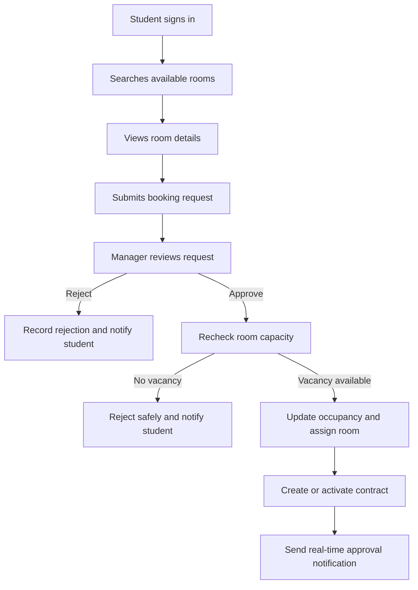
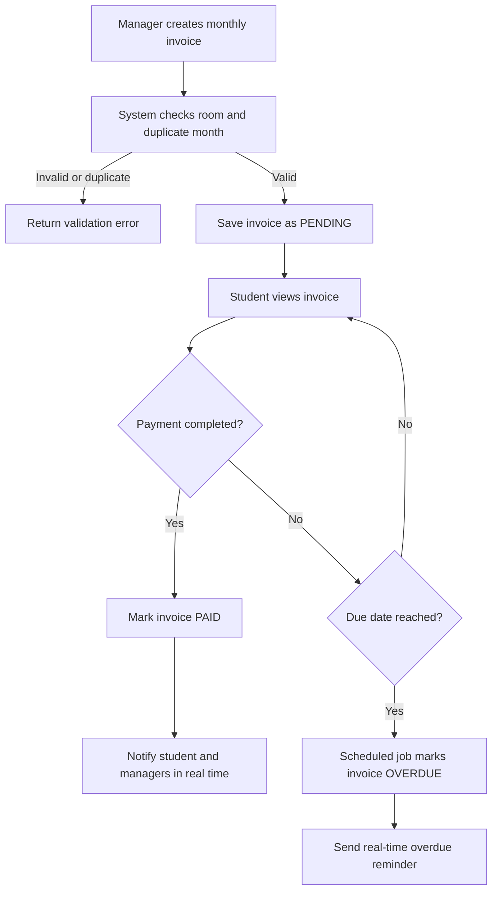

# Dormify — Vision Document

**Dormitory Management System**  
**Version:** 1.0 — Scrum-Aligned PA2 Draft  
**Date:** 11 July 2026  
**Document language:** English  
**Repository baseline reviewed:** `main` branches of the frontend and backend repositories on 11 July 2026

## Revision History
**Performed by:** Trần Huỳnh Mạnh Đạt | **Reviewed by:** Đào Duy Anh | **Edited by:** Trần Huỳnh Mạnh Đạt

| Date | Version | Description | Author |
|---|---:|---|---|
| 08 July 2026 | 1.0 | Initial Vision Document based on the project proposal. | Trần Huỳnh Mạnh Đạt |

> **Supersession note (26 August 2026).** This file is the PA2 baseline and is kept as the historical
> v1.0 record. It has been superseded by `PA3/documents/VisionDocument_v1.1.md`, which now carries
> version 1.2 after being synchronised with PA4. Two statements below were written against the PA2
> repository baseline and are no longer true of the current product: the RAG rules chatbot and
> automated activity auditing have since been delivered — see `F-11 Dormify AI Assistant` and the
> audit-log workspace in the v1.2 Vision Document, and `FR31` / `FR32` in `PA2/spec.md`. Read this
> file for what the team committed to at PA2, and the v1.2 document for current scope.

# 1. Introduction
**Performed by:** Trần Huỳnh Mạnh Đạt | **Reviewed by:** Đào Duy Anh | **Edited by:** Trần Huỳnh Mạnh Đạt

This Vision Document defines the problem, stakeholders, users, product position, high-level features, and quality goals of Dormify, a web-based Dormitory Management System. It provides a shared product direction for the project team, supervisor, and dormitory stakeholders throughout five Scrum sprints, with one sprint corresponding to each Project Assignment. Detailed user stories, acceptance criteria, API contracts, and test cases will be maintained in the Product Backlog, Trello board, Use-Case Specification, and Supplementary Specification.

The PA2 baseline is intentionally divided into three states: features already visible in the repositories, features partially implemented and requiring completion, and planned features for later sprints. This distinction prevents the document from presenting a future target as an already completed capability.

## 1.1 Purpose
**Performed by:** Trần Huỳnh Mạnh Đạt | **Reviewed by:** Đào Duy Anh | **Edited by:** Trần Huỳnh Mạnh Đạt

The purpose of this document is to explain why Dormify is needed, who will use it, what value it will provide, and which capabilities belong to the current product direction. It also establishes measurable non-functional targets that can be converted into acceptance tests. The document will be revised in PA3 after feedback from the teaching assistants and changes in the Trello backlog.

## 1.2 References
**Performed by:** Trần Huỳnh Mạnh Đạt | **Reviewed by:** Đào Duy Anh | **Edited by:** Trần Huỳnh Mạnh Đạt

| Reference | Description |
|---|---|
| PA1-2026 Project Proposal and App Survey | Initial project concept, stakeholder needs, and market/application survey. |
| PA2-2026 Project Assignment | Required structure, Scrum constraints, Mermaid diagrams, and submission rules. |
| *NHỮNG TÍNH NĂNG CHÍNH CỦA HỆ THỐNG QUẢN LÝ KTX* | Functional feature catalogue used to refine the Vision scope. |
| Backend repository | https://github.com/ddanh2436/Domitory_Management_Backend |
| Frontend repository | https://github.com/ddanh2436/Domitory_Management_Frontend |
| Product Backlog and Trello Board | Operational source for priorities, task ownership, status, and sprint dates. |
| Use-Case Specification | Planned detailed functional flows and business rules. |
| Supplementary Specification | Planned detailed security, performance, reliability, and platform requirements. |

# 2. Positioning
**Performed by:** Trần Huỳnh Mạnh Đạt | **Reviewed by:** Đào Duy Anh | **Edited by:** Trần Huỳnh Mạnh Đạt

## 2.1 Problem Statement
**Performed by:** Trần Huỳnh Mạnh Đạt | **Reviewed by:** Đào Duy Anh | **Edited by:** Trần Huỳnh Mạnh Đạt

| Field | Statement |
|---|---|
| **The problem of** | Manual and fragmented dormitory processes across accounts, room allocation, contracts, invoices, maintenance, absence reporting, violations, room transfers, and communication. |
| **Affects** | Students, System Administrators, Dormitory Managers, Floor Managers, Maintenance Staff, the Dormitory Management Board, and the project team responsible for operating the system. |
| **The impact of which is** | Duplicated work, inconsistent records, slow approvals, missed maintenance requests, weak debt visibility, delayed communication, and limited traceability of decisions and status changes. |
| **A successful solution would be** | A secure role-based web application that centralizes dormitory workflows, provides self-service access, preserves transaction history, sends timely notifications, and gives authorized staff reliable operational information. |

## 2.2 Product Position Statement
**Performed by:** Trần Huỳnh Mạnh Đạt | **Reviewed by:** Đào Duy Anh | **Edited by:** Trần Huỳnh Mạnh Đạt

| Positioning element | Description |
|---|---|
| **For** | Dormitory management personnel, maintenance personnel, and resident students. |
| **Who** | Need a transparent and efficient way to process residential services and access current dormitory information. |
| **Dormify** | Is a role-based dormitory management and student self-service web application. |
| **That** | Centralizes authentication, rooms, bookings, contracts, invoices, maintenance, absences, violations, room transfers, announcements, and real-time notifications. |
| **Unlike** | Paper forms, disconnected spreadsheets, physical bulletin boards, and informal messaging channels. |
| **Our product** | Provides controlled access, consistent records, traceable workflows, automated invoice aging, transactional room transfers, and real-time status communication through a single platform. |

# 3. Stakeholder and User Descriptions
**Performed by:** Trần Huỳnh Mạnh Đạt | **Reviewed by:** Tô Trần Hoàng Triệu | **Edited by:** Trần Huỳnh Mạnh Đạt

## 3.1 Stakeholder Summary
**Performed by:** Trần Huỳnh Mạnh Đạt | **Reviewed by:** Tô Trần Hoàng Triệu | **Edited by:** Trần Huỳnh Mạnh Đạt

| Stakeholder | Interest and responsibility |
|---|---|
| Dormitory Management Board | Defines policies, approves operational rules, reviews reports, and evaluates whether the system improves service quality and control. |
| Product Owner / Stakeholder Representative | Prioritizes the Product Backlog, clarifies dormitory rules, approves acceptance criteria, and accepts or rejects completed increments. |
| Project Supervisor / Lecturer | Reviews academic deliverables, provides methodological guidance, and evaluates project progress and quality. |
| Development Team | Designs, implements, reviews, tests, documents, and demonstrates the product across the frontend and backend repositories. |
| Maintenance Service Team | Receives repair work, updates progress, records results and evidence, and supports service-quality improvement. |
| External Service Providers | Provide Google authentication, hosting, image storage, and future payment interfaces when those integrations are enabled. |

## 3.2 User Summary
**Performed by:** Trần Huỳnh Mạnh Đạt | **Reviewed by:** Tô Trần Hoàng Triệu | **Edited by:** Trần Huỳnh Mạnh Đạt

| User | Main responsibilities | Repository alignment |
|---|---|---|
| System Administrator | Manages accounts, fixed system roles, access status, system-wide data, announcements, and administrative views. | Present as `ADMIN`; account locking and role-based guards are visible. |
| Dormitory Manager | Reviews bookings, rooms, invoices, absences, violations, transfers, and dormitory-wide operations. | Present as `DORMITORY_MANAGER`; several management workflows share the admin interface. |
| Floor Manager | Reviews students, rooms, absences, and violations within an assigned operational scope. | Present as `FLOOR_MANAGER`; fine-grained floor scoping still requires validation. |
| Maintenance Staff | Reviews assigned maintenance work, updates repair progress, and records completion evidence. | Role `MAINTENANCE_STAFF` exists; a complete assignment/dashboard workflow is planned. |
| Student | Maintains a profile, searches and books rooms, reviews contracts and invoices, submits maintenance and absence requests, requests room transfers, and receives notifications. | Student routes exist for the principal workflows. |

> **Role correction:** The current repositories define `MAINTENANCE_STAFF` but do not define a separate `OFFICE_STAFF` role. Financial and administrative duties are therefore assigned to `ADMIN` and `DORMITORY_MANAGER` in this PA2 baseline.

## 3.3 User Environment
**Performed by:** Trần Huỳnh Mạnh Đạt | **Reviewed by:** Hồ Phúc Kiên | **Edited by:** Trần Huỳnh Mạnh Đạt

Dormify is a browser-based application. The frontend currently uses Next.js, React, TypeScript, Tailwind CSS, Recharts, and Socket.IO Client, while the backend uses NestJS, MongoDB through Mongoose, JWT authentication, Google authentication, Cloudinary, scheduled jobs, and Socket.IO. Staff mainly use desktop or laptop browsers, while students and floor managers may also use responsive mobile browsers.

The application requires an internet connection. External-service failures must not corrupt room, transfer, invoice, contract, or payment-state records. The initial release does not include a native mobile application or offline synchronization.

## 3.4 Summary of Key Stakeholder and User Needs
**Performed by:** Trần Huỳnh Mạnh Đạt | **Reviewed by:** Tô Trần Hoàng Triệu | **Edited by:** Trần Huỳnh Mạnh Đạt

| Need | Priority | Proposed solution | PA2 status |
|---|---|---|---|
| Secure identity and account access | Must | Email/MSSV login, Google authentication, JWT, password hashing, account lock/unlock, and fixed role-based authorization. | Implemented / being hardened |
| Searchable room availability and booking | Must | Room filters, room details, booking submission, approval/rejection, occupancy control, and contract creation. | Partial |
| Accurate invoices and debt tracking | Must | Monthly invoices, status tracking, mock payment, revenue statistics, automatic overdue detection, and payment notifications. | Partial; real payment gateways are future work |
| Maintenance request lifecycle | Must | Student request, priority and status tracking, image evidence, completion, rating, and a planned maintenance-staff workspace. | Partial |
| Absence and residency visibility | Must | Student absence requests and manager review/history. Visitor registration and full temporary-residence workflows remain planned. | Partial |
| Fair violation and conduct records | Should | Violation history and a behavior score visible to authorized users. | Partial |
| Reliable announcements and notifications | Must | Broadcast announcements, per-user notification center, unread counts, Socket.IO delivery, and automatic retention. | Implemented / partial |
| Safe room transfers | Must | Student transfer request, manager approval/rejection, capacity validation, contract update, history, and notification. | Implemented / being tested |
| Operational dashboards and reports | Should | Summary cards, revenue charts, room status, invoice status, and maintenance views. | Partial |

## 3.5 Alternatives and Competition
**Performed by:** Trần Huỳnh Mạnh Đạt | **Reviewed by:** Hồ Phúc Kiên | **Edited by:** Trần Huỳnh Mạnh Đạt

| Alternative | Strengths | Weaknesses compared with Dormify |
|---|---|---|
| Existing paper process | Familiar and has almost no software cost. | Slow, difficult to search, weakly auditable, and prone to duplicated or missing data. |
| Spreadsheets and messaging applications | Fast to start and flexible for small teams. | Weak permissions, inconsistent versions, no unified transaction lifecycle, and poor traceability. |
| Generic property-management software | Mature room, rent, and maintenance functions. | May not support student conduct, absence reporting, dormitory-specific approval rules, or course-specific customization. |
| University portal extension | Can reuse institutional infrastructure and accounts. | Depends on another release cycle and may give dormitory workflows lower priority. |
| Purpose-built Dormify | Matches the identified roles and local workflows and can be evolved through the five course sprints. | Requires development, testing, migration, documentation, and continued maintenance by the team. |

The PA1 application survey should be updated when user feedback changes the priorities or reveals an existing product that covers the same local workflows more effectively.

# 4. Product Overview
**Performed by:** Trần Huỳnh Mạnh Đạt | **Reviewed by:** Đào Duy Anh | **Edited by:** Trần Huỳnh Mạnh Đạt

## 4.1 Product Perspective
**Performed by:** Trần Huỳnh Mạnh Đạt | **Reviewed by:** Đào Duy Anh | **Edited by:** Trần Huỳnh Mạnh Đạt

Dormify is a new web platform with separate frontend and backend repositories. The backend exposes role-protected services for users, rooms, bookings, contracts, invoices, maintenance, notifications, violations, transfers, and absences. The frontend provides separate student and management routes for these workflows.

The PA2 product scope is organized as follows:

| Status | Meaning |
|---|---|
| **Implemented / visible** | A corresponding module, route, or service is visible on the repositories' `main` branches. |
| **Partial** | A foundation exists, but one or more business rules, interfaces, tests, or role-specific paths still require completion. |
| **Planned** | The feature is part of the target product but is not yet visible as a complete repository capability. |
| **Future candidate** | The feature is excluded from the committed PA2 baseline until the Product Owner adds it to Trello and the team estimates it. |

Real VNPay, MoMo, ZaloPay, or Internet Banking integration is not treated as completed in this version; the backend currently contains a mock payment path. AI maintenance routing and a RAG chatbot are future candidates because no corresponding module is visible in the reviewed repository baseline. *(PA4 update: the RAG chatbot was delivered as Dormify AI — `FR31`; AI maintenance routing remains a future candidate.)*

## 4.2 Assumptions and Dependencies
**Performed by:** Trần Huỳnh Mạnh Đạt | **Reviewed by:** Đào Duy Anh | **Edited by:** Trần Huỳnh Mạnh Đạt

| ID | Assumption or dependency | Effect if it changes |
|---|---|---|
| AD-01 | Users have a supported browser and stable internet access. | Offline support would require additional architecture and synchronization work. |
| AD-02 | Dormitory rules for bookings, contracts, absences, violations, and transfers are available to the team. | Unclear rules will delay acceptance criteria and implementation. |
| AD-03 | The Product Owner keeps Trello priorities consistent with the five-sprint plan. | Uncontrolled additions may prevent the final integrated demo. |
| AD-04 | MongoDB Atlas, Google authentication, Cloudinary, and deployment environments remain available. | The team must use mocks or a documented fallback if a provider is unavailable. |
| AD-05 | Frontend and backend API changes are reviewed and integrated frequently. | Repository drift can break end-to-end workflows. |
| AD-06 | Test data may be synthetic and contains no real sensitive student information. | Use of real data would require formal privacy and access controls. |
| AD-07 | Real payment gateways are optional until credentials, callback rules, and sandbox access are approved. | The mock payment flow remains the demonstration fallback. |
| AD-08 | Exact sprint dates and task identifiers are synchronized with Trello before submission. | A mismatch may reduce the PA2 Project Plan score. |

## 4.3 Scrum Delivery Approach
**Performed by:** Trần Huỳnh Mạnh Đạt | **Reviewed by:** Đào Duy Anh | **Edited by:** Trần Huỳnh Mạnh Đạt

Dormify is delivered exclusively through Scrum. The Product Owner orders the Product Backlog according to stakeholder value, risk, repository readiness, and the fixed academic deadline. At Sprint Planning, the Scrum Team selects a realistic Sprint Backlog and defines a Sprint Goal; during the sprint, the team coordinates through Scrum meetings and integrates frontend, backend, documentation, and testing work into one usable Increment.

Each sprint lasts approximately two to three weeks and corresponds to one Project Assignment:

| Sprint | Assignment | Product focus |
|---|---|---|
| Sprint 1 | PA1 | Product proposal, application survey, initial scope, repositories, and early prototype |
| Sprint 2 | PA2 | Vision, Software Development Plan, Spec Kit, documentation evidence, repository review, and stabilization of the current baseline |
| Sprint 3 | PA3 | Refined backlog, use cases, room booking, contracts, authorization, and accommodation workflow |
| Sprint 4 | PA4 | Invoices, maintenance, absences, violations, notifications, dashboards, and operational integration |
| Sprint 5 | PA5 | Final accepted features, security and regression testing, deployment, documentation, and full demonstration |

The principal Scrum artifacts are the Product Backlog, Sprint Backlog, and Product Increment. Trello is the operational source for backlog order, task ownership, reviewer assignment, estimates, due dates, and status. Every Increment must satisfy the Definition of Done and must be demonstrated at the Sprint Review; feedback and incomplete work return to the Product Backlog for re-prioritization.

The Vision describes the intended product outcome, but it does not fix all implementation details at the beginning. Features may be refined, reordered, divided, or postponed between sprints when stakeholder feedback, technical evidence, repository status, or capacity changes. Changes must preserve the Product Goal and must not silently enter an active sprint without agreement from the Product Owner and Scrum Team.

# 5. Product Features
**Performed by:** Trần Huỳnh Mạnh Đạt | **Reviewed by:** Đào Duy Anh and Tô Trần Hoàng Triệu | **Edited by:** Trần Huỳnh Mạnh Đạt

## F-01 Identity and Profile Management
**Performed by:** Trần Huỳnh Mạnh Đạt | **Reviewed by:** Đào Duy Anh | **Edited by:** Trần Huỳnh Mạnh Đạt

**Status:** Implemented / partial.

Dormify supports manual registration and login using an email address or student identifier, and it also supports Google authentication. A successful login issues a JWT containing the user's role, while passwords are stored as hashes rather than plain text. Students can view and maintain relevant profile information, and authorized managers can use the profile as the identity foundation for bookings, contracts, rooms, invoices, and violations. A production-ready OTP password-recovery flow remains planned; the current backend reset function is explicitly a development sandbox function.

## F-02 Account Administration and Role-Based Access
**Performed by:** Trần Huỳnh Mạnh Đạt | **Reviewed by:** Đào Duy Anh | **Edited by:** Trần Huỳnh Mạnh Đạt

**Status:** Partial.

System Administrators can manage user access, assign one of the supported roles, and lock an account with a recorded reason. Role guards restrict protected operations to authorized users and reduce accidental or malicious access to sensitive data. The current role set is Student, Admin, Dormitory Manager, Floor Manager, and Maintenance Staff, which must remain consistent across both repositories. Dynamic permission creation, comprehensive activity auditing, and operational backup/restore controls are planned rather than claimed as completed.

## F-03 Room Search, Booking, and Contract Management
**Performed by:** Hồ Phúc Kiên | **Reviewed by:** Đào Duy Anh | **Edited by:** Trần Huỳnh Mạnh Đạt

**Status:** Partial.

Students can browse room information and submit a room-booking request, while authorized managers review and process the request. Room occupancy and availability must be updated safely so that concurrent approvals do not exceed room capacity. Approved accommodation is linked to a contract that records the resident, room, rental information, and contract status. Automatic allocation by preference, full check-in/check-out processing, renewal, termination, and verified PDF export should be completed only when corresponding Trello stories and tests exist.

## F-04 Invoice, Debt, and Automated Overdue Management
**Performed by:** Trần Huỳnh Mạnh Đạt | **Reviewed by:** Đào Duy Anh | **Edited by:** Trần Huỳnh Mạnh Đạt

**Status:** Implemented / partial.

Authorized managers can create monthly room invoices containing room, electricity, and water charges, while students can view invoices for their own room. The backend prevents duplicate invoices for the same room and month, records payment status, and produces recent revenue statistics from paid invoices. A scheduled job automatically changes eligible pending invoices to overdue and sends a real-time reminder to affected students, which makes debt tracking more proactive. The current payment path is a mock payment flow; real VNPay, MoMo, ZaloPay, banking callbacks, meter-reading evidence, and downloadable invoice PDFs remain planned.

## F-05 Maintenance Requests and Maintenance Staff Workspace
**Performed by:** Tô Trần Hoàng Triệu | **Reviewed by:** Trần Huỳnh Mạnh Đạt | **Edited by:** Trần Huỳnh Mạnh Đạt

**Status:** Partial; maintenance-staff workspace added as a planned highlighted feature.

Students can submit a maintenance request containing a title, description, priority, room, and optional image evidence. Management users can review and update the request status, and students can rate a resolved request to provide service-quality feedback. The highlighted extension is a dedicated Maintenance Staff workspace that lists assigned jobs, supports status updates, records repair results, stores before-and-after images, and preserves maintenance history. Assignment ownership, separate before-and-after fields, and the complete maintenance dashboard must be added and tested in a later sprint.

## F-06 Absence, Temporary Residency, and Visitor Control
**Performed by:** Đào Duy Anh | **Reviewed by:** Trần Hoàng Quốc Khánh | **Edited by:** Trần Huỳnh Mạnh Đạt

**Status:** Partial.

Students can submit absence-related information and authorized managers can review absence records. This reduces dependence on paper books and gives managers a searchable history of reported absences. The broader target includes overnight absence, temporary residence, long-term temporary absence, and visitor registration, subject to approved dormitory rules and privacy controls. Visitor registration and complete temporary-residency workflows are planned because no dedicated visitor module is visible in the current backend baseline.

## F-07 Violation Records and Conduct Evaluation
**Performed by:** Trần Hoàng Quốc Khánh | **Reviewed by:** Đào Duy Anh | **Edited by:** Trần Huỳnh Mạnh Đạt

**Status:** Partial.

Authorized managers can record violations and maintain a history associated with the affected student. The user model includes a behavior score that can support a simple conduct-evaluation process. Students should be able to see the records that directly affect them, while unrelated disciplinary information remains restricted. Rule configuration, appeals, and periodic evaluation reports require explicit business rules and acceptance tests before they are treated as complete.

## F-08 Announcements and Real-Time Notification Center
**Performed by:** Hồ Phúc Kiên | **Reviewed by:** Trần Huỳnh Mạnh Đạt | **Edited by:** Trần Huỳnh Mạnh Đạt

**Status:** Implemented / partial.

Dormify stores user-specific notifications and sends new events immediately through Socket.IO. Students can view paginated notifications, see an unread count, mark notifications as read, and delete their own notifications, while authorized users can broadcast announcements to active students. Notification records use an expiration field and MongoDB TTL index so old records are removed automatically, reducing uncontrolled data growth. A complete two-way feedback and complaint workflow remains planned and should not be represented as already implemented.

## F-09 Transactional Room Transfer Workflow
**Performed by:** Trần Huỳnh Mạnh Đạt | **Reviewed by:** Đào Duy Anh | **Edited by:** Trần Huỳnh Mạnh Đạt

**Status:** Implemented / being tested; added as a highlighted feature.

A student can request a transfer from the current room to an available target room and provide a reason for the request. Managers can approve or reject the request, and the approval process checks capacity, updates the old and new room occupancies, changes the student's room, updates the active contract, and stores the transfer history in a database transaction. The student and relevant managers receive real-time notifications about submission and processing outcomes. This feature is important because it converts a multi-record administrative procedure into one traceable and consistent workflow.

## F-10 Dashboards and Operational Reporting
**Performed by:** Hồ Phúc Kiên | **Reviewed by:** Tô Trần Hoàng Triệu | **Edited by:** Trần Huỳnh Mạnh Đạt

**Status:** Partial.

Management dashboards summarize operational information such as room status, student records, invoices, maintenance requests, and recent revenue. Charts and summary cards help managers identify overdue invoices, occupancy issues, and workload without opening every record. Student dashboards provide direct navigation to personal room, contract, invoice, maintenance, absence, transfer, and notification information. Final dashboard content must be tied to verified API data and acceptance criteria rather than static demonstration values.

## 5.1 Important Workflow Diagram — Room Booking and Contract
**Performed by:** Hồ Phúc Kiên | **Reviewed by:** Đào Duy Anh | **Edited by:** Trần Huỳnh Mạnh Đạt

## 5.2 Important Workflow Diagram — Invoice and Overdue Notification
**Performed by:** Trần Huỳnh Mạnh Đạt | **Reviewed by:** Tô Trần Hoàng Triệu | **Edited by:** Trần Huỳnh Mạnh Đạt

## 5.3 Future Candidates Outside the Committed PA2 Baseline
**Performed by:** Trần Hoàng Quốc Khánh | **Reviewed by:** Đào Duy Anh | **Edited by:** Trần Huỳnh Mạnh Đạt

The following items may be added only after Product Owner approval, Trello estimation, and confirmation that core workflows remain achievable: real payment-gateway integration, a complete visitor-registration module, automated room allocation by preferences, formal activity auditing, backup/restore administration, AI-assisted maintenance classification, and a RAG rules chatbot. These items must be labelled as planned or future work until implementation and test evidence exist. *(PA4 update: automated room allocation, formal activity auditing, and the RAG rules chatbot have since been delivered; the remaining items are still future candidates.)*

# 6. Non-Functional Requirements
**Performed by:** Tô Trần Hoàng Triệu | **Reviewed by:** Đào Duy Anh | **Edited by:** Trần Huỳnh Mạnh Đạt

| ID | Category | Measurable requirement | Priority |
|---|---|---|---|
| NFR-01 | Standards | Public application APIs shall use REST-style JSON over HTTPS; repository releases shall use semantic version tags; security review shall use the OWASP Top 10 as a checklist. | Must |
| NFR-02 | Authentication | Protected API operations shall reject missing, invalid, or expired JWTs and shall enforce the role required by the endpoint. | Must |
| NFR-03 | Password security | Passwords shall be hashed with bcrypt and never returned by normal user queries or committed to source control. | Must |
| NFR-04 | Authorization | A student shall be unable to read or change another student's room invoice, notification, transfer, or private profile through direct API requests. | Must |
| NFR-05 | Performance | Under a test load of 100 concurrent authenticated users, at least 95% of common read and update API requests shall complete within 2 seconds, excluding third-party response time. | Should |
| NFR-06 | Web responsiveness | On a 10 Mbps connection, principal pages shall become usable within 3 seconds for at least 95% of measured runs using the agreed test dataset. | Should |
| NFR-07 | Real-time delivery | At least 95% of Socket.IO notifications shall appear for an online recipient within 5 seconds after the related database transaction completes. | Should |
| NFR-08 | Transaction integrity | Concurrent booking or transfer approvals shall not cause room occupancy to exceed capacity, and an approved room transfer shall update the student, both rooms, and the active contract consistently. | Must |
| NFR-09 | Invoice integrity | The system shall prevent more than one invoice for the same room, month, and year and shall not mark an unverified real payment as successful. | Must |
| NFR-10 | Notification retention | Unread notifications shall expire after 30 days and read notifications after 10 days unless the Product Owner approves a different policy. | Should |
| NFR-11 | File handling | Uploaded images shall be restricted to approved image MIME types and a maximum size of 5 MB per file; unauthorized users shall not receive protected file URLs. | Must |
| NFR-12 | Compatibility | The interface shall support the latest two major versions of Chrome, Edge, and Firefox and remain usable from 360 px viewport width upward. | Must |
| NFR-13 | Accessibility | Core workflows shall be keyboard-operable and shall use labels, visible focus, readable error messages, and contrast targets based on WCAG 2.1 AA. | Should |
| NFR-14 | Reliability | A failed external authentication, storage, or future payment request shall not create a duplicate booking, invoice, transfer, or paid-payment record. | Must |
| NFR-15 | Testing | By the PA5 demo, critical services shall have automated unit/integration tests and at least 70% measured service-layer statement coverage, or an approved documented exception. | Should |
| NFR-16 | Backup and recovery | Before the final demo, the team shall document and rehearse one database backup and restore procedure with an RPO target of 24 hours and an RTO target of 4 hours. | Should |
| NFR-17 | Privacy | Demonstration and test environments shall use synthetic or anonymized student data; secrets and connection strings shall remain outside Git. | Must |
| NFR-18 | Maintainability | Pull requests to a protected integration or main branch shall be reviewed by at least one team member other than the author and shall pass configured lint/build/test checks. | Must |

# 7. Scope Traceability Summary
**Performed by:** Trần Huỳnh Mạnh Đạt | **Reviewed by:** Tô Trần Hoàng Triệu | **Edited by:** Trần Huỳnh Mạnh Đạt

| Vision feature | Main repository area | Planned validation evidence |
|---|---|---|
| F-01 Identity and Profile | `backend/src/auth`, `backend/src/users`, frontend auth/profile routes | Login, Google login, account-lock, and profile tests |
| F-02 Administration and RBAC | auth guards, user schema/service, admin permissions routes | Role-access matrix and negative authorization tests |
| F-03 Rooms, Booking, Contract | rooms, bookings, contracts; student/admin routes | End-to-end booking and capacity tests |
| F-04 Invoice and Overdue | invoices, notifications, student payment route | Duplicate invoice, overdue cron, mock payment, notification tests |
| F-05 Maintenance | maintenance module and student/admin maintenance routes | Request, status, rating, and later staff-assignment tests |
| F-06 Absences | absences module and routes | Submit/review/history tests |
| F-07 Violations | violations module and rules routes | Violation and behavior-score tests |
| F-08 Notifications | notifications service/gateway and notification routes | Socket, pagination, unread count, TTL-policy tests |
| F-09 Transfers | transfers module and student/admin transfer routes | Approval transaction, capacity, contract update, and notification tests |
| F-10 Dashboards | admin/student pages and Recharts | API-backed dashboard acceptance tests |

*End of Vision Document — Version 1.0*
