# Use-Case Specification — Dormify Dormitory Management System

> Dormitory Management System

| Field | Details |
| --- | --- |
| Document type | Use-Case Specification |
| Version | 1.2 — PA3 document synchronised with PA4 |
| Date | 26 August 2026 |
| Performed by | Trần Huỳnh Mạnh Đạt |
| Reviewed by | Đào Duy Anh |
| Edited by | Trần Huỳnh Mạnh Đạt |

## Specification Snapshot

> _Performed by:_ Trần Huỳnh Mạnh Đạt | _Reviewed by:_ Đào Duy Anh | _Edited by:_ Trần Huỳnh Mạnh Đạt

| Review item | Summary |
| --- | --- |
| Product | Dormify |
| Scope | Functional behavior for the PA4 Dormitory Management System |
| Use-case count | 79 use cases |
| Functional groups | 12 functional groups plus traceability appendices |
| Selected PA3 focus | Maintenance Management |
| Selected PA4 additions | Dormify AI chatbot assistance; violation appeal and revocation |
| Related use-case model | [use-case-model.md](use-case-model.md) and [use-case-model.pdf](use-case-model.pdf) |
| Main readers | Development team, reviewers, testers, and PA3/PA4 evaluators |
| Modeling status | Intended system behavior with repository-based PA4 additions |

> **Synchronisation note.** This file is the PA3 copy of the Use-Case Specification and is kept
> content-identical to `PA4/Part A - Revised Use-Case Specification/Use Case Specification.md`.
> The `AI Chatbot Assistance` group (section 13, `UC-AI-01`–`UC-AI-04`) and the conduct appeal and
> revocation use cases (`UC-COND-06`–`UC-COND-08`) were introduced during PA4 and back-ported here
> so that the PA3 and PA4 documentation sets no longer contradict each other. Everything the
> document states about PA4 additions applies to both copies; only the relative screenshot paths
> differ, because the two files sit at different depths in the repository.

## PA4 Structure Checklist

> _Performed by:_ Trần Huỳnh Mạnh Đạt | _Reviewed by:_ Đào Duy Anh | _Edited by:_ Trần Huỳnh Mạnh Đạt

| PA4 requirement | How this document addresses it |
| --- | --- |
| Clear use-case ordering | Use cases are grouped by workflow and functional area, with a functional group index before the detailed specifications. |
| Use-case model alignment | The detailed specifications are linked to the separate Mermaid use-case model and PDF export. |
| Use-case name and ID | Every detailed use case starts with `Use-case ID` and `Use-case name`. |
| Actor(s) | Every use case lists the initiating actor and supporting actor when applicable. |
| Description and preconditions | Each specification explains the user goal, trigger, and conditions required before execution. |
| Basic flow | The normal successful path is written as numbered, step-by-step behavior. |
| Alternative flows | Recoverable alternatives and exception paths are listed under a dedicated field. |
| Postconditions and special requirements | Outcome state, constraints, business rules, validation, and security notes are captured per use case. |
| Prototype or implementation evidence | Legacy PA3 use cases include prototype screenshots from `PA3/assets`; PA4 AI use cases cite repository evidence because no PA3 AI screenshot exists. |

## Table of Contents

> _Performed by:_ Trần Huỳnh Mạnh Đạt | _Reviewed by:_ Đào Duy Anh | _Edited by:_ Trần Huỳnh Mạnh Đạt

- [Specification Snapshot](#specification-snapshot)
- [PA4 Structure Checklist](#pa4-structure-checklist)
- [Functional Group Index](#functional-group-index)
- [1. Introduction](#1-introduction)
- [2. Authentication and Personal Profile](#2-authentication-and-personal-profile)
- [3. System Administration](#3-system-administration)
- [4. Room and Student Management](#4-room-and-student-management)
- [5. Contract Management](#5-contract-management)
- [6. Checkout and Deposit Refund](#6-checkout-and-deposit-refund)
- [7. Finance and Meter Management](#7-finance-and-meter-management)
- [8. Residence Management](#8-residence-management)
- [9. Maintenance Management](#9-maintenance-management)
- [10. Feedback and Suggestions](#10-feedback-and-suggestions)
- [11. Conduct and Student Evaluation](#11-conduct-and-student-evaluation)
- [12. Notifications and Message Center](#12-notifications-and-message-center)
- [13. AI Chatbot Assistance](#13-ai-chatbot-assistance)
- [14. Functional Requirement Traceability](#14-functional-requirement-traceability)
- [15. Student Feature Traceability](#15-student-feature-traceability)
- [16. Maintenance Staff Feature Traceability](#16-maintenance-staff-feature-traceability)
- [17. Floor Manager Function Reassignment](#17-floor-manager-function-reassignment)

## Functional Group Index

> _Performed by:_ Trần Huỳnh Mạnh Đạt | _Reviewed by:_ Đào Duy Anh | _Edited by:_ Trần Huỳnh Mạnh Đạt

| Section | Functional group | Use-case count |
| --- | --- | ---: |
| 2 | Authentication and Personal Profile | 10 |
| 3 | System Administration | 4 |
| 4 | Room and Student Management | 11 |
| 5 | Contract Management | 6 |
| 6 | Checkout and Deposit Refund | 4 |
| 7 | Finance and Meter Management | 11 |
| 8 | Residence Management | 5 |
| 9 | Maintenance Management | 10 |
| 10 | Feedback and Suggestions | 3 |
| 11 | Conduct and Student Evaluation | 8 |
| 12 | Notifications and Message Center | 3 |
| 13 | AI Chatbot Assistance | 4 |

---

## 1. Introduction

> _Performed by:_ Trần Huỳnh Mạnh Đạt | _Reviewed by:_ Đào Duy Anh | _Edited by:_ Trần Huỳnh Mạnh Đạt

### 1.1 Purpose

> _Performed by:_ Trần Huỳnh Mạnh Đạt | _Reviewed by:_ Đào Duy Anh | _Edited by:_ Trần Huỳnh Mạnh Đạt

This document specifies the functional behavior of the Dormify Dormitory Management System. It expands the approved use-case model into complete use-case descriptions that can be used for design, implementation, testing, and PA4 evaluation.

### 1.2 Scope and Modeling Decisions

> _Performed by:_ Trần Huỳnh Mạnh Đạt | _Reviewed by:_ Đào Duy Anh | _Edited by:_ Trần Huỳnh Mạnh Đạt

- The document contains **76 use cases** across 12 functional groups.
- The related use-case model is maintained in `use-case-model.md`, with a PDF export in `use-case-model.pdf`.
- System Admin and Dormitory Manager remain separate actors.
- Floor Manager responsibilities are represented under Dormitory Manager in the diagrams and specifications, while the implementation may retain a separate role.
- FR08 (Back up and restore data) is outside the current scope.
- Payment methods are alternative flows of UC-FIN-09, not separate use cases.
- Automatic notifications are treated as postconditions of their originating use cases.
- Dormify AI is treated as an active PA4 feature because `ChatbotModule` is registered in the backend root module and exposes authenticated chatbot, feedback, and knowledge-ingestion endpoints.
- The specification describes the intended system behavior and does not claim implementation status.
- Each use case includes a **Prototype Screens:** field. Legacy use cases reference PA3 prototype assets; the PA4 AI use cases reference repository implementation evidence where prototype screenshots are not available.

### 1.3 Use-Case Template

> _Performed by:_ Trần Huỳnh Mạnh Đạt | _Reviewed by:_ Đào Duy Anh | _Edited by:_ Trần Huỳnh Mạnh Đạt

Each use-case specification follows the same structure so design, implementation, testing, and review work can trace behavior consistently.

| Template field | Purpose |
| --- | --- |
| Use-case ID and name | Provides the stable identifier and clear title required by PA3. |
| Actor(s) and supporting actors | Identifies who starts or supports the behavior. |
| Description and trigger | Explains the goal and the event that starts the use case. |
| Preconditions | Lists what must be true before the use case begins. |
| Basic flow (main success scenario) | Defines the normal successful path step by step. |
| Alternative flows | Defines recoverable alternatives, exceptions, and error paths. |
| Postconditions | States what is true after the use case finishes. |
| Special requirements | Captures constraints that affect design, security, data, or validation. |
| Prototype screens | Includes one or more PA3 asset screenshots covering the related basic-flow and alternative-flow screens. |
| Relationships | Records include, extend, or related-use-case links. |
| Traceability | Links the use case to functional requirements or feature IDs. |

### 1.4 Actors

> _Performed by:_ Trần Huỳnh Mạnh Đạt | _Reviewed by:_ Đào Duy Anh | _Edited by:_ Trần Huỳnh Mạnh Đạt

| Actor | Responsibility |
| --- | --- |
| Applicant / Guest | Submits a preliminary residence profile and authenticates before becoming a resident. |
| Authenticated User | Any logged-in Dormify user who can access cross-role functions such as Dormify AI. |
| Student | Uses residence, room, contract, invoice, maintenance, feedback, conduct, communication, and Dormify AI functions. |
| System Admin | Controls accounts, roles, permissions, logs, administration monitoring, and AI knowledge/feedback maintenance. |
| Dormitory Manager | Performs dormitory operations across rooms, students, contracts, finance, residence, maintenance, feedback, and conduct. |
| Maintenance Staff | Receives and processes assigned repair work. |
| Google OAuth Provider | Provides external Google authentication. |
| Email / SMS Service | Delivers confirmation and password-recovery messages. |
| Payment Gateway | Processes electronic invoice payments. |
| Scheduled Trigger | Starts time-based debt reminder and overdue processes. |
| Ollama AI Runtime | Generates embeddings and Vietnamese chatbot responses for Dormify AI through local HTTP/JSON APIs. |

---

## 2. Authentication and Personal Profile

> _Performed by:_ Trần Huỳnh Mạnh Đạt | _Reviewed by:_ Đào Duy Anh | _Edited by:_ Trần Huỳnh Mạnh Đạt

Account registration, authentication, profile self-service, and student residence information.

| ID | Use case | Primary actor |
| --- | --- | --- |
| UC-AUTH-01 | Submit Preliminary Residence Profile | Applicant / Guest |
| UC-AUTH-02 | Log In | Applicant / Guest, Student |
| UC-AUTH-03 | Log Out | Student |
| UC-AUTH-04 | Reset Forgotten Password | Applicant / Guest, Student |
| UC-PRO-01 | View Personal Profile | Student |
| UC-PRO-02 | Update Contact Information | Student |
| UC-PRO-03 | Change Password | Student |
| UC-STAY-01 | View Current Residence Information | Student |
| UC-STAY-02 | View Roommates | Student |
| UC-STAY-03 | View Residence History | Student |

### UC-AUTH-01 — Submit Preliminary Residence Profile

> _Performed by:_ Trần Huỳnh Mạnh Đạt | _Reviewed by:_ Đào Duy Anh | _Edited by:_ Trần Huỳnh Mạnh Đạt

**Use-case ID:** UC-AUTH-01  
**Use-case name:** Submit Preliminary Residence Profile  
**Actor(s):** Applicant / Guest  
**Supporting Actor(s):** Email / SMS Service  
**Description:** A prospective resident creates a preliminary profile so the dormitory can contact and evaluate the application.  
**Trigger:** The applicant selects the registration or residence-application function.

**Preconditions:**
1. The applicant is not authenticated.
2. No active account already uses the submitted email or citizen identification number.

**Basic Flow (Main Success Scenario):**
1. The applicant enters preliminary personal data, contact information, accommodation preferences, and a password.
2. The system validates required fields and checks uniqueness.
3. The system creates an applicant/student account in a pending or active state according to the configured admission policy.
4. The system sends a confirmation or contact notification through email or SMS.
5. The system displays a successful submission message and directs the applicant to log in or await further contact.

**Alternative Flows:**
- A1. Duplicate email or identification number: the system rejects the submission and identifies the conflicting field.
- A2. Invalid or incomplete information: the system highlights validation errors and keeps the entered data.
- A3. Notification service unavailable: the profile is saved and the system records the delivery failure for retry or manual follow-up.

**Postconditions:**
- A preliminary residence profile and user account are stored.
- A confirmation/contact notification is queued or sent.

**Special Requirements:**
- Passwords must be stored as secure hashes.
- Sensitive identity data must be protected in transit and at rest.

**Prototype Screens:**
- 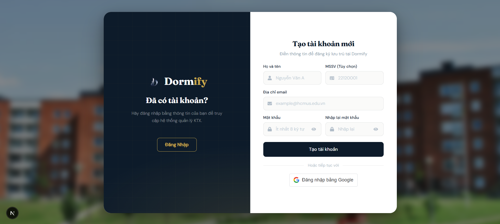
- PA3 asset screenshot evidence covering the basic flow and alternative flows for UC-AUTH-01.

**Relationships:**
- None.

**Traceability:** FR01

---

### UC-AUTH-02 — Log In

> _Performed by:_ Trần Huỳnh Mạnh Đạt | _Reviewed by:_ Đào Duy Anh | _Edited by:_ Trần Huỳnh Mạnh Đạt

**Use-case ID:** UC-AUTH-02  
**Use-case name:** Log In  
**Actor(s):** Applicant / Guest, Student  
**Supporting Actor(s):** Google OAuth Provider  
**Description:** A registered user authenticates using email, citizen identification number, or Google authentication.  
**Trigger:** The user submits the login form or selects Google sign-in.

**Preconditions:**
1. The user account exists.
2. The account is not locked, deactivated, or deleted.

**Basic Flow (Main Success Scenario):**
1. The user enters an email or citizen identification number and password.
2. The system validates the credentials and account status.
3. The system creates an authenticated session or access token.
4. The system identifies the user role and redirects the user to the appropriate workspace.

**Alternative Flows:**
- A1. Google login: the Google OAuth Provider authenticates the user; the system links or creates the local account according to policy.
- A2. Invalid credentials: the system denies access without revealing which field is incorrect.
- A3. Locked/deactivated account: the system denies access and displays the permitted reason or support guidance.
- A4. OAuth failure: the user returns to the login page with a non-sensitive error message.

**Postconditions:**
- A valid authenticated session exists.
- The login event may be written to the audit log.

**Special Requirements:**
- Authentication attempts should be rate-limited.
- Session data must not expose passwords or sensitive credentials.

**Prototype Screens:**
- 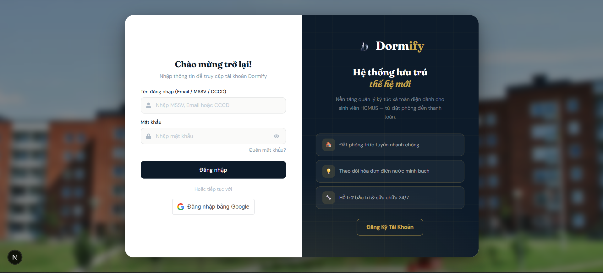
- PA3 asset screenshot evidence covering the basic flow and alternative flows for UC-AUTH-02.

**Relationships:**
- None.

**Traceability:** FR02

---

### UC-AUTH-03 — Log Out

> _Performed by:_ Trần Huỳnh Mạnh Đạt | _Reviewed by:_ Đào Duy Anh | _Edited by:_ Trần Huỳnh Mạnh Đạt

**Use-case ID:** UC-AUTH-03  
**Use-case name:** Log Out  
**Actor(s):** Student  
**Supporting Actor(s):** None  
**Description:** An authenticated user ends the current session.  
**Trigger:** The user selects Log out.

**Preconditions:**
1. The user is authenticated.

**Basic Flow (Main Success Scenario):**
1. The system invalidates or removes the local session credentials.
2. The system clears protected user context from the client.
3. The system redirects the user to the login page.

**Alternative Flows:**
- A1. Server-side logout is unavailable: the client still clears local credentials and prevents access to protected pages.
- A2. Session already expired: the system keeps the user logged out and redirects to the login page without showing an error.
- A3. Unsaved local form state exists: the system warns the user before clearing the session and protected client context.

**Postconditions:**
- The current device no longer has an active user session.

**Special Requirements:**
- Protected pages must require re-authentication after logout.

**Prototype Screens:**
- 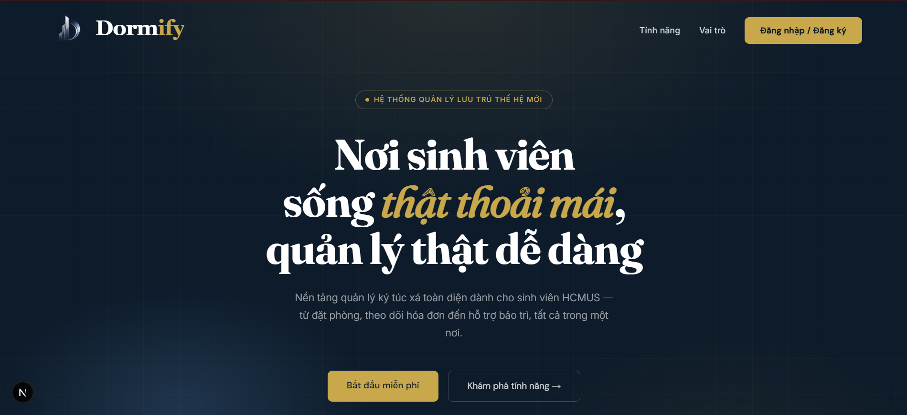
- 
- 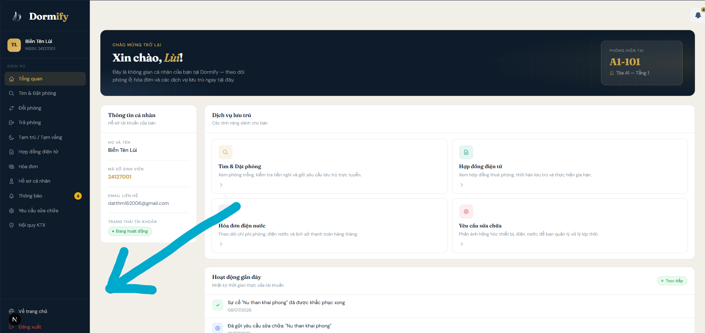
- PA3 asset screenshot evidence covering the basic flow and alternative flows for UC-AUTH-03.

**Relationships:**
- None.

**Traceability:** FR02

---

### UC-AUTH-04 — Reset Forgotten Password

> _Performed by:_ Trần Huỳnh Mạnh Đạt | _Reviewed by:_ Đào Duy Anh | _Edited by:_ Trần Huỳnh Mạnh Đạt

**Use-case ID:** UC-AUTH-04  
**Use-case name:** Reset Forgotten Password  
**Actor(s):** Applicant / Guest, Student  
**Supporting Actor(s):** Email / SMS Service  
**Description:** A user who cannot remember the password verifies account ownership and sets a new password.  
**Trigger:** The user selects Forgot password.

**Preconditions:**
1. An account exists for the submitted email or phone number.

**Basic Flow (Main Success Scenario):**
1. The user submits the registered email or phone number.
2. The system generates a time-limited OTP or reset token.
3. The Email / SMS Service delivers the verification code or reset link.
4. The user submits the OTP/token and a new password.
5. The system validates the request, updates the password hash, and invalidates the OTP/token.
6. The system confirms the reset and directs the user to log in.

**Alternative Flows:**
- A1. Unknown account: the system returns a generic response to prevent account enumeration.
- A2. Invalid or expired OTP/token: the reset is rejected and the user may request a new code.
- A3. Weak password: the system requests a password that satisfies the configured policy.

**Postconditions:**
- The account password is changed.
- The OTP/token cannot be reused.

**Special Requirements:**
- OTP/token lifetime and retry limits must be enforced.

**Prototype Screens:**
- 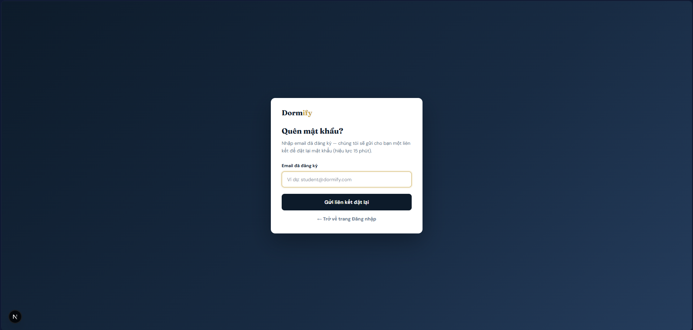
- PA3 asset screenshot evidence covering the basic flow and alternative flows for UC-AUTH-04.

**Relationships:**
- None.

**Traceability:** FR02

---

### UC-PRO-01 — View Personal Profile

> _Performed by:_ Trần Huỳnh Mạnh Đạt | _Reviewed by:_ Đào Duy Anh | _Edited by:_ Trần Huỳnh Mạnh Đạt

**Use-case ID:** UC-PRO-01  
**Use-case name:** View Personal Profile  
**Actor(s):** Student  
**Supporting Actor(s):** None  
**Description:** A student views personal and identity information stored by the dormitory.  
**Trigger:** The student opens the Personal Profile page.

**Preconditions:**
1. The student is authenticated.

**Basic Flow (Main Success Scenario):**
1. The system retrieves the student profile.
2. The system displays identity data, contact data, permanent address, student identifier, and account information.
3. The system visually distinguishes editable contact fields from manager-controlled identity fields.

**Alternative Flows:**
- A1. Profile data is incomplete: the system shows empty or pending fields without failing the page.
- A2. Profile service unavailable: the system shows a retry message and does not expose stale sensitive data beyond the active session policy.
- A3. Unauthorized profile access attempt: the system denies access and records the attempt for audit review.

**Postconditions:**
- No data is changed.

**Special Requirements:**
- Only the profile owner and authorized management roles may view the complete record.

**Prototype Screens:**
- 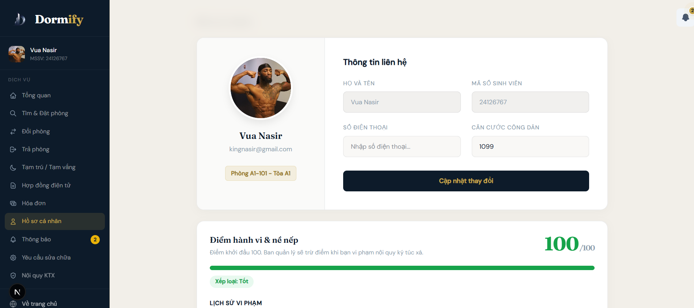
- PA3 asset screenshot evidence covering the basic flow and alternative flows for UC-PRO-01.

**Relationships:**
- None.

**Traceability:** FR03, ST01

---

### UC-PRO-02 — Update Contact Information

> _Performed by:_ Trần Huỳnh Mạnh Đạt | _Reviewed by:_ Đào Duy Anh | _Edited by:_ Trần Huỳnh Mạnh Đạt

**Use-case ID:** UC-PRO-02  
**Use-case name:** Update Contact Information  
**Actor(s):** Student  
**Supporting Actor(s):** None  
**Description:** A student updates permitted contact details without modifying protected identity information.  
**Trigger:** The student selects Edit contact information.

**Preconditions:**
1. The student is authenticated.

**Basic Flow (Main Success Scenario):**
1. The system displays editable fields such as phone number, email where permitted, current address, and avatar.
2. The student enters changes and submits.
3. The system validates the values and uniqueness constraints.
4. The system saves only fields allowed for student self-service.
5. The system confirms the update.

**Alternative Flows:**
- A1. Invalid phone/email format: the system rejects the affected field.
- A2. Protected identity field included in the request: the system ignores or rejects the unauthorized change.
- A3. Duplicate contact identifier: the system requests a different value.

**Postconditions:**
- Permitted contact information is updated.

**Special Requirements:**
- Full name, date of birth, citizen identification number, and other identity fields require an authorized manager.

**Prototype Screens:**
- 
- PA3 asset screenshot evidence covering the basic flow and alternative flows for UC-PRO-02.

**Relationships:**
- None.

**Traceability:** FR03, ST02

---

### UC-PRO-03 — Change Password

> _Performed by:_ Trần Huỳnh Mạnh Đạt | _Reviewed by:_ Đào Duy Anh | _Edited by:_ Trần Huỳnh Mạnh Đạt

**Use-case ID:** UC-PRO-03  
**Use-case name:** Change Password  
**Actor(s):** Student  
**Supporting Actor(s):** None  
**Description:** An authenticated student changes the account password by providing the current password.  
**Trigger:** The student selects Change password.

**Preconditions:**
1. The student is authenticated.
2. The student knows the current password.

**Basic Flow (Main Success Scenario):**
1. The student enters the current password, new password, and confirmation.
2. The system verifies the current password.
3. The system validates password strength and matching confirmation.
4. The system stores the new password hash.
5. The system confirms the change and may require re-login on other devices.

**Alternative Flows:**
- A1. Current password incorrect: no change is made.
- A2. New password and confirmation differ: the system requests correction.
- A3. New password violates policy: the system explains the unmet requirements.

**Postconditions:**
- The new password becomes valid and the old password becomes invalid.

**Special Requirements:**
- Password values must never be logged or returned.

**Prototype Screens:**
- 
- PA3 asset screenshot evidence covering the basic flow and alternative flows for UC-PRO-03.

**Relationships:**
- None.

**Traceability:** FR02, ST03

---

### UC-STAY-01 — View Current Residence Information

> _Performed by:_ Trần Huỳnh Mạnh Đạt | _Reviewed by:_ Đào Duy Anh | _Edited by:_ Trần Huỳnh Mạnh Đạt

**Use-case ID:** UC-STAY-01  
**Use-case name:** View Current Residence Information  
**Actor(s):** Student  
**Supporting Actor(s):** None  
**Description:** A resident views the currently assigned building, floor, room, bed, and stay status.  
**Trigger:** The student opens Current Residence.

**Preconditions:**
1. The student is authenticated.

**Basic Flow (Main Success Scenario):**
1. The system finds the student’s active room assignment or contract.
2. The system displays building, floor, room, bed, room type, contract period, and residence status.

**Alternative Flows:**
- A1. No active assignment: the system displays a message and a link to search or apply for a room.
- A2. Assignment is expired or inactive: the system shows the latest known residence record with an inactive status label.
- A3. Residence details are partially unavailable: the system displays available fields and provides a contact option for dormitory support.

**Postconditions:**
- No data is changed.

**Special Requirements:**
- None.

**Prototype Screens:**
- 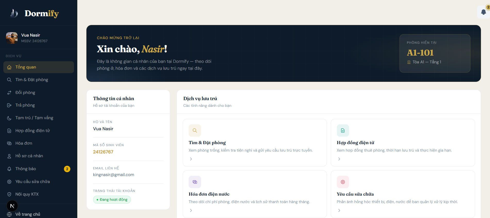
- PA3 asset screenshot evidence covering the basic flow and alternative flows for UC-STAY-01.

**Relationships:**
- None.

**Traceability:** FR03, ST04

---

### UC-STAY-02 — View Roommates

> _Performed by:_ Trần Huỳnh Mạnh Đạt | _Reviewed by:_ Đào Duy Anh | _Edited by:_ Trần Huỳnh Mạnh Đạt

**Use-case ID:** UC-STAY-02  
**Use-case name:** View Roommates  
**Actor(s):** Student  
**Supporting Actor(s):** None  
**Description:** A resident views basic information about students currently sharing the assigned room.  
**Trigger:** The student selects Roommates.

**Preconditions:**
1. The student is authenticated.
2. The student has an active room assignment.

**Basic Flow (Main Success Scenario):**
1. The system retrieves active occupants of the same room.
2. The system displays each roommate’s permitted public information, such as name and student identifier.

**Alternative Flows:**
- A1. The student is the only occupant: the system displays an appropriate empty state.
- A2. A roommate has privacy-restricted contact data: the system omits those fields.

**Postconditions:**
- No data is changed.

**Special Requirements:**
- Sensitive personal information must not be exposed to roommates.

**Prototype Screens:**
- 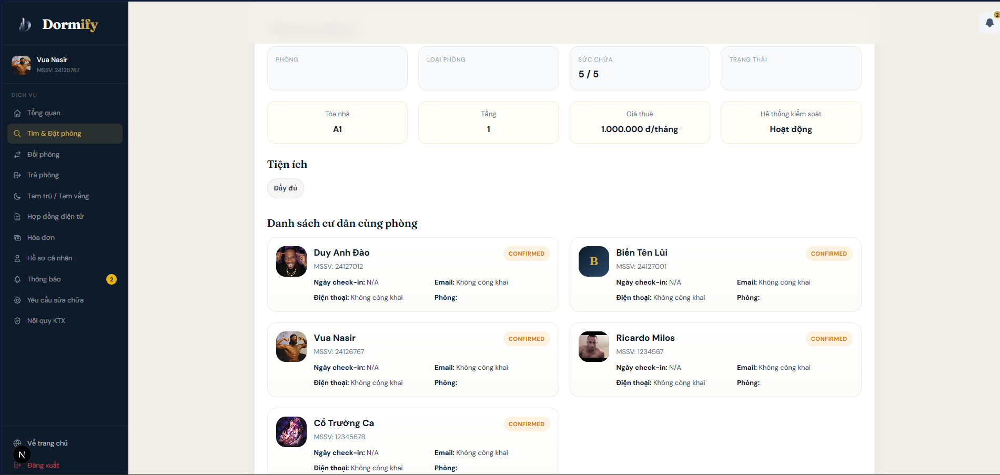
- PA3 asset screenshot evidence covering the basic flow and alternative flows for UC-STAY-02.

**Relationships:**
- None.

**Traceability:** FR03, ST05

---

### UC-STAY-03 — View Residence History

> _Performed by:_ Trần Huỳnh Mạnh Đạt | _Reviewed by:_ Đào Duy Anh | _Edited by:_ Trần Huỳnh Mạnh Đạt

**Use-case ID:** UC-STAY-03  
**Use-case name:** View Residence History  
**Actor(s):** Student  
**Supporting Actor(s):** None  
**Description:** A student reviews previous room assignments, transfers, contracts, and checkout records.  
**Trigger:** The student opens Residence History.

**Preconditions:**
1. The student is authenticated.

**Basic Flow (Main Success Scenario):**
1. The system retrieves historical room assignments and relevant dates.
2. The system orders records from newest to oldest.
3. The student may open an entry to view room, contract, transfer, and checkout details.

**Alternative Flows:**
- A1. No previous residence records: the system displays an empty state.
- A2. Filters return no history: the system displays an empty filtered state and offers a clear-filter action.
- A3. Selected historical detail is archived or unavailable: the system keeps the list visible and explains that the detail cannot be opened.

**Postconditions:**
- No data is changed.

**Special Requirements:**
- None.

**Prototype Screens:**
- 
- PA3 asset screenshot evidence covering the basic flow and alternative flows for UC-STAY-03.

**Relationships:**
- None.

**Traceability:** FR03, ST06

---

## 3. System Administration

> _Performed by:_ Trần Huỳnh Mạnh Đạt | _Reviewed by:_ Đào Duy Anh | _Edited by:_ Trần Huỳnh Mạnh Đạt

System account control, authorization, auditability, and administrative monitoring.

| ID | Use case | Primary actor |
| --- | --- | --- |
| UC-ADM-01 | Manage User Accounts | System Admin |
| UC-ADM-02 | Manage Roles and Permissions | System Admin |
| UC-ADM-03 | View and Filter Audit Logs | System Admin |
| UC-ADM-04 | View Administration Dashboard | System Admin |

### UC-ADM-01 — Manage User Accounts

> _Performed by:_ Trần Huỳnh Mạnh Đạt | _Reviewed by:_ Đào Duy Anh | _Edited by:_ Trần Huỳnh Mạnh Đạt

**Use-case ID:** UC-ADM-01  
**Use-case name:** Manage User Accounts  
**Actor(s):** System Admin  
**Supporting Actor(s):** None  
**Description:** The System Admin views accounts and performs lifecycle actions such as lock, unlock, deactivate, or delete.  
**Trigger:** The admin opens User Account Management.

**Preconditions:**
1. The actor is authenticated as System Admin.

**Basic Flow (Main Success Scenario):**
1. The system displays searchable and filterable user accounts.
2. The admin selects an account and an allowed action.
3. For a restrictive action, the admin enters a reason where required.
4. The system validates permissions and account dependencies.
5. The system updates the account status or removes the account according to retention policy.
6. The system records the action in the audit log.

**Alternative Flows:**
- A1. Lock account: access is denied until unlocked.
- A2. Unlock account: active access is restored.
- A3. Deactivate account: login is disabled while records are retained.
- A4. Delete account with active obligations: the system blocks deletion and recommends deactivation.
- A5. Admin attempts to remove the last System Admin or their own essential access: the system rejects the action.

**Postconditions:**
- The account reflects the selected lifecycle status.
- An audit record exists.

**Special Requirements:**
- Referential integrity with contracts, invoices, and history must be preserved.

**Prototype Screens:**
- 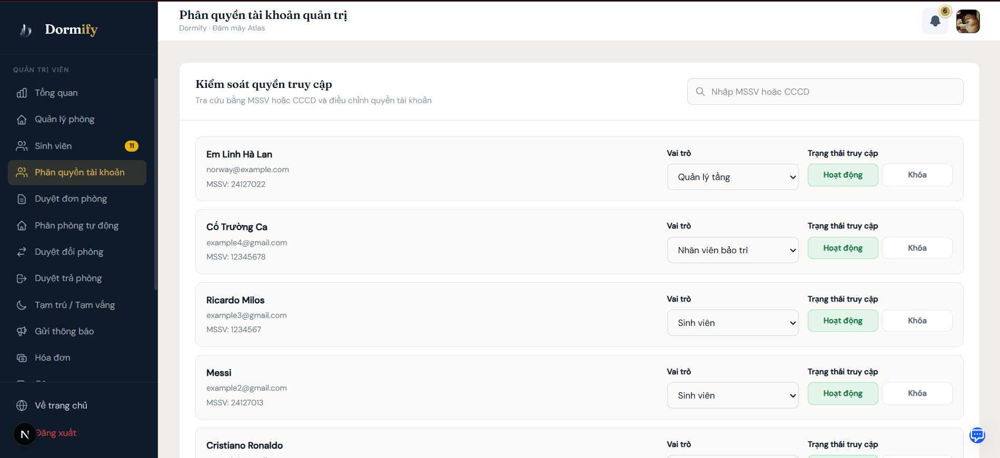
- PA3 asset screenshot evidence covering the basic flow and alternative flows for UC-ADM-01.

**Relationships:**
- None.

**Traceability:** FR04

---

### UC-ADM-02 — Manage Roles and Permissions

> _Performed by:_ Trần Huỳnh Mạnh Đạt | _Reviewed by:_ Đào Duy Anh | _Edited by:_ Trần Huỳnh Mạnh Đạt

**Use-case ID:** UC-ADM-02  
**Use-case name:** Manage Roles and Permissions  
**Actor(s):** System Admin  
**Supporting Actor(s):** None  
**Description:** The System Admin defines roles, assigns permissions, assigns roles to users, and revokes access.  
**Trigger:** The admin opens Roles and Permissions.

**Preconditions:**
1. The actor is authenticated as System Admin.

**Basic Flow (Main Success Scenario):**
1. The system displays roles and their permission sets.
2. The admin creates or edits a role and selects allowed functions.
3. The admin assigns one or more roles to a user.
4. The system validates that critical permissions remain assigned to at least one administrator.
5. The system saves the configuration and applies it to subsequent authorization checks.
6. The system records the change in the audit log.

**Alternative Flows:**
- A1. Duplicate role name: the system requests another name.
- A2. Invalid permission combination: the system blocks the change and explains the conflict.
- A3. Revoke access: the system removes the selected role/permission and terminates access where required.

**Postconditions:**
- Role and permission assignments are updated.

**Special Requirements:**
- Authorization must follow least-privilege principles.

**Prototype Screens:**
- 
- PA3 asset screenshot evidence covering the basic flow and alternative flows for UC-ADM-02.

**Relationships:**
- None.

**Traceability:** FR05

---

### UC-ADM-03 — View and Filter Audit Logs

> _Performed by:_ Trần Huỳnh Mạnh Đạt | _Reviewed by:_ Đào Duy Anh | _Edited by:_ Trần Huỳnh Mạnh Đạt

**Use-case ID:** UC-ADM-03  
**Use-case name:** View and Filter Audit Logs  
**Actor(s):** System Admin  
**Supporting Actor(s):** None  
**Description:** The System Admin reviews recorded system actions for accountability and troubleshooting.  
**Trigger:** The admin opens Audit Logs.

**Preconditions:**
1. The actor is authenticated as System Admin.
2. Audit records exist or the system can return an empty result.

**Basic Flow (Main Success Scenario):**
1. The system displays audit records ordered by time.
2. The admin filters by user, role, date range, action, function, result, or affected object.
3. The admin opens a record to view permitted before/after metadata and technical context.
4. The system preserves the log as read-only.

**Alternative Flows:**
- A1. No records match: the system displays an empty result.
- A2. Sensitive values are present in the original request: the system redacts passwords, tokens, and protected fields.

**Postconditions:**
- No operational data is changed.

**Special Requirements:**
- Audit logs should be tamper-resistant and retained according to project policy.

**Prototype Screens:**
- 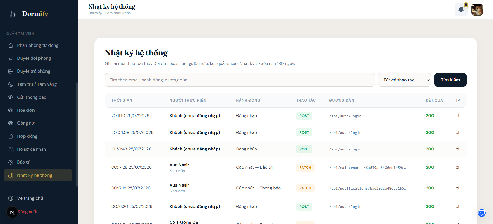
- PA3 asset screenshot evidence covering the basic flow and alternative flows for UC-ADM-03.

**Relationships:**
- None.

**Traceability:** FR06

---

### UC-ADM-04 — View Administration Dashboard

> _Performed by:_ Trần Huỳnh Mạnh Đạt | _Reviewed by:_ Đào Duy Anh | _Edited by:_ Trần Huỳnh Mạnh Đạt

**Use-case ID:** UC-ADM-04  
**Use-case name:** View Administration Dashboard  
**Actor(s):** System Admin  
**Supporting Actor(s):** None  
**Description:** The System Admin views system-wide statistics, warnings, and operational summaries.  
**Trigger:** The admin enters the administration workspace.

**Preconditions:**
1. The actor is authenticated as System Admin.

**Basic Flow (Main Success Scenario):**
1. The system aggregates account, occupancy, finance, request, maintenance, and alert data.
2. The system displays key indicators and recent warnings.
3. The admin selects a metric to navigate to the relevant management page.

**Alternative Flows:**
- A1. A data source is temporarily unavailable: the dashboard marks the affected widget and displays the remaining metrics.
- A2. No data for a period: the widget displays zero or an empty state.

**Postconditions:**
- No data is changed.

**Special Requirements:**
- Dashboard values should identify their update time and reporting period.

**Prototype Screens:**
- 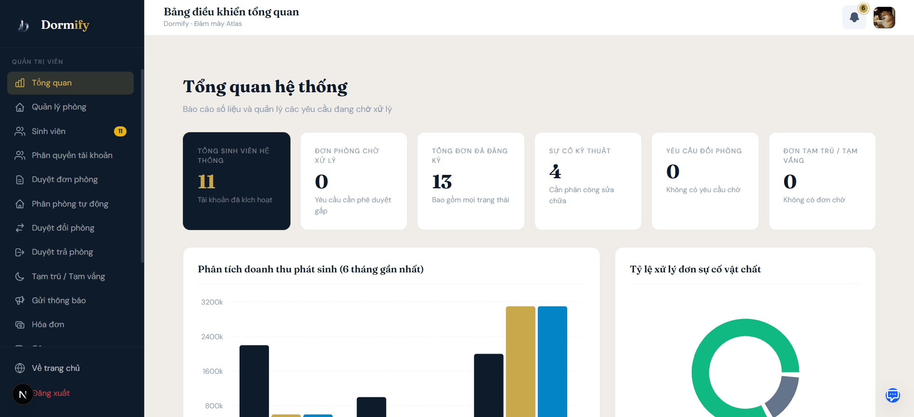
- PA3 asset screenshot evidence covering the basic flow and alternative flows for UC-ADM-04.

**Relationships:**
- None.

**Traceability:** FR07

---

## 4. Room and Student Management

> _Performed by:_ Trần Huỳnh Mạnh Đạt | _Reviewed by:_ Đào Duy Anh | _Edited by:_ Trần Huỳnh Mạnh Đạt

Room inventory, student records, applications, automatic allocation, and transfers.

| ID | Use case | Primary actor |
| --- | --- | --- |
| UC-ROOM-01 | Manage Rooms | Dormitory Manager |
| UC-STU-01 | Manage Student Records | Dormitory Manager |
| UC-ROOM-02 | Search Available Rooms | Student |
| UC-ROOM-03 | View Room Details | Student |
| UC-ROOM-04 | Submit Room Application | Student |
| UC-ROOM-05 | Track Room Application Status | Student |
| UC-ROOM-06 | Review Room Application | Dormitory Manager |
| UC-ROOM-07 | Run Automatic Room Allocation | Dormitory Manager |
| UC-ROOM-08 | Submit Room Transfer Request | Student |
| UC-ROOM-09 | Track Room Transfer Status | Student |
| UC-ROOM-10 | Review Room Transfer Request | Dormitory Manager |

### UC-ROOM-01 — Manage Rooms

> _Performed by:_ Trần Huỳnh Mạnh Đạt | _Reviewed by:_ Đào Duy Anh | _Edited by:_ Trần Huỳnh Mạnh Đạt

**Use-case ID:** UC-ROOM-01  
**Use-case name:** Manage Rooms  
**Actor(s):** Dormitory Manager  
**Supporting Actor(s):** None  
**Description:** The manager maintains the dormitory room catalog and room operating status.  
**Trigger:** The manager opens Room Management.

**Preconditions:**
1. The actor is authenticated as Dormitory Manager.

**Basic Flow (Main Success Scenario):**
1. The system displays rooms with building, floor, type, capacity, occupancy, price, facilities, and status.
2. The manager adds a new room or selects an existing room to edit.
3. The system validates uniqueness, capacity, price, and required data.
4. The manager may mark a room as available, full, unavailable, or under maintenance.
5. The system saves the room and records the action.

**Alternative Flows:**
- A1. Delete room with active occupants/contracts: the system rejects deletion.
- A2. Reduce capacity below current occupancy: the system rejects the change.
- A3. Mark occupied room under maintenance: the system requires a relocation plan or confirmation according to policy.

**Postconditions:**
- Room information and status are updated.

**Special Requirements:**
- Room lists should support building and floor filters.

**Prototype Screens:**
- 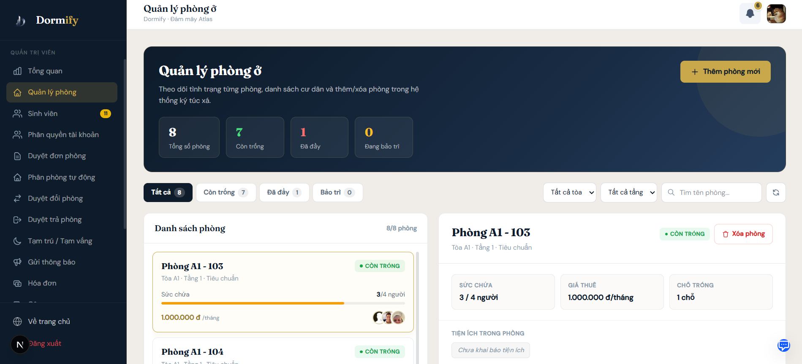
- 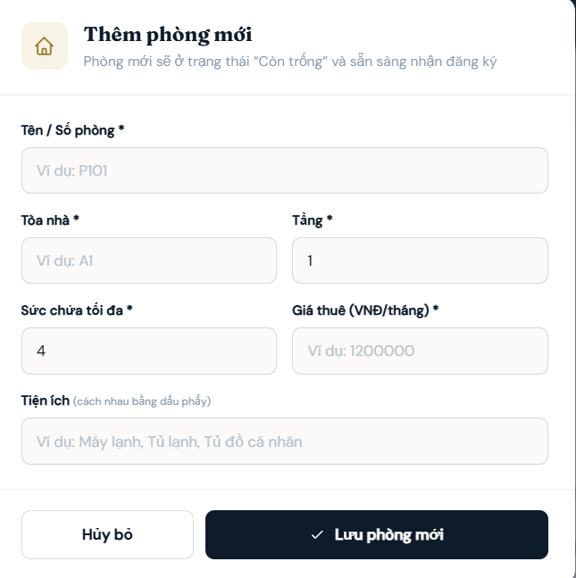
- 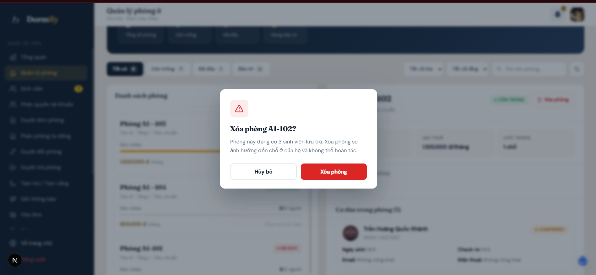
- 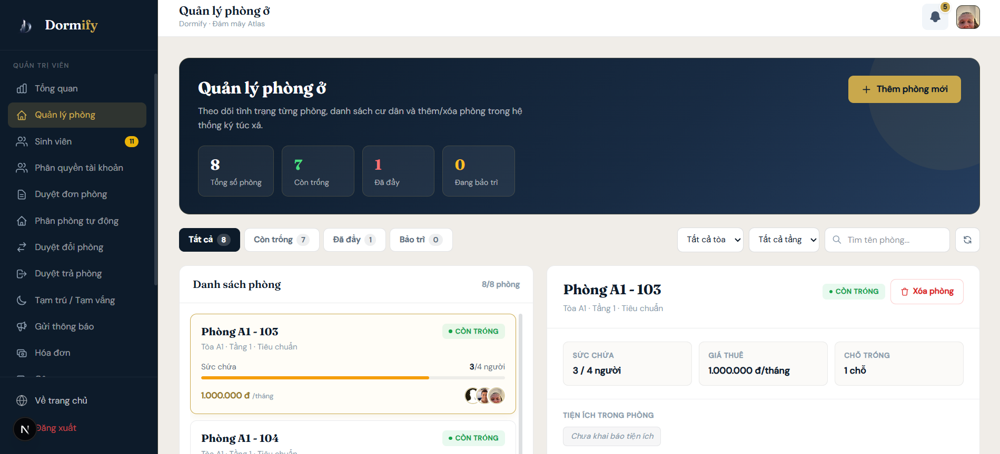
- PA3 asset screenshot evidence covering the basic flow and alternative flows for UC-ROOM-01.

**Relationships:**
- None.

**Traceability:** FR09, FM03

---

### UC-STU-01 — Manage Student Records

> _Performed by:_ Trần Huỳnh Mạnh Đạt | _Reviewed by:_ Đào Duy Anh | _Edited by:_ Trần Huỳnh Mạnh Đạt

**Use-case ID:** UC-STU-01  
**Use-case name:** Manage Student Records  
**Actor(s):** Dormitory Manager  
**Supporting Actor(s):** None  
**Description:** The manager views, filters, and updates student records and reviews room-rental history.  
**Trigger:** The manager opens Student Management.

**Preconditions:**
1. The actor is authenticated as Dormitory Manager.

**Basic Flow (Main Success Scenario):**
1. The system lists students with identity, contact, room, contract, and status summaries.
2. The manager searches or filters by building, floor, room, status, or student identifier.
3. The manager opens a student record and reviews residence history.
4. The manager edits authorized identity/contact fields and submits.
5. The system validates and saves the changes and records an audit entry.

**Alternative Flows:**
- A1. Duplicate citizen/student identifier: the update is rejected.
- A2. Student has historical records: deletion is blocked; deactivation is offered.
- A3. Unauthorized field or action: the system denies access.

**Postconditions:**
- The student record is updated or remains unchanged after a failed validation.

**Special Requirements:**
- None.

**Prototype Screens:**
- 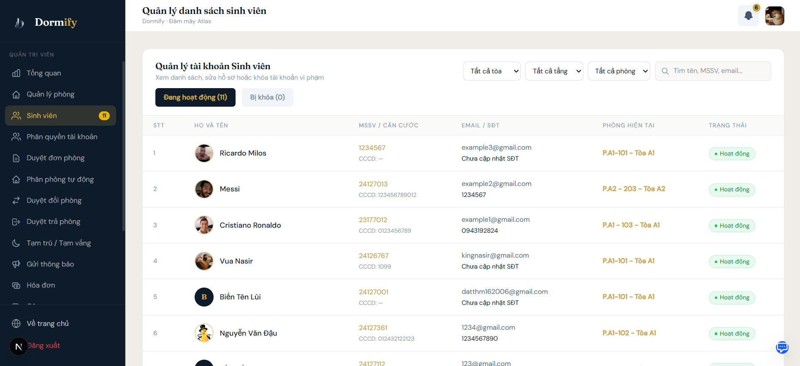
- 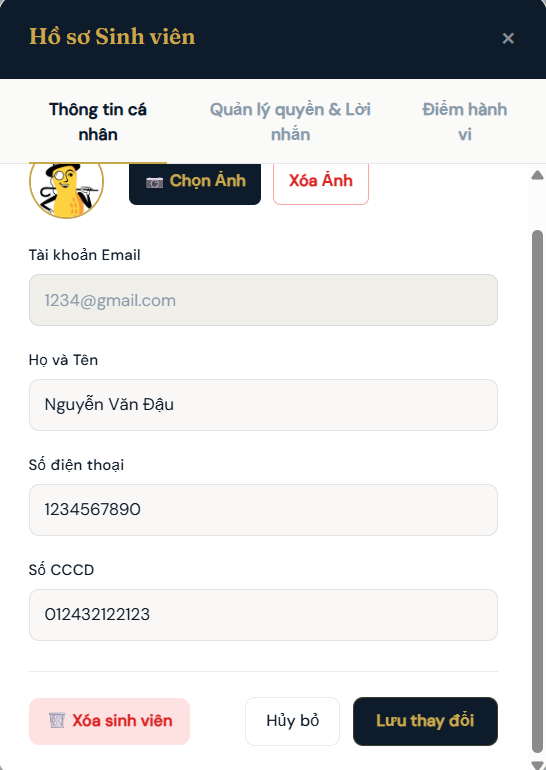
- 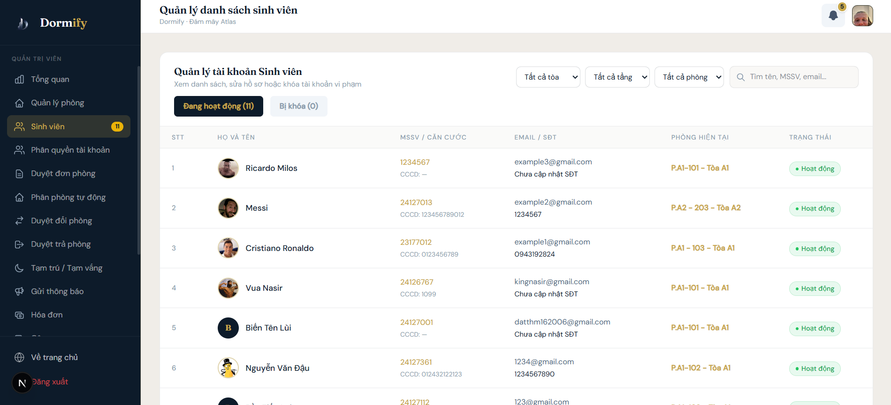
- PA3 asset screenshot evidence covering the basic flow and alternative flows for UC-STU-01.

**Relationships:**
- None.

**Traceability:** FR03, FR10, FM01, FM02

---

### UC-ROOM-02 — Search Available Rooms

> _Performed by:_ Trần Huỳnh Mạnh Đạt | _Reviewed by:_ Đào Duy Anh | _Edited by:_ Trần Huỳnh Mạnh Đạt

**Use-case ID:** UC-ROOM-02  
**Use-case name:** Search Available Rooms  
**Actor(s):** Student  
**Supporting Actor(s):** None  
**Description:** A student searches for rooms with available beds using accommodation filters.  
**Trigger:** The student opens Room Search.

**Preconditions:**
1. The student is authenticated.

**Basic Flow (Main Success Scenario):**
1. The system displays available rooms.
2. The student filters by room type, building, price range, gender policy, and number of available beds.
3. The system refreshes the result list and shows matching rooms.

**Alternative Flows:**
- A1. No rooms match: the system displays an empty state and allows filters to be cleared.
- A2. Room availability changes during search: the system refreshes the latest capacity before application.

**Postconditions:**
- No data is changed.

**Special Requirements:**
- None.

**Prototype Screens:**
- 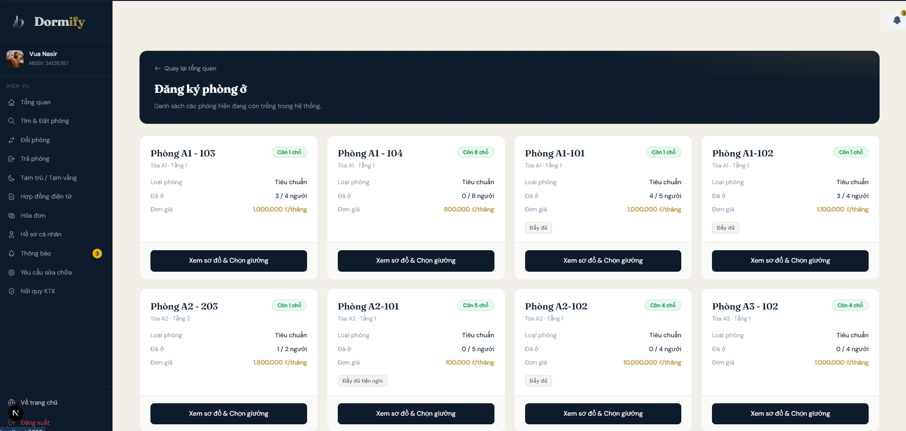
- PA3 asset screenshot evidence covering the basic flow and alternative flows for UC-ROOM-02.

**Relationships:**
- None.

**Traceability:** ST07

---

### UC-ROOM-03 — View Room Details

> _Performed by:_ Trần Huỳnh Mạnh Đạt | _Reviewed by:_ Đào Duy Anh | _Edited by:_ Trần Huỳnh Mạnh Đạt

**Use-case ID:** UC-ROOM-03  
**Use-case name:** View Room Details  
**Actor(s):** Student  
**Supporting Actor(s):** None  
**Description:** A student views the details of a room before submitting an application.  
**Trigger:** The student selects a room from search results.

**Preconditions:**
1. The room exists.

**Basic Flow (Main Success Scenario):**
1. The system displays building, floor, room type, gender policy, price, facilities, capacity, occupancy, and available beds.
2. The system displays current availability and applicable rules.
3. The student may proceed to submit an application.

**Alternative Flows:**
- A1. Room no longer available: the system disables application and suggests returning to search.
- A2. Room removed or unavailable: the system displays an error and returns to the room list.

**Postconditions:**
- No data is changed.

**Special Requirements:**
- None.

**Prototype Screens:**
- 
- PA3 asset screenshot evidence covering the basic flow and alternative flows for UC-ROOM-03.

**Relationships:**
- Included by UC-ROOM-04 Submit Room Application.

**Traceability:** ST08

---

### UC-ROOM-04 — Submit Room Application

> _Performed by:_ Trần Huỳnh Mạnh Đạt | _Reviewed by:_ Đào Duy Anh | _Edited by:_ Trần Huỳnh Mạnh Đạt

**Use-case ID:** UC-ROOM-04  
**Use-case name:** Submit Room Application  
**Actor(s):** Student  
**Supporting Actor(s):** None  
**Description:** A student applies to rent a selected available room.  
**Trigger:** The student selects Apply for this room.

**Preconditions:**
1. The student is authenticated.
2. The student has viewed the room details.
3. The student has no active room assignment and no conflicting pending application.

**Basic Flow (Main Success Scenario):**
1. The system revalidates room availability and eligibility.
2. The student confirms accommodation preferences and application information.
3. The system creates a pending room application.
4. The system notifies the Dormitory Manager.
5. The system displays the application reference and status.

**Alternative Flows:**
- A1. Room becomes full: the application is not created and the student returns to search.
- A2. Existing room or pending application: the system rejects the duplicate/conflicting request.
- A3. Ineligible gender or room policy: the system explains the restriction.

**Postconditions:**
- A pending room application exists.

**Special Requirements:**
- None.

**Prototype Screens:**
- 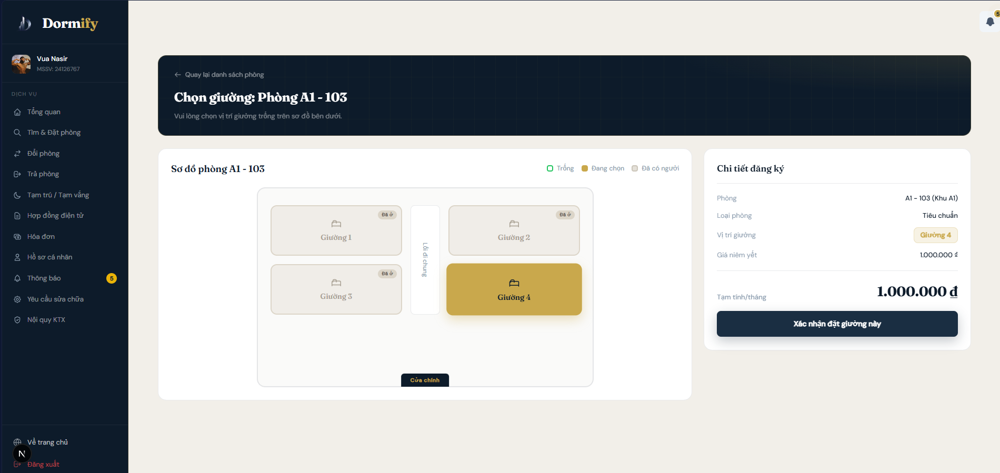
- PA3 asset screenshot evidence covering the basic flow and alternative flows for UC-ROOM-04.

**Relationships:**
- Includes UC-ROOM-03 View Room Details.

**Traceability:** FR11, ST09

---

### UC-ROOM-05 — Track Room Application Status

> _Performed by:_ Trần Huỳnh Mạnh Đạt | _Reviewed by:_ Đào Duy Anh | _Edited by:_ Trần Huỳnh Mạnh Đạt

**Use-case ID:** UC-ROOM-05  
**Use-case name:** Track Room Application Status  
**Actor(s):** Student  
**Supporting Actor(s):** None  
**Description:** A student reviews current and previous room application decisions.  
**Trigger:** The student opens My Room Applications.

**Preconditions:**
1. The student is authenticated.

**Basic Flow (Main Success Scenario):**
1. The system retrieves the student’s applications.
2. The system displays pending, approved, rejected, or cancelled status with submission and decision dates.
3. The student opens an application to view room and decision details.

**Alternative Flows:**
- A1. No applications: the system provides a link to room search.
- A2. Pending application cancellation is allowed: the student confirms cancellation and the system marks it cancelled.

**Postconditions:**
- No data is changed unless a pending application is cancelled.

**Special Requirements:**
- None.

**Prototype Screens:**
- 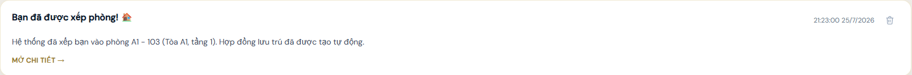
- PA3 asset screenshot evidence covering the basic flow and alternative flows for UC-ROOM-05.

**Relationships:**
- None.

**Traceability:** FR11, ST10

---

### UC-ROOM-06 — Review Room Application

> _Performed by:_ Trần Huỳnh Mạnh Đạt | _Reviewed by:_ Đào Duy Anh | _Edited by:_ Trần Huỳnh Mạnh Đạt

**Use-case ID:** UC-ROOM-06  
**Use-case name:** Review Room Application  
**Actor(s):** Dormitory Manager  
**Supporting Actor(s):** None  
**Description:** The manager reviews an applicant profile and approves or rejects a room application.  
**Trigger:** A pending application appears in the manager queue.

**Preconditions:**
1. The actor is authenticated as Dormitory Manager.
2. The application is pending.

**Basic Flow (Main Success Scenario):**
1. The system displays the application, applicant profile, selected room, and current capacity.
2. The manager checks eligibility and supporting information.
3. The manager selects Approve or Reject and optionally enters a note.
4. For approval, the system reserves a bed, creates the room assignment and rental contract, and updates occupancy atomically.
5. The system updates the application status and notifies the student.

**Alternative Flows:**
- A1. Room is full at approval time: approval is rejected and the manager may select another room or reject the application.
- A2. Applicant becomes ineligible or already assigned: the system blocks approval.
- A3. Rejection: no room or contract is created.

**Postconditions:**
- The application is approved or rejected.
- Approved students receive an assignment and contract.

**Special Requirements:**
- Approval must prevent over-capacity under concurrent requests.

**Prototype Screens:**
- 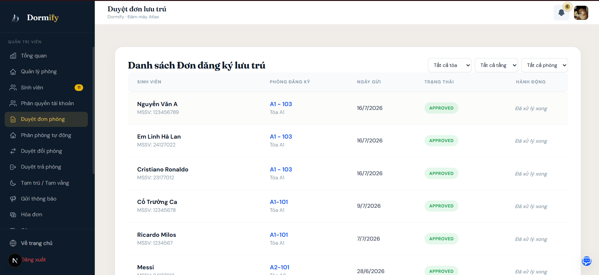
- PA3 asset screenshot evidence covering the basic flow and alternative flows for UC-ROOM-06.

**Relationships:**
- None.

**Traceability:** FR11

---

### UC-ROOM-07 — Run Automatic Room Allocation

> _Performed by:_ Trần Huỳnh Mạnh Đạt | _Reviewed by:_ Đào Duy Anh | _Edited by:_ Trần Huỳnh Mạnh Đạt

**Use-case ID:** UC-ROOM-07  
**Use-case name:** Run Automatic Room Allocation  
**Actor(s):** Dormitory Manager  
**Supporting Actor(s):** None  
**Description:** The manager automatically allocates many eligible students to rooms based on preferences, gender, capacity, and availability.  
**Trigger:** The manager starts an automatic allocation run.

**Preconditions:**
1. The actor is authenticated as Dormitory Manager.
2. Eligible unassigned students and available beds exist.

**Basic Flow (Main Success Scenario):**
1. The system previews candidates and available capacity.
2. The manager selects the candidate set and confirms allocation rules.
3. The system orders candidates according to the configured priority.
4. For each candidate, the system selects a compatible room and reserves a bed.
5. The system creates approved applications/assignments and rental contracts.
6. The system returns a result report and notifies assigned students.

**Alternative Flows:**
- A1. No compatible room for a student: the system skips the student and records the reason.
- A2. Capacity changes during the run: the system retries another compatible room or skips the candidate.
- A3. Manager cancels before confirmation: no assignment is made.

**Postconditions:**
- Zero or more students are assigned without exceeding capacity.
- An allocation report is stored or available for review.

**Special Requirements:**
- Allocation must be deterministic or auditable for the same inputs and rule set.

**Prototype Screens:**
- 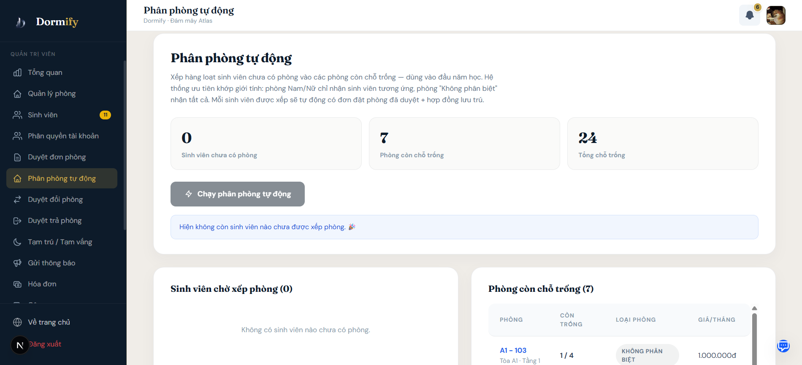
- PA3 asset screenshot evidence covering the basic flow and alternative flows for UC-ROOM-07.

**Relationships:**
- None.

**Traceability:** FR12

---

### UC-ROOM-08 — Submit Room Transfer Request

> _Performed by:_ Trần Huỳnh Mạnh Đạt | _Reviewed by:_ Đào Duy Anh | _Edited by:_ Trần Huỳnh Mạnh Đạt

**Use-case ID:** UC-ROOM-08  
**Use-case name:** Submit Room Transfer Request  
**Actor(s):** Student  
**Supporting Actor(s):** None  
**Description:** A resident requests transfer from the current room to another suitable room.  
**Trigger:** The student selects Request Room Transfer.

**Preconditions:**
1. The student is authenticated.
2. The student has an active room assignment and contract.
3. No conflicting pending transfer request exists.

**Basic Flow (Main Success Scenario):**
1. The student selects a preferred destination room or transfer preferences.
2. The student enters a reason and submits.
3. The system validates destination availability and policy constraints.
4. The system creates a pending transfer request and notifies the Dormitory Manager.

**Alternative Flows:**
- A1. Destination is the current room: the system rejects the request.
- A2. No available destination: the student may submit preferences without a fixed room if policy allows.
- A3. Existing pending transfer: the duplicate request is rejected.

**Postconditions:**
- A pending transfer request exists.

**Special Requirements:**
- None.

**Prototype Screens:**
- 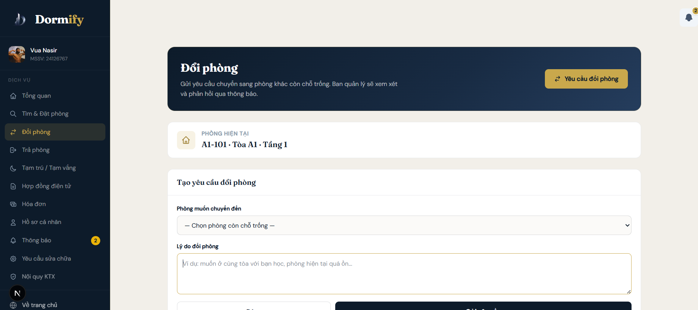
- PA3 asset screenshot evidence covering the basic flow and alternative flows for UC-ROOM-08.

**Relationships:**
- None.

**Traceability:** FR13

---

### UC-ROOM-09 — Track Room Transfer Status

> _Performed by:_ Trần Huỳnh Mạnh Đạt | _Reviewed by:_ Đào Duy Anh | _Edited by:_ Trần Huỳnh Mạnh Đạt

**Use-case ID:** UC-ROOM-09  
**Use-case name:** Track Room Transfer Status  
**Actor(s):** Student  
**Supporting Actor(s):** None  
**Description:** A student reviews the processing status and result of room transfer requests.  
**Trigger:** The student opens My Transfer Requests.

**Preconditions:**
1. The student is authenticated.

**Basic Flow (Main Success Scenario):**
1. The system displays transfer requests and their pending, approved, rejected, or cancelled status.
2. The student opens a request to view source room, destination, reason, notes, and decision date.

**Alternative Flows:**
- A1. Pending request may be cancelled according to policy.
- A2. No transfer history: the system displays an empty state.

**Postconditions:**
- No data is changed unless cancellation is performed.

**Special Requirements:**
- None.

**Prototype Screens:**
- 
- PA3 asset screenshot evidence covering the basic flow and alternative flows for UC-ROOM-09.

**Relationships:**
- None.

**Traceability:** FR13

---

### UC-ROOM-10 — Review Room Transfer Request

> _Performed by:_ Trần Huỳnh Mạnh Đạt | _Reviewed by:_ Đào Duy Anh | _Edited by:_ Trần Huỳnh Mạnh Đạt

**Use-case ID:** UC-ROOM-10  
**Use-case name:** Review Room Transfer Request  
**Actor(s):** Dormitory Manager  
**Supporting Actor(s):** None  
**Description:** The manager approves or rejects a transfer and records the transfer history.  
**Trigger:** A pending transfer request appears in the manager queue.

**Preconditions:**
1. The actor is authenticated as Dormitory Manager.
2. The student has an active assignment.
3. The request is pending.

**Basic Flow (Main Success Scenario):**
1. The system displays the student, source room, requested destination/preferences, and reason.
2. The manager checks destination capacity and compatibility.
3. The manager approves with a destination room or rejects with a note.
4. On approval, the system releases the old bed, reserves the new bed, updates the assignment/contract as required, and records transfer history atomically.
5. The system updates the request and notifies the student.

**Alternative Flows:**
- A1. Destination fills before approval: the system requests another room.
- A2. Student no longer occupies the source room: the request is invalidated.
- A3. Rejection: existing assignment remains unchanged.

**Postconditions:**
- Approved transfer changes the active room and creates a history record; rejected transfer makes no room change.

**Special Requirements:**
- None.

**Prototype Screens:**
- 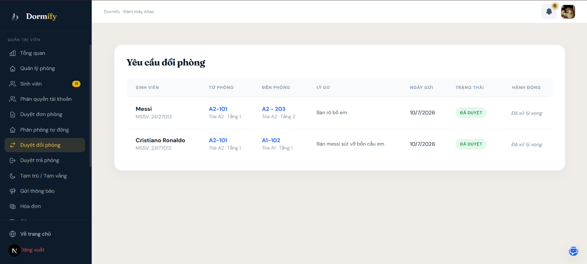
- PA3 asset screenshot evidence covering the basic flow and alternative flows for UC-ROOM-10.

**Relationships:**
- None.

**Traceability:** FR13

---

## 5. Contract Management

> _Performed by:_ Trần Huỳnh Mạnh Đạt | _Reviewed by:_ Đào Duy Anh | _Edited by:_ Trần Huỳnh Mạnh Đạt

Creation, extension, liquidation, viewing, and PDF export of rental contracts.

| ID | Use case | Primary actor |
| --- | --- | --- |
| UC-CON-01 | Create Rental Contract | Dormitory Manager |
| UC-CON-02 | Extend Rental Contract | Dormitory Manager |
| UC-CON-03 | Liquidate Rental Contract | Dormitory Manager |
| UC-CON-04 | Export Contract PDF | Dormitory Manager |
| UC-CON-05 | View Rental Contract | Student |
| UC-CON-06 | Download Contract PDF | Student |

### UC-CON-01 — Create Rental Contract

> _Performed by:_ Trần Huỳnh Mạnh Đạt | _Reviewed by:_ Đào Duy Anh | _Edited by:_ Trần Huỳnh Mạnh Đạt

**Use-case ID:** UC-CON-01  
**Use-case name:** Create Rental Contract  
**Actor(s):** Dormitory Manager  
**Supporting Actor(s):** None  
**Description:** The manager creates a rental contract after a room application or automatic allocation has been approved.  
**Trigger:** An approved assignment requires a contract.

**Preconditions:**
1. The student has an approved room assignment.
2. No conflicting active contract exists.

**Basic Flow (Main Success Scenario):**
1. The system pre-fills student, room, rental fee, deposit, start date, and standard terms.
2. The manager reviews and completes required contract data.
3. The system validates dates, fees, and uniqueness.
4. The manager confirms creation.
5. The system stores an active contract and associates it with the student and room.
6. The student is notified that the contract is available.

**Alternative Flows:**
- A1. Conflicting active contract: creation is rejected.
- A2. Invalid date range or fee: correction is required.
- A3. Manager cancels: no contract is created.

**Postconditions:**
- An active rental contract exists.

**Special Requirements:**
- Contract number must be unique and immutable.

**Prototype Screens:**
- 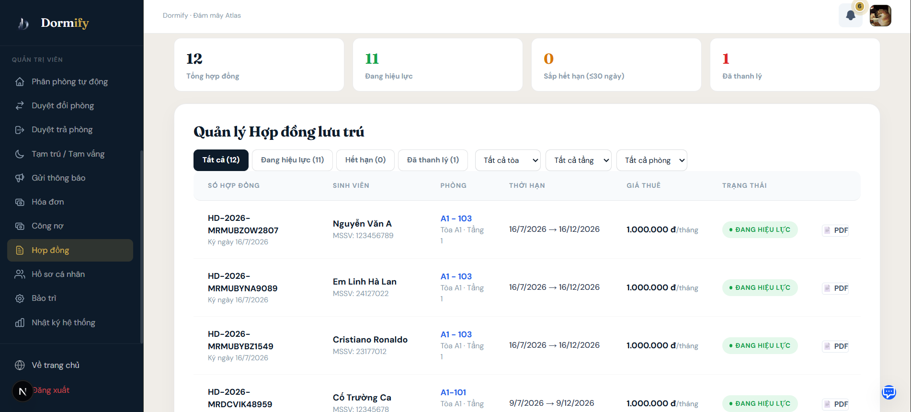
- PA3 asset screenshot evidence covering the basic flow and alternative flows for UC-CON-01.

**Relationships:**
- None.

**Traceability:** FR14

---

### UC-CON-02 — Extend Rental Contract

> _Performed by:_ Trần Huỳnh Mạnh Đạt | _Reviewed by:_ Đào Duy Anh | _Edited by:_ Trần Huỳnh Mạnh Đạt

**Use-case ID:** UC-CON-02  
**Use-case name:** Extend Rental Contract  
**Actor(s):** Dormitory Manager  
**Supporting Actor(s):** None  
**Description:** The manager extends the end date of an eligible active rental contract.  
**Trigger:** The manager selects Extend contract.

**Preconditions:**
1. The actor is authenticated as Dormitory Manager.
2. The contract is active and eligible for extension.

**Basic Flow (Main Success Scenario):**
1. The system displays current contract dates and room information.
2. The manager enters the extension period or new end date.
3. The system checks policy, room availability, and date validity.
4. The manager confirms.
5. The system updates the contract and records the extension history.
6. The student is notified.

**Alternative Flows:**
- A1. Contract already terminated/expired beyond policy: extension is rejected.
- A2. Room unavailable for the extension period: the system requires another arrangement.
- A3. Invalid date: the system requests correction.

**Postconditions:**
- The contract end date and extension history are updated.

**Special Requirements:**
- None.

**Prototype Screens:**
- 
- PA3 asset screenshot evidence covering the basic flow and alternative flows for UC-CON-02.

**Relationships:**
- None.

**Traceability:** FR14, FR15

---

### UC-CON-03 — Liquidate Rental Contract

> _Performed by:_ Trần Huỳnh Mạnh Đạt | _Reviewed by:_ Đào Duy Anh | _Edited by:_ Trần Huỳnh Mạnh Đạt

**Use-case ID:** UC-CON-03  
**Use-case name:** Liquidate Rental Contract  
**Actor(s):** Dormitory Manager  
**Supporting Actor(s):** None  
**Description:** The manager formally terminates a rental contract and records the liquidation.  
**Trigger:** The manager selects Liquidate contract or checkout completion invokes this use case.

**Preconditions:**
1. The actor is authenticated as Dormitory Manager or the use case is invoked by checkout completion.
2. An active contract exists.

**Basic Flow (Main Success Scenario):**
1. The system displays contract obligations, outstanding invoices, and related checkout data.
2. The manager confirms the effective termination date and reason.
3. The system validates that required checkout/settlement conditions are satisfied.
4. The system changes the contract status to liquidated/terminated and records the event.
5. The system releases the room assignment when appropriate and notifies the student.

**Alternative Flows:**
- A1. Outstanding mandatory settlement: liquidation is blocked or marked pending settlement according to policy.
- A2. Already terminated contract: the system returns the existing status without duplicate processing.

**Postconditions:**
- The contract is no longer active.
- The liquidation history is stored.

**Special Requirements:**
- None.

**Prototype Screens:**
- 
- PA3 asset screenshot evidence covering the basic flow and alternative flows for UC-CON-03.

**Relationships:**
- Included by UC-CHK-04 Refund Deposit and Complete Checkout.

**Traceability:** FR14, FR16

---

### UC-CON-04 — Export Contract PDF

> _Performed by:_ Trần Huỳnh Mạnh Đạt | _Reviewed by:_ Đào Duy Anh | _Edited by:_ Trần Huỳnh Mạnh Đạt

**Use-case ID:** UC-CON-04  
**Use-case name:** Export Contract PDF  
**Actor(s):** Dormitory Manager  
**Supporting Actor(s):** None  
**Description:** The manager exports a contract as a formatted PDF for administration or signing.  
**Trigger:** The manager selects Export PDF on a contract.

**Preconditions:**
1. The contract exists.

**Basic Flow (Main Success Scenario):**
1. The system retrieves the current contract and related student/room data.
2. The system renders the contract using the approved template.
3. The system provides the PDF for download or printing.
4. The export event may be recorded.

**Alternative Flows:**
- A1. Required data is missing: the system identifies the incomplete fields and does not generate an invalid document.
- A2. PDF generation fails: the system reports the error and preserves the contract.

**Postconditions:**
- A PDF representation is generated; the contract data is unchanged.

**Special Requirements:**
- The PDF must preserve Vietnamese characters and display a contract number/version.

**Prototype Screens:**
- 
- 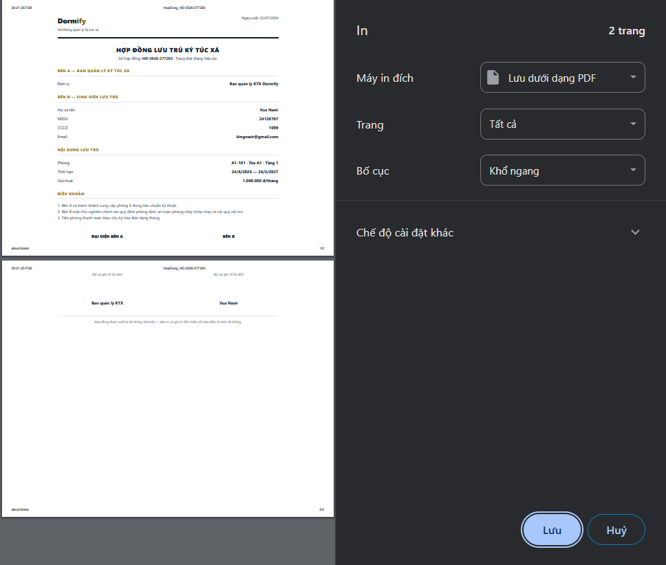
- PA3 asset screenshot evidence covering the basic flow and alternative flows for UC-CON-04.

**Relationships:**
- None.

**Traceability:** FR14, FR17

---

### UC-CON-05 — View Rental Contract

> _Performed by:_ Trần Huỳnh Mạnh Đạt | _Reviewed by:_ Đào Duy Anh | _Edited by:_ Trần Huỳnh Mạnh Đạt

**Use-case ID:** UC-CON-05  
**Use-case name:** View Rental Contract  
**Actor(s):** Student  
**Supporting Actor(s):** None  
**Description:** A student views the active and historical rental contract information.  
**Trigger:** The student opens My Contract.

**Preconditions:**
1. The student is authenticated.

**Basic Flow (Main Success Scenario):**
1. The system retrieves contracts belonging to the student.
2. The system displays contract number, room, term, fees, deposit, status, and terms.
3. The student may select a historical contract.

**Alternative Flows:**
- A1. No contract exists: the system displays an empty state.
- A2. Only historical contracts exist: the system lists historical contracts and clearly indicates that no active contract is available.
- A3. Contract file unavailable: the system displays contract metadata and tells the student to contact dormitory management for the official document.

**Postconditions:**
- No data is changed.

**Special Requirements:**
- None.

**Prototype Screens:**
- 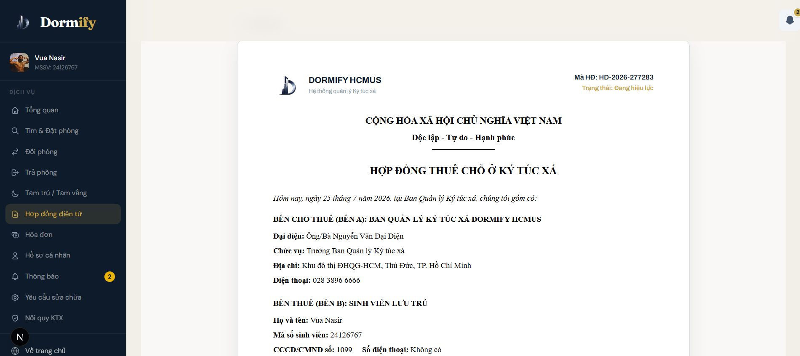
- PA3 asset screenshot evidence covering the basic flow and alternative flows for UC-CON-05.

**Relationships:**
- None.

**Traceability:** ST11

---

### UC-CON-06 — Download Contract PDF

> _Performed by:_ Trần Huỳnh Mạnh Đạt | _Reviewed by:_ Đào Duy Anh | _Edited by:_ Trần Huỳnh Mạnh Đạt

**Use-case ID:** UC-CON-06  
**Use-case name:** Download Contract PDF  
**Actor(s):** Student  
**Supporting Actor(s):** None  
**Description:** A student downloads a PDF copy of a contract being viewed.  
**Trigger:** The student selects Download PDF.

**Preconditions:**
1. The student is authenticated.
2. The selected contract belongs to the student.

**Basic Flow (Main Success Scenario):**
1. The system verifies ownership.
2. The system generates or retrieves the contract PDF.
3. The browser downloads the PDF.

**Alternative Flows:**
- A1. Unauthorized contract identifier: access is denied.
- A2. PDF generation unavailable: the system displays an error and keeps the contract view open.

**Postconditions:**
- A PDF copy is delivered; no contract data is changed.

**Special Requirements:**
- None.

**Prototype Screens:**
- 
- 
- PA3 asset screenshot evidence covering the basic flow and alternative flows for UC-CON-06.

**Relationships:**
- Extends UC-CON-05 View Rental Contract.

**Traceability:** FR17, ST12

---

## 6. Checkout and Deposit Refund

> _Performed by:_ Trần Huỳnh Mạnh Đạt | _Reviewed by:_ Đào Duy Anh | _Edited by:_ Trần Huỳnh Mạnh Đạt

Student checkout requests, inspection, compensation calculation, deposit refund, and stay closure.

| ID | Use case | Primary actor |
| --- | --- | --- |
| UC-CHK-01 | Submit Checkout Request | Student |
| UC-CHK-02 | Review Checkout Request | Dormitory Manager |
| UC-CHK-03 | Calculate Compensation Fee | Dormitory Manager |
| UC-CHK-04 | Refund Deposit and Complete Checkout | Dormitory Manager |

### UC-CHK-01 — Submit Checkout Request

> _Performed by:_ Trần Huỳnh Mạnh Đạt | _Reviewed by:_ Đào Duy Anh | _Edited by:_ Trần Huỳnh Mạnh Đạt

**Use-case ID:** UC-CHK-01  
**Use-case name:** Submit Checkout Request  
**Actor(s):** Student  
**Supporting Actor(s):** None  
**Description:** A resident requests to leave the assigned room on an expected date.  
**Trigger:** The student selects Request Checkout.

**Preconditions:**
1. The student is authenticated.
2. The student has an active room assignment and contract.
3. No pending checkout request exists.

**Basic Flow (Main Success Scenario):**
1. The student enters expected departure date and reason.
2. The system validates the date and active residence.
3. The system creates a pending checkout request.
4. The system notifies the Dormitory Manager.
5. The system displays the request reference and status.

**Alternative Flows:**
- A1. Departure date is in the past: the system requests a valid date.
- A2. No active room/contract: the request is rejected.
- A3. Existing pending checkout: the system directs the student to the existing request.

**Postconditions:**
- A pending checkout request exists.

**Special Requirements:**
- None.

**Prototype Screens:**
- 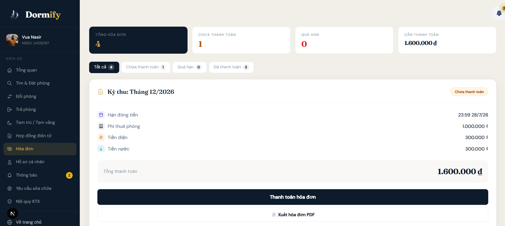
- PA3 asset screenshot evidence covering the basic flow and alternative flows for UC-CHK-01.

**Relationships:**
- None.

**Traceability:** FR18

---

### UC-CHK-02 — Review Checkout Request

> _Performed by:_ Trần Huỳnh Mạnh Đạt | _Reviewed by:_ Đào Duy Anh | _Edited by:_ Trần Huỳnh Mạnh Đạt

**Use-case ID:** UC-CHK-02  
**Use-case name:** Review Checkout Request  
**Actor(s):** Dormitory Manager  
**Supporting Actor(s):** None  
**Description:** The manager reviews the checkout request, plans inspection, and accepts or rejects processing.  
**Trigger:** The manager opens a pending checkout request.

**Preconditions:**
1. The actor is authenticated as Dormitory Manager.
2. The checkout request is pending.

**Basic Flow (Main Success Scenario):**
1. The system displays the student, room, contract, departure date, and reason.
2. The manager verifies outstanding obligations and inspects room assets.
3. The manager records notes and decides to reject or proceed to completion.
4. If damage or missing assets are identified, UC-CHK-03 is invoked.
5. The system saves the review decision and notifies the student when rejected or scheduled.

**Alternative Flows:**
- A1. Reject request: status becomes rejected and no contract/room change occurs.
- A2. Inspection cannot be completed: the request remains pending with a scheduled follow-up.
- A3. No damage: the manager proceeds directly to UC-CHK-04 with zero compensation.

**Postconditions:**
- The request is rejected, remains pending for inspection, or is ready for completion.

**Special Requirements:**
- None.

**Prototype Screens:**
- 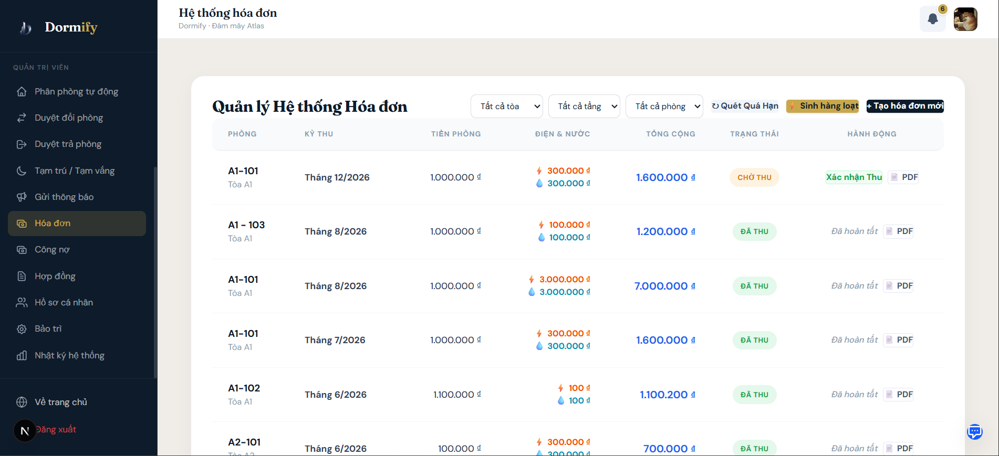
- 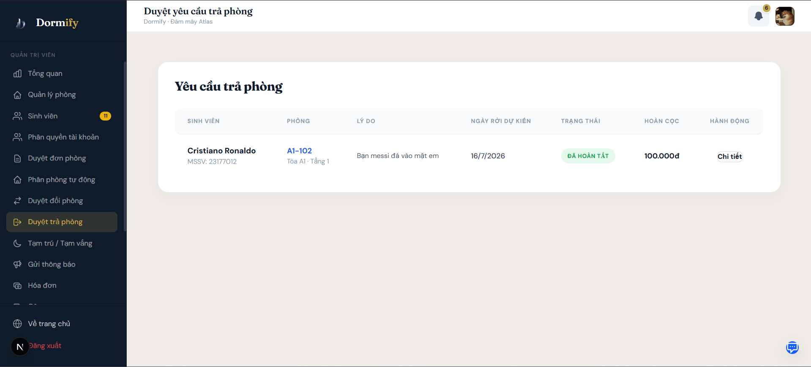
- PA3 asset screenshot evidence covering the basic flow and alternative flows for UC-CHK-02.

**Relationships:**
- None.

**Traceability:** FR18, FR19

---

### UC-CHK-03 — Calculate Compensation Fee

> _Performed by:_ Trần Huỳnh Mạnh Đạt | _Reviewed by:_ Đào Duy Anh | _Edited by:_ Trần Huỳnh Mạnh Đạt

**Use-case ID:** UC-CHK-03  
**Use-case name:** Calculate Compensation Fee  
**Actor(s):** Dormitory Manager  
**Supporting Actor(s):** None  
**Description:** The manager records damaged or missing items and the system calculates deductions from the deposit.  
**Trigger:** Damage is found during checkout review.

**Preconditions:**
1. UC-CHK-02 is in progress.
2. A deposit amount or settlement basis is known.

**Basic Flow (Main Success Scenario):**
1. The manager adds each damaged/missing item, quantity, condition, fee, and note.
2. The system validates non-negative values and calculates the compensation total.
3. The system calculates the refundable deposit as the greater of zero and deposit minus compensation.
4. The manager reviews and confirms the calculation for checkout completion.

**Alternative Flows:**
- A1. No damage item remains: compensation becomes zero.
- A2. Compensation exceeds deposit: refund becomes zero and the excess is recorded as an amount owed according to policy.
- A3. Invalid fee or incomplete item: confirmation is blocked.

**Postconditions:**
- A compensation breakdown is prepared for UC-CHK-04.

**Special Requirements:**
- None.

**Prototype Screens:**
- 
- PA3 asset screenshot evidence covering the basic flow and alternative flows for UC-CHK-03.

**Relationships:**
- Extends UC-CHK-02 Review Checkout Request.

**Traceability:** FR19, FR20

---

### UC-CHK-04 — Refund Deposit and Complete Checkout

> _Performed by:_ Trần Huỳnh Mạnh Đạt | _Reviewed by:_ Đào Duy Anh | _Edited by:_ Trần Huỳnh Mạnh Đạt

**Use-case ID:** UC-CHK-04  
**Use-case name:** Refund Deposit and Complete Checkout  
**Actor(s):** Dormitory Manager  
**Supporting Actor(s):** None  
**Description:** The manager finalizes checkout, determines the refund, liquidates the contract, and releases the room.  
**Trigger:** The manager confirms checkout completion.

**Preconditions:**
1. The checkout request has been reviewed.
2. Compensation has been calculated or confirmed as zero.

**Basic Flow (Main Success Scenario):**
1. The system displays deposit, compensation, refund, outstanding balance, and final checkout details.
2. The manager confirms the final settlement and payment method/status.
3. The system records the refund amount and completion date.
4. The system invokes UC-CON-03 to liquidate the rental contract.
5. The system releases the bed, updates room occupancy, and closes the residence assignment atomically.
6. The system notifies the student and makes the completed checkout record available.

**Alternative Flows:**
- A1. Refund processing fails: operational checkout remains pending settlement and room release follows configured policy.
- A2. Concurrent room/contract change: the transaction is stopped and the manager refreshes the request.
- A3. Additional amount owed: the system creates or records the debt before completion according to policy.

**Postconditions:**
- Checkout is completed.
- The contract is liquidated and the room/bed is released.
- Refund and compensation records are stored.

**Special Requirements:**
- None.

**Prototype Screens:**
- 
- PA3 asset screenshot evidence covering the basic flow and alternative flows for UC-CHK-04.

**Relationships:**
- Includes UC-CON-03 Liquidate Rental Contract.

**Traceability:** FR21

---

## 7. Finance and Meter Management

> _Performed by:_ Trần Huỳnh Mạnh Đạt | _Reviewed by:_ Đào Duy Anh | _Edited by:_ Trần Huỳnh Mạnh Đạt

Meter readings, invoices, payments, debts, reminders, overdue processing, and revenue reporting.

| ID | Use case | Primary actor |
| --- | --- | --- |
| UC-FIN-01 | Manage Electricity and Water Meter Readings | Dormitory Manager |
| UC-FIN-02 | Create or Bulk-Generate Invoices | Dormitory Manager |
| UC-FIN-03 | Mark Invoice as Paid Manually | Dormitory Manager |
| UC-FIN-04 | View Debt Summary | Dormitory Manager |
| UC-FIN-05 | Send Debt Reminders | Dormitory Manager, Scheduled Trigger |
| UC-FIN-06 | Generate Revenue Report | Dormitory Manager |
| UC-FIN-07 | Mark Overdue Invoices | Scheduled Trigger |
| UC-FIN-08 | View Invoices | Student |
| UC-FIN-09 | Pay Invoice | Student |
| UC-FIN-10 | View Payment History | Student |
| UC-FIN-11 | Download Invoice PDF | Student |

### UC-FIN-01 — Manage Electricity and Water Meter Readings

> _Performed by:_ Trần Huỳnh Mạnh Đạt | _Reviewed by:_ Đào Duy Anh | _Edited by:_ Trần Huỳnh Mạnh Đạt

**Use-case ID:** UC-FIN-01  
**Use-case name:** Manage Electricity and Water Meter Readings  
**Actor(s):** Dormitory Manager  
**Supporting Actor(s):** None  
**Description:** The manager records opening and closing electricity/water readings, uploads meter evidence, and reviews consumption history.  
**Trigger:** The manager opens Meter Management for a billing period.

**Preconditions:**
1. The actor is authenticated as Dormitory Manager.
2. The room and billing period exist.

**Basic Flow (Main Success Scenario):**
1. The system displays rooms and the previous closing readings.
2. The manager enters opening/closing electricity and water readings and uploads meter photos.
3. The system validates that closing readings are not lower than opening readings.
4. The system calculates consumption.
5. The manager confirms and the system stores the readings and evidence.
6. The manager may view historical readings and consumption trends.

**Alternative Flows:**
- A1. Duplicate room/period reading: the system requests editing the existing record.
- A2. Closing reading lower than opening: submission is rejected.
- A3. Photo upload fails: the system follows the configured evidence requirement and reports the failure.

**Postconditions:**
- Meter readings and consumption history are stored.

**Special Requirements:**
- Photo files must be restricted by type and size.

**Prototype Screens:**
- 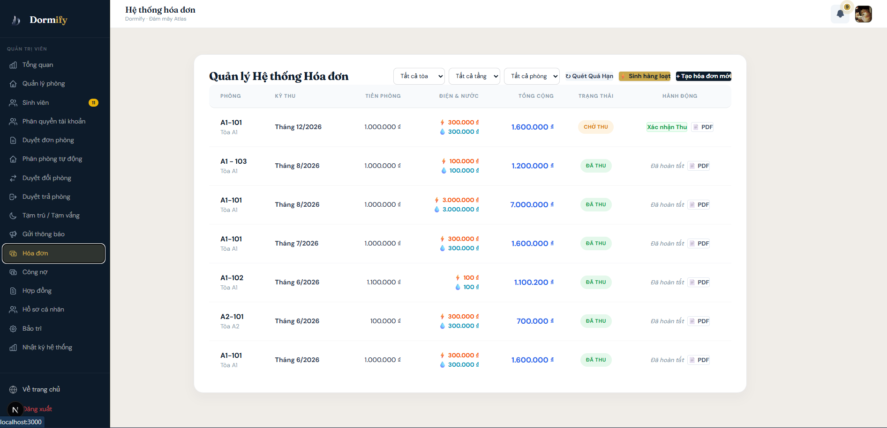
- PA3 asset screenshot evidence covering the basic flow and alternative flows for UC-FIN-01.

**Relationships:**
- None.

**Traceability:** FR22, FM04, FM05, FM06, FM07, FM08, FM09

---

### UC-FIN-02 — Create or Bulk-Generate Invoices

> _Performed by:_ Trần Huỳnh Mạnh Đạt | _Reviewed by:_ Đào Duy Anh | _Edited by:_ Trần Huỳnh Mạnh Đạt

**Use-case ID:** UC-FIN-02  
**Use-case name:** Create or Bulk-Generate Invoices  
**Actor(s):** Dormitory Manager  
**Supporting Actor(s):** None  
**Description:** The manager creates individual or bulk invoices for accommodation, electricity, water, repairs, or other approved charges.  
**Trigger:** The manager starts invoice generation for a billing period.

**Preconditions:**
1. The actor is authenticated as Dormitory Manager.
2. Required room, contract, tariff, and meter data exist.

**Basic Flow (Main Success Scenario):**
1. The manager selects billing period and invoice type.
2. The system loads eligible rooms/students and calculates applicable charges.
3. The manager reviews generated amounts and due dates.
4. The system validates that duplicate invoices are not created for the same charge and period.
5. The manager confirms creation.
6. The system stores pending invoices and notifies affected students.

**Alternative Flows:**
- A1. Missing meter/tariff data: affected invoices are skipped and listed in an error report.
- A2. Duplicate invoice: the system excludes it or requires explicit correction, not duplication.
- A3. Single invoice: the manager selects one student/room and enters the charge manually.

**Postconditions:**
- One or more pending invoices exist.

**Special Requirements:**
- Currency amounts must use integer VND or a defined decimal policy.

**Prototype Screens:**
- 
- PA3 asset screenshot evidence covering the basic flow and alternative flows for UC-FIN-02.

**Relationships:**
- None.

**Traceability:** FR22

---

### UC-FIN-03 — Mark Invoice as Paid Manually

> _Performed by:_ Trần Huỳnh Mạnh Đạt | _Reviewed by:_ Đào Duy Anh | _Edited by:_ Trần Huỳnh Mạnh Đạt

**Use-case ID:** UC-FIN-03  
**Use-case name:** Mark Invoice as Paid Manually  
**Actor(s):** Dormitory Manager  
**Supporting Actor(s):** None  
**Description:** The manager confirms an offline payment such as cash or verified bank transfer.  
**Trigger:** The manager selects Mark as paid.

**Preconditions:**
1. The invoice exists and is pending or overdue.
2. The actor is authenticated as Dormitory Manager.

**Basic Flow (Main Success Scenario):**
1. The system displays invoice and payer details.
2. The manager enters payment date, method, reference, and optional evidence.
3. The system validates the payment amount.
4. The manager confirms.
5. The system marks the invoice paid, records payment history, and notifies the student.

**Alternative Flows:**
- A1. Invoice already paid: duplicate confirmation is blocked.
- A2. Partial amount: the system follows configured partial-payment policy or rejects the action.
- A3. Invalid reference/evidence: the system requests correction.

**Postconditions:**
- The invoice is paid and a payment record exists.

**Special Requirements:**
- None.

**Prototype Screens:**
- 
- PA3 asset screenshot evidence covering the basic flow and alternative flows for UC-FIN-03.

**Relationships:**
- None.

**Traceability:** FR22

---

### UC-FIN-04 — View Debt Summary

> _Performed by:_ Trần Huỳnh Mạnh Đạt | _Reviewed by:_ Đào Duy Anh | _Edited by:_ Trần Huỳnh Mạnh Đạt

**Use-case ID:** UC-FIN-04  
**Use-case name:** View Debt Summary  
**Actor(s):** Dormitory Manager  
**Supporting Actor(s):** None  
**Description:** The manager reviews unpaid and overdue amounts by student, room, building, or period.  
**Trigger:** The manager opens Debt Management.

**Preconditions:**
1. The actor is authenticated as Dormitory Manager.

**Basic Flow (Main Success Scenario):**
1. The system aggregates pending and overdue invoices.
2. The system displays total debt, overdue count, oldest due date, students/rooms involved, and filters.
3. The manager opens a debtor entry to view invoice details and available actions.

**Alternative Flows:**
- A1. No debt exists: the system displays a positive empty state.
- A2. Data changes during review: totals refresh to the latest values.

**Postconditions:**
- No data is changed.

**Special Requirements:**
- None.

**Prototype Screens:**
- 
- PA3 asset screenshot evidence covering the basic flow and alternative flows for UC-FIN-04.

**Relationships:**
- None.

**Traceability:** FR23

---

### UC-FIN-05 — Send Debt Reminders

> _Performed by:_ Trần Huỳnh Mạnh Đạt | _Reviewed by:_ Đào Duy Anh | _Edited by:_ Trần Huỳnh Mạnh Đạt

**Use-case ID:** UC-FIN-05  
**Use-case name:** Send Debt Reminders  
**Actor(s):** Dormitory Manager, Scheduled Trigger  
**Supporting Actor(s):** None  
**Description:** The system sends manual or scheduled reminders for unpaid or overdue invoices.  
**Trigger:** A manager selects Send reminder, or the configured schedule is reached.

**Preconditions:**
1. At least one eligible unpaid invoice exists.

**Basic Flow (Main Success Scenario):**
1. The system identifies eligible recipients and invoices.
2. The system composes a reminder containing amount, due date, and payment guidance.
3. For a manual reminder, the manager confirms the target set.
4. The system sends notifications/messages and records reminder time and result.

**Alternative Flows:**
- A1. Invoice was paid before sending: the system excludes it.
- A2. Recipient delivery fails: the failure is recorded and other reminders continue.
- A3. Reminder frequency limit reached: the system postpones or blocks duplicate reminders.

**Postconditions:**
- Reminder records are created and messages are sent or queued.

**Special Requirements:**
- Scheduled reminders must avoid excessive or duplicate messaging.

**Prototype Screens:**
- 
- 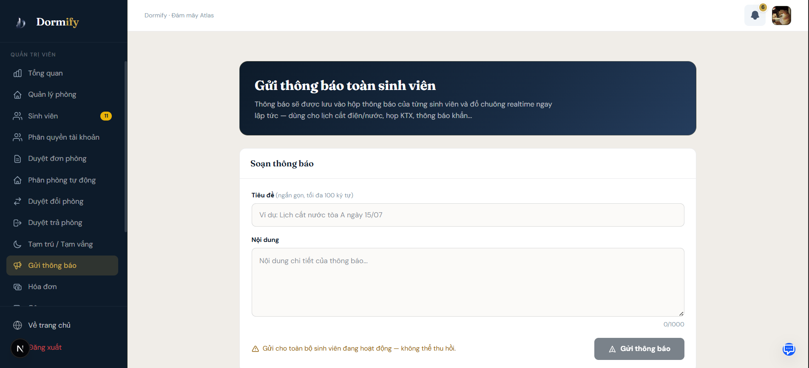
- PA3 asset screenshot evidence covering the basic flow and alternative flows for UC-FIN-05.

**Relationships:**
- None.

**Traceability:** FR23

---

### UC-FIN-06 — Generate Revenue Report

> _Performed by:_ Trần Huỳnh Mạnh Đạt | _Reviewed by:_ Đào Duy Anh | _Edited by:_ Trần Huỳnh Mạnh Đạt

**Use-case ID:** UC-FIN-06  
**Use-case name:** Generate Revenue Report  
**Actor(s):** Dormitory Manager  
**Supporting Actor(s):** None  
**Description:** The manager generates collected-revenue reports for monthly, quarterly, or yearly periods.  
**Trigger:** The manager opens Revenue Reports and selects a period.

**Preconditions:**
1. The actor is authenticated as Dormitory Manager.

**Basic Flow (Main Success Scenario):**
1. The manager chooses period, grouping, and optional building/charge filters.
2. The system aggregates successfully paid invoices and refunds/adjustments according to accounting rules.
3. The system displays totals and breakdowns by accommodation, electricity, water, repair, and other charges.
4. The manager may export or print the report.

**Alternative Flows:**
- A1. No paid transactions: the report displays zero values.
- A2. Invalid period: the system requests a valid range.
- A3. Export failure: the on-screen report remains available.

**Postconditions:**
- A report is displayed or exported; financial records are unchanged.

**Special Requirements:**
- The report must clearly state whether figures are gross or net of refunds.

**Prototype Screens:**
- 
- 
- PA3 asset screenshot evidence covering the basic flow and alternative flows for UC-FIN-06.

**Relationships:**
- None.

**Traceability:** FR24

---

### UC-FIN-07 — Mark Overdue Invoices

> _Performed by:_ Trần Huỳnh Mạnh Đạt | _Reviewed by:_ Đào Duy Anh | _Edited by:_ Trần Huỳnh Mạnh Đạt

**Use-case ID:** UC-FIN-07  
**Use-case name:** Mark Overdue Invoices  
**Actor(s):** Scheduled Trigger  
**Supporting Actor(s):** Dormitory Manager  
**Description:** The system automatically changes eligible unpaid invoices from pending to overdue.  
**Trigger:** The scheduled overdue check runs or a manager triggers it manually.

**Preconditions:**
1. An unpaid invoice has passed its due date.

**Basic Flow (Main Success Scenario):**
1. The system finds pending invoices with due dates earlier than the current time.
2. The system marks each eligible invoice overdue and records the overdue timestamp.
3. The system sends an overdue notification to affected students.
4. The system records processing results.

**Alternative Flows:**
- A1. Invoice paid concurrently: it is not marked overdue.
- A2. No eligible invoices: the run completes with zero updates.
- A3. Notification failure: invoice status remains updated and delivery is retried/logged.

**Postconditions:**
- Eligible invoices are overdue and appear in the debt summary.

**Special Requirements:**
- None.

**Prototype Screens:**
- 
- PA3 asset screenshot evidence covering the basic flow and alternative flows for UC-FIN-07.

**Relationships:**
- None.

**Traceability:** FR22, FR23

---

### UC-FIN-08 — View Invoices

> _Performed by:_ Trần Huỳnh Mạnh Đạt | _Reviewed by:_ Đào Duy Anh | _Edited by:_ Trần Huỳnh Mạnh Đạt

**Use-case ID:** UC-FIN-08  
**Use-case name:** View Invoices  
**Actor(s):** Student  
**Supporting Actor(s):** None  
**Description:** A student views invoices related to the current or previous residence.  
**Trigger:** The student opens My Invoices.

**Preconditions:**
1. The student is authenticated.

**Basic Flow (Main Success Scenario):**
1. The system retrieves invoices belonging to the student or assigned room according to billing policy.
2. The system displays amount, charge breakdown, due date, status, and billing period.
3. The student opens an invoice to view full details and payment actions.

**Alternative Flows:**
- A1. No invoices: the system displays an empty state.
- A2. Invoice ownership mismatch: access is denied.

**Postconditions:**
- No data is changed.

**Special Requirements:**
- None.

**Prototype Screens:**
- 
- PA3 asset screenshot evidence covering the basic flow and alternative flows for UC-FIN-08.

**Relationships:**
- None.

**Traceability:** FR22, ST13

---

### UC-FIN-09 — Pay Invoice

> _Performed by:_ Trần Huỳnh Mạnh Đạt | _Reviewed by:_ Đào Duy Anh | _Edited by:_ Trần Huỳnh Mạnh Đạt

**Use-case ID:** UC-FIN-09  
**Use-case name:** Pay Invoice  
**Actor(s):** Student  
**Supporting Actor(s):** Payment Gateway  
**Description:** A student pays an invoice using a supported bank or electronic payment provider.  
**Trigger:** The student selects Pay on an unpaid invoice.

**Preconditions:**
1. The student is authenticated.
2. The invoice belongs to the student and is unpaid.

**Basic Flow (Main Success Scenario):**
1. The system displays the payable amount and supported methods.
2. The student selects bank, VNPay, MoMo, ZaloPay, or another configured provider.
3. The system creates a payment transaction and redirects or opens the Payment Gateway.
4. The Payment Gateway processes the payment and returns a signed result.
5. The system verifies the result, records the transaction, updates the invoice when successful, and notifies the student.

**Alternative Flows:**
- A1. Payment cancelled: transaction is recorded as cancelled and invoice remains unpaid.
- A2. Payment failed: transaction is recorded as failed and retry is allowed.
- A3. Callback delayed: transaction remains pending until verified.
- A4. Duplicate callback: the system processes it idempotently.

**Postconditions:**
- Successful payment marks the invoice paid; otherwise it remains unpaid with transaction history.

**Special Requirements:**
- Gateway signatures and transaction identifiers must be verified.

**Prototype Screens:**
- 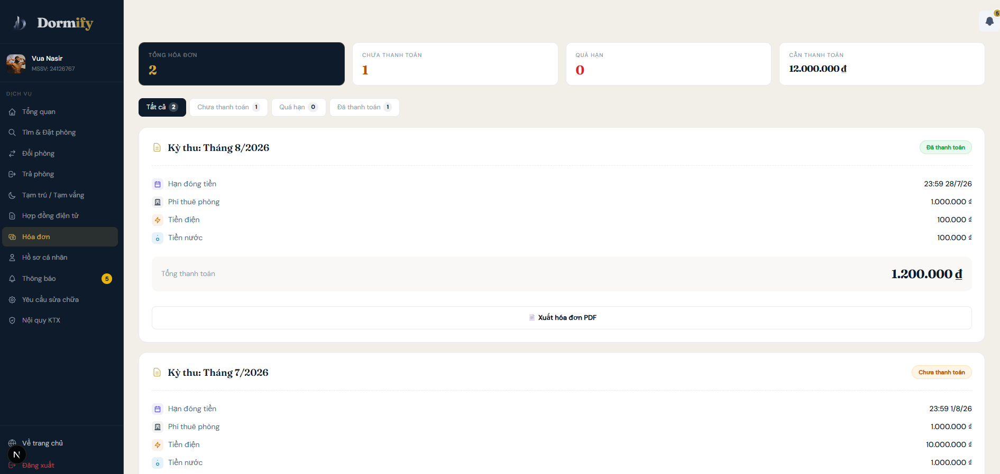
- PA3 asset screenshot evidence covering the basic flow and alternative flows for UC-FIN-09.

**Relationships:**
- None.

**Traceability:** FR22, ST14

---

### UC-FIN-10 — View Payment History

> _Performed by:_ Trần Huỳnh Mạnh Đạt | _Reviewed by:_ Đào Duy Anh | _Edited by:_ Trần Huỳnh Mạnh Đạt

**Use-case ID:** UC-FIN-10  
**Use-case name:** View Payment History  
**Actor(s):** Student  
**Supporting Actor(s):** None  
**Description:** A student reviews successful, pending, failed, and cancelled payment attempts.  
**Trigger:** The student opens Payment History.

**Preconditions:**
1. The student is authenticated.

**Basic Flow (Main Success Scenario):**
1. The system retrieves the student’s payment transactions.
2. The system displays invoice, amount, method, status, transaction reference, and time.
3. The student may open a transaction to view details.

**Alternative Flows:**
- A1. No payment history: the system displays an empty state.
- A2. Filters return no transactions: the system displays an empty filtered state and offers a clear-filter action.
- A3. Payment gateway reference unavailable: the system shows the local payment record and marks the external reference status as unavailable.

**Postconditions:**
- No data is changed.

**Special Requirements:**
- None.

**Prototype Screens:**
- 
- PA3 asset screenshot evidence covering the basic flow and alternative flows for UC-FIN-10.

**Relationships:**
- None.

**Traceability:** FR22, ST15

---

### UC-FIN-11 — Download Invoice PDF

> _Performed by:_ Trần Huỳnh Mạnh Đạt | _Reviewed by:_ Đào Duy Anh | _Edited by:_ Trần Huỳnh Mạnh Đạt

**Use-case ID:** UC-FIN-11  
**Use-case name:** Download Invoice PDF  
**Actor(s):** Student  
**Supporting Actor(s):** None  
**Description:** A student downloads a formatted PDF copy of an invoice.  
**Trigger:** The student selects Download PDF while viewing an invoice.

**Preconditions:**
1. The student is authenticated.
2. The invoice belongs to the student.

**Basic Flow (Main Success Scenario):**
1. The system verifies invoice ownership.
2. The system renders the invoice using the approved template.
3. The system provides the PDF for download.

**Alternative Flows:**
- A1. Unauthorized invoice: access is denied.
- A2. PDF generation fails: the invoice view remains available with an error message.

**Postconditions:**
- A PDF copy is generated; invoice data is unchanged.

**Special Requirements:**
- None.

**Prototype Screens:**
- 
- PA3 asset screenshot evidence covering the basic flow and alternative flows for UC-FIN-11.

**Relationships:**
- Extends UC-FIN-08 View Invoices.

**Traceability:** FR22, ST16

---

## 8. Residence Management

> _Performed by:_ Trần Huỳnh Mạnh Đạt | _Reviewed by:_ Đào Duy Anh | _Edited by:_ Trần Huỳnh Mạnh Đạt

Overnight absence, temporary residence, long-term absence, visitor registration, and management review.

| ID | Use case | Primary actor |
| --- | --- | --- |
| UC-RES-01 | Submit Overnight Absence Declaration | Student |
| UC-RES-02 | Register Temporary Residence | Student |
| UC-RES-03 | Register Long-Term Temporary Absence | Student |
| UC-RES-04 | Register a Visitor | Student |
| UC-RES-05 | Review and Track Residence Declarations | Dormitory Manager |

### UC-RES-01 — Submit Overnight Absence Declaration

> _Performed by:_ Trần Huỳnh Mạnh Đạt | _Reviewed by:_ Đào Duy Anh | _Edited by:_ Trần Huỳnh Mạnh Đạt

**Use-case ID:** UC-RES-01  
**Use-case name:** Submit Overnight Absence Declaration  
**Actor(s):** Student  
**Supporting Actor(s):** None  
**Description:** A resident reports an overnight absence from the dormitory.  
**Trigger:** The student selects Overnight Absence.

**Preconditions:**
1. The student is authenticated.
2. The student has an active room assignment.

**Basic Flow (Main Success Scenario):**
1. The student enters departure time/date, expected return time/date, destination or contact information where required, and reason.
2. The system validates the date range and policy.
3. The system creates a residence declaration and notifies the Dormitory Manager.
4. The system displays the declaration status.

**Alternative Flows:**
- A1. Start time is in the past beyond the allowed tolerance: the system requests correction.
- A2. End precedes start: submission is rejected.
- A3. Conflicting pending declaration: the system warns or rejects according to policy.

**Postconditions:**
- An overnight absence declaration is stored.

**Special Requirements:**
- None.

**Prototype Screens:**
- 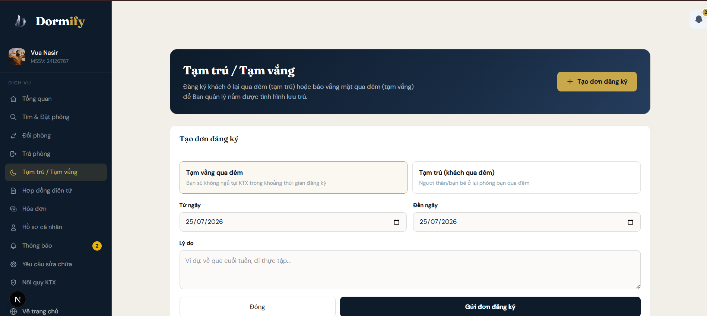
- PA3 asset screenshot evidence covering the basic flow and alternative flows for UC-RES-01.

**Relationships:**
- None.

**Traceability:** FR25, ST21

---

### UC-RES-02 — Register Temporary Residence

> _Performed by:_ Trần Huỳnh Mạnh Đạt | _Reviewed by:_ Đào Duy Anh | _Edited by:_ Trần Huỳnh Mạnh Đạt

**Use-case ID:** UC-RES-02  
**Use-case name:** Register Temporary Residence  
**Actor(s):** Student  
**Supporting Actor(s):** None  
**Description:** A student registers a person temporarily staying overnight in the assigned room.  
**Trigger:** The student selects Temporary Residence Registration.

**Preconditions:**
1. The student is authenticated.
2. The student has an active room assignment.

**Basic Flow (Main Success Scenario):**
1. The student enters guest name, identification number, contact details, relationship, and stay period.
2. The system validates required guest information and dormitory rules.
3. The system creates a pending or registered temporary-residence declaration.
4. The system notifies the Dormitory Manager and displays the status.

**Alternative Flows:**
- A1. Missing guest identification: submission is rejected.
- A2. Stay exceeds the permitted duration: manager approval or a different process is required.
- A3. Room/visitor limit exceeded: submission is rejected.

**Postconditions:**
- A temporary-residence declaration is stored.

**Special Requirements:**
- None.

**Prototype Screens:**
- 
- PA3 asset screenshot evidence covering the basic flow and alternative flows for UC-RES-02.

**Relationships:**
- None.

**Traceability:** ST22, FM11

---

### UC-RES-03 — Register Long-Term Temporary Absence

> _Performed by:_ Trần Huỳnh Mạnh Đạt | _Reviewed by:_ Đào Duy Anh | _Edited by:_ Trần Huỳnh Mạnh Đạt

**Use-case ID:** UC-RES-03  
**Use-case name:** Register Long-Term Temporary Absence  
**Actor(s):** Student  
**Supporting Actor(s):** None  
**Description:** A student reports an absence longer than the ordinary overnight period.  
**Trigger:** The student selects Long-Term Absence.

**Preconditions:**
1. The student is authenticated.
2. The student has an active room assignment.

**Basic Flow (Main Success Scenario):**
1. The student enters the extended absence period, reason, destination/contact information, and optional evidence.
2. The system validates the duration and any additional requirements.
3. The system creates a declaration requiring manager review.
4. The system notifies the Dormitory Manager and displays status.

**Alternative Flows:**
- A1. Duration does not meet the long-term threshold: the system directs the student to UC-RES-01.
- A2. Missing required evidence: submission remains incomplete or is rejected.
- A3. Date conflict: the system requests correction.

**Postconditions:**
- A long-term temporary-absence declaration is stored.

**Special Requirements:**
- None.

**Prototype Screens:**
- 
- PA3 asset screenshot evidence covering the basic flow and alternative flows for UC-RES-03.

**Relationships:**
- None.

**Traceability:** ST23, FM12

---

### UC-RES-04 — Register a Visitor

> _Performed by:_ Trần Huỳnh Mạnh Đạt | _Reviewed by:_ Đào Duy Anh | _Edited by:_ Trần Huỳnh Mạnh Đạt

**Use-case ID:** UC-RES-04  
**Use-case name:** Register a Visitor  
**Actor(s):** Student  
**Supporting Actor(s):** None  
**Description:** A student registers a day visitor and the intended visit time.  
**Trigger:** The student selects Visitor Registration.

**Preconditions:**
1. The student is authenticated.
2. The student has an active room assignment.

**Basic Flow (Main Success Scenario):**
1. The student enters visitor name, identification/contact details, visit date, arrival/departure time, and purpose.
2. The system validates visiting hours and restrictions.
3. The system creates a visitor registration and notifies or exposes it to authorized management/security.
4. The system displays confirmation or pending approval status.

**Alternative Flows:**
- A1. Visit outside allowed hours: the system rejects or requires special approval.
- A2. Visitor/room limit exceeded: registration is rejected.
- A3. Visitor restricted by dormitory policy: registration is denied.

**Postconditions:**
- A visitor registration is stored.

**Special Requirements:**
- None.

**Prototype Screens:**
- 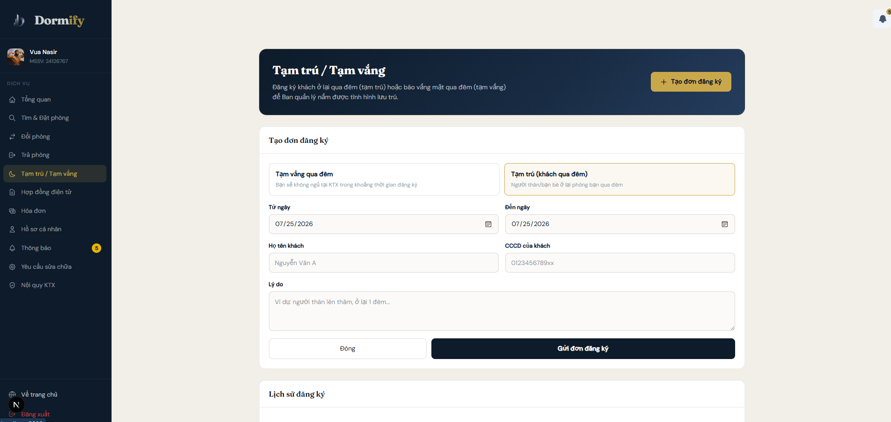
- PA3 asset screenshot evidence covering the basic flow and alternative flows for UC-RES-04.

**Relationships:**
- None.

**Traceability:** ST24

---

### UC-RES-05 — Review and Track Residence Declarations

> _Performed by:_ Trần Huỳnh Mạnh Đạt | _Reviewed by:_ Đào Duy Anh | _Edited by:_ Trần Huỳnh Mạnh Đạt

**Use-case ID:** UC-RES-05  
**Use-case name:** Review and Track Residence Declarations  
**Actor(s):** Dormitory Manager  
**Supporting Actor(s):** None  
**Description:** The manager views and processes overnight absence, temporary residence, long-term absence, and visitor declarations.  
**Trigger:** A declaration is submitted or the manager opens Residence Management.

**Preconditions:**
1. The actor is authenticated as Dormitory Manager.

**Basic Flow (Main Success Scenario):**
1. The system lists declarations with type, student, room, dates, and status.
2. The manager filters by building, floor, room, type, date, or status.
3. The manager opens a declaration and verifies its details.
4. The manager approves, rejects, acknowledges, or records notes according to declaration type.
5. The system updates status and notifies the student.

**Alternative Flows:**
- A1. Declaration period has already ended: the system marks it expired/closed according to policy.
- A2. Invalid or conflicting information: the manager rejects with a reason.
- A3. No approval required: the manager records acknowledgment only.

**Postconditions:**
- The declaration status and review history are updated.

**Special Requirements:**
- None.

**Prototype Screens:**
- 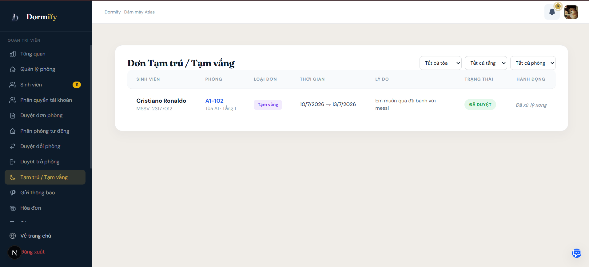
- PA3 asset screenshot evidence covering the basic flow and alternative flows for UC-RES-05.

**Relationships:**
- None.

**Traceability:** FR25, FM10, FM11, FM12

---

## 9. Maintenance Management

> _Performed by:_ Trần Huỳnh Mạnh Đạt | _Reviewed by:_ Đào Duy Anh | _Edited by:_ Trần Huỳnh Mạnh Đạt

Repair reporting, assignment, progress tracking, evidence, staff history, and dashboard.

| PA3 focus item | Coverage |
| --- | --- |
| Student flow | Submit and track repair requests. |
| Dormitory Manager flow | Review, assign, and monitor maintenance progress. |
| Maintenance Staff flow | View assigned jobs, update repair status, upload evidence, review history, and view dashboard metrics. |
| Evidence focus | Status timeline, image evidence, repair result, assignment history, and traceability to `FR26-FR28` / `MT01-MT08`. |

| ID | Use case | Primary actor |
| --- | --- | --- |
| UC-MNT-01 | Submit Repair Request | Student |
| UC-MNT-02 | Track Repair Request | Student |
| UC-MNT-03 | Review and Assign Maintenance Request | Dormitory Manager |
| UC-MNT-04 | Track Maintenance Progress | Dormitory Manager |
| UC-MNT-05 | View Assigned Maintenance Jobs | Maintenance Staff |
| UC-MNT-06 | View Maintenance Job Details | Maintenance Staff |
| UC-MNT-07 | Update Repair Status and Result | Maintenance Staff |
| UC-MNT-08 | Upload Before and After Repair Photos | Maintenance Staff |
| UC-MNT-09 | View Maintenance History | Maintenance Staff |
| UC-MNT-10 | View Maintenance Dashboard | Maintenance Staff |

### UC-MNT-01 — Submit Repair Request

> _Performed by:_ Trần Huỳnh Mạnh Đạt | _Reviewed by:_ Đào Duy Anh | _Edited by:_ Trần Huỳnh Mạnh Đạt

**Use-case ID:** UC-MNT-01  
**Use-case name:** Submit Repair Request  
**Actor(s):** Student  
**Supporting Actor(s):** None  
**Description:** A student reports a room or facility incident and may attach photographs.  
**Trigger:** The student selects New Repair Request.

**Preconditions:**
1. The student is authenticated.
2. The student has an active room assignment or selects an authorized common-area location.

**Basic Flow (Main Success Scenario):**
1. The student enters title, description, location, category, priority, and optional photos.
2. The system validates required data and file restrictions.
3. The system creates a pending maintenance request.
4. The system notifies the Dormitory Manager.
5. The system displays the request reference and status.

**Alternative Flows:**
- A1. Invalid file: the system rejects the attachment and allows correction.
- A2. Urgent safety issue: the system highlights emergency guidance and raises priority.
- A3. Duplicate suspected: the system warns the student but allows confirmation according to policy.

**Postconditions:**
- A pending maintenance request exists.

**Special Requirements:**
- None.

**Prototype Screens:**
- 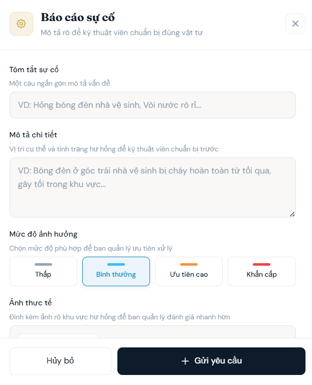
- 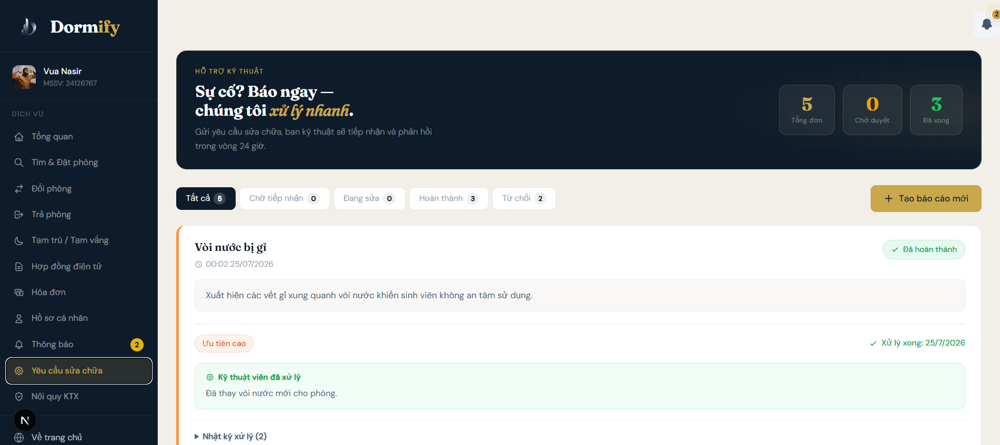
- PA3 asset screenshot evidence covering the basic flow and alternative flows for UC-MNT-01.

**Relationships:**
- None.

**Traceability:** FR26, ST17

---

### UC-MNT-02 — Track Repair Request

> _Performed by:_ Trần Huỳnh Mạnh Đạt | _Reviewed by:_ Đào Duy Anh | _Edited by:_ Trần Huỳnh Mạnh Đạt

**Use-case ID:** UC-MNT-02  
**Use-case name:** Track Repair Request  
**Actor(s):** Student  
**Supporting Actor(s):** None  
**Description:** A student views repair request status and recorded results.  
**Trigger:** The student opens My Repair Requests.

**Preconditions:**
1. The student is authenticated.

**Basic Flow (Main Success Scenario):**
1. The system displays the student’s requests with pending, in-progress, completed, or rejected status.
2. The student opens a request to view assignment, progress notes, result, photos, and timestamps.
3. When permitted, the student acknowledges or rates completed work.

**Alternative Flows:**
- A1. No requests: the system displays an empty state.
- A2. Request rejected: the system displays the reason.

**Postconditions:**
- No data is changed unless an acknowledgment/rating is submitted.

**Special Requirements:**
- None.

**Prototype Screens:**
- 
- PA3 asset screenshot evidence covering the basic flow and alternative flows for UC-MNT-02.

**Relationships:**
- None.

**Traceability:** FR28, ST18

---

### UC-MNT-03 — Review and Assign Maintenance Request

> _Performed by:_ Trần Huỳnh Mạnh Đạt | _Reviewed by:_ Đào Duy Anh | _Edited by:_ Trần Huỳnh Mạnh Đạt

**Use-case ID:** UC-MNT-03  
**Use-case name:** Review and Assign Maintenance Request  
**Actor(s):** Dormitory Manager  
**Supporting Actor(s):** Maintenance Staff  
**Description:** The manager reviews a repair request and assigns it to an internal employee or approved third-party provider.  
**Trigger:** A new pending maintenance request is received.

**Preconditions:**
1. The actor is authenticated as Dormitory Manager.

**Basic Flow (Main Success Scenario):**
1. The system displays request details, location, priority, attachments, and reporter contact.
2. The manager validates and prioritizes the request.
3. The manager selects an available Maintenance Staff member/provider and adds instructions.
4. The system records the assignment and notifies the assignee and student.

**Alternative Flows:**
- A1. Invalid/duplicate request: the manager rejects it with a reason.
- A2. No staff available: the request remains pending/unassigned or is assigned to an external provider.
- A3. Reassignment: the system records both old and new assignees and notifies affected parties.

**Postconditions:**
- The request is assigned or rejected.

**Special Requirements:**
- None.

**Prototype Screens:**
- 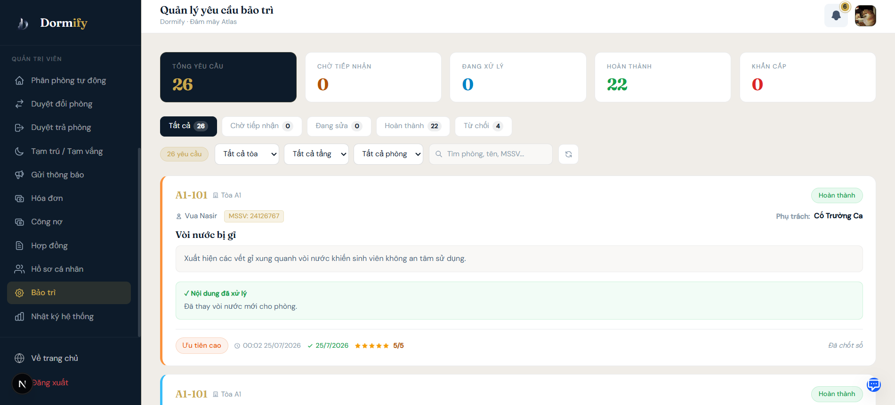
- PA3 asset screenshot evidence covering the basic flow and alternative flows for UC-MNT-03.

**Relationships:**
- None.

**Traceability:** FR26, FR27

---

### UC-MNT-04 — Track Maintenance Progress

> _Performed by:_ Trần Huỳnh Mạnh Đạt | _Reviewed by:_ Đào Duy Anh | _Edited by:_ Trần Huỳnh Mạnh Đạt

**Use-case ID:** UC-MNT-04  
**Use-case name:** Track Maintenance Progress  
**Actor(s):** Dormitory Manager  
**Supporting Actor(s):** None  
**Description:** The manager monitors pending, in-progress, and completed maintenance requests.  
**Trigger:** The manager opens Maintenance Management.

**Preconditions:**
1. The actor is authenticated as Dormitory Manager.

**Basic Flow (Main Success Scenario):**
1. The system lists requests with priority, location, assignee, status, and age.
2. The manager filters/searches and opens a request.
3. The manager reviews status changes, notes, photos, and completion result.
4. The manager may follow up, reassign, or escalate according to permissions.

**Alternative Flows:**
- A1. Overdue request: the system highlights it for escalation.
- A2. No results: the system displays an empty state.

**Postconditions:**
- No data is changed unless the manager performs an allowed follow-up action.

**Special Requirements:**
- None.

**Prototype Screens:**
- 
- PA3 asset screenshot evidence covering the basic flow and alternative flows for UC-MNT-04.

**Relationships:**
- None.

**Traceability:** FR28, FM16

---

### UC-MNT-05 — View Assigned Maintenance Jobs

> _Performed by:_ Trần Huỳnh Mạnh Đạt | _Reviewed by:_ Đào Duy Anh | _Edited by:_ Trần Huỳnh Mạnh Đạt

**Use-case ID:** UC-MNT-05  
**Use-case name:** View Assigned Maintenance Jobs  
**Actor(s):** Maintenance Staff  
**Supporting Actor(s):** None  
**Description:** A maintenance staff member views work assigned to them.  
**Trigger:** The staff member enters the maintenance workspace.

**Preconditions:**
1. The actor is authenticated as Maintenance Staff.

**Basic Flow (Main Success Scenario):**
1. The system lists assigned jobs grouped or filterable by status and priority.
2. The staff member searches by room, issue, date, or keyword.
3. The staff member selects a job to view details.

**Alternative Flows:**
- A1. No assigned jobs: the system displays an empty state.
- A2. Job reassigned while displayed: the system refreshes access and removes it from the list.

**Postconditions:**
- No data is changed.

**Special Requirements:**
- None.

**Prototype Screens:**
- 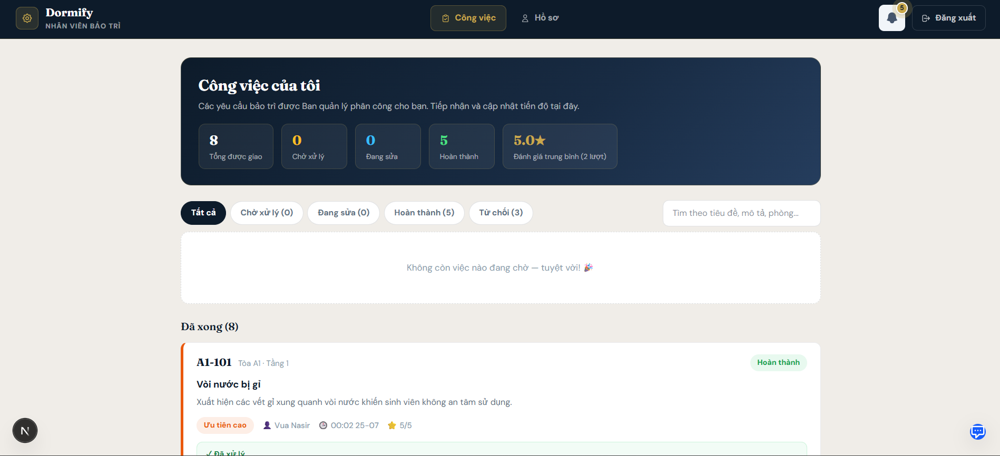
- PA3 asset screenshot evidence covering the basic flow and alternative flows for UC-MNT-05.

**Relationships:**
- None.

**Traceability:** FR28, MT01

---

### UC-MNT-06 — View Maintenance Job Details

> _Performed by:_ Trần Huỳnh Mạnh Đạt | _Reviewed by:_ Đào Duy Anh | _Edited by:_ Trần Huỳnh Mạnh Đạt

**Use-case ID:** UC-MNT-06  
**Use-case name:** View Maintenance Job Details  
**Actor(s):** Maintenance Staff  
**Supporting Actor(s):** None  
**Description:** A staff member views the issue, location, priority, reporter information, instructions, and attachments for an assigned job.  
**Trigger:** The staff member selects a job from the assigned list.

**Preconditions:**
1. The job is assigned to the staff member or access is otherwise authorized.

**Basic Flow (Main Success Scenario):**
1. The system verifies assignment.
2. The system displays full job details, timeline, and available status actions.
3. The staff member reviews attached evidence and manager instructions.

**Alternative Flows:**
- A1. Job is no longer assigned to the staff member: access is denied and the list refreshes.
- A2. Attachment unavailable: the system displays the remaining details and an attachment error.

**Postconditions:**
- No data is changed.

**Special Requirements:**
- None.

**Prototype Screens:**
- 
- 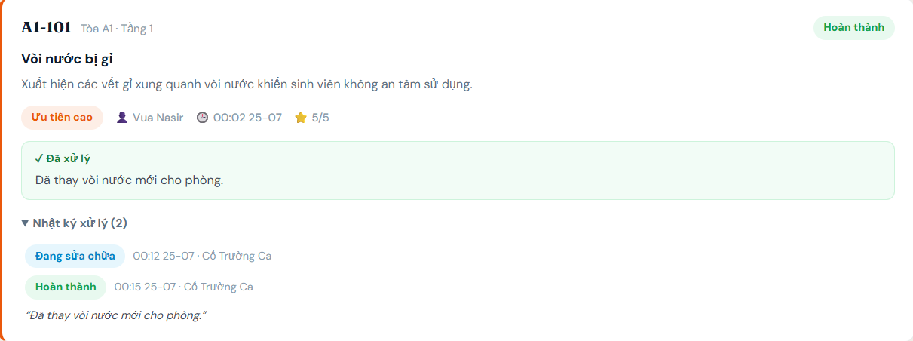
- PA3 asset screenshot evidence covering the basic flow and alternative flows for UC-MNT-06.

**Relationships:**
- Accessed from UC-MNT-05 View Assigned Maintenance Jobs (include relationship in the model).

**Traceability:** FR28, MT02

---

### UC-MNT-07 — Update Repair Status and Result

> _Performed by:_ Trần Huỳnh Mạnh Đạt | _Reviewed by:_ Đào Duy Anh | _Edited by:_ Trần Huỳnh Mạnh Đạt

**Use-case ID:** UC-MNT-07  
**Use-case name:** Update Repair Status and Result  
**Actor(s):** Maintenance Staff  
**Supporting Actor(s):** Dormitory Manager  
**Description:** The assigned staff member updates a repair from pending to in progress to completed and records the result.  
**Trigger:** The staff member selects a status action on an assigned job.

**Preconditions:**
1. The actor is assigned to the job.
2. The request is not closed in a conflicting state.

**Basic Flow (Main Success Scenario):**
1. The staff member changes status to In progress when work begins.
2. The system records the start time.
3. The staff member enters work notes, materials, and result.
4. When work is finished, the staff member changes status to Completed.
5. The system records completion time and notifies the student and manager.

**Alternative Flows:**
- A1. Invalid status transition: the system rejects the update.
- A2. Work cannot be completed: the staff member records a blocker and the request remains in progress or is escalated.
- A3. Manager rejects the completion after review: the request returns to in progress with instructions.

**Postconditions:**
- The status timeline and repair result are updated.

**Special Requirements:**
- None.

**Prototype Screens:**
- 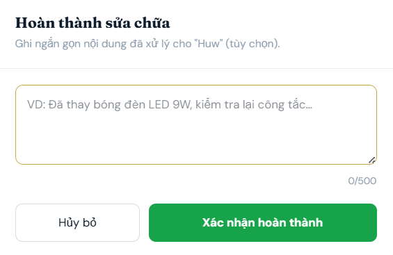
- 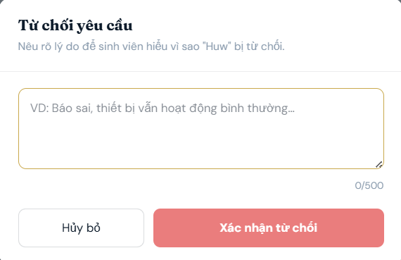
- PA3 asset screenshot evidence covering the basic flow and alternative flows for UC-MNT-07.

**Relationships:**
- None.

**Traceability:** FR28, MT03, MT04

---

### UC-MNT-08 — Upload Before and After Repair Photos

> _Performed by:_ Trần Huỳnh Mạnh Đạt | _Reviewed by:_ Đào Duy Anh | _Edited by:_ Trần Huỳnh Mạnh Đạt

**Use-case ID:** UC-MNT-08  
**Use-case name:** Upload Before and After Repair Photos  
**Actor(s):** Maintenance Staff  
**Supporting Actor(s):** None  
**Description:** A staff member uploads visual evidence before and/or after repair work.  
**Trigger:** The staff member updates a repair status or result.

**Preconditions:**
1. The job is assigned to the staff member.

**Basic Flow (Main Success Scenario):**
1. The staff member selects Before or After photo type.
2. The system validates file type, size, and count.
3. The system uploads and associates the photo with the maintenance request.
4. The system displays the evidence in the job timeline.

**Alternative Flows:**
- A1. Upload fails: the status update is handled according to whether photos are mandatory.
- A2. Invalid file: the system rejects it.
- A3. Replacement/removal: the system records the change according to audit policy.

**Postconditions:**
- Photo evidence is associated with the job.

**Special Requirements:**
- None.

**Prototype Screens:**
- 
- 
- PA3 asset screenshot evidence covering the basic flow and alternative flows for UC-MNT-08.

**Relationships:**
- Extends UC-MNT-07 Update Repair Status and Result.

**Traceability:** FR28, MT05, MT06

---

### UC-MNT-09 — View Maintenance History

> _Performed by:_ Trần Huỳnh Mạnh Đạt | _Reviewed by:_ Đào Duy Anh | _Edited by:_ Trần Huỳnh Mạnh Đạt

**Use-case ID:** UC-MNT-09  
**Use-case name:** View Maintenance History  
**Actor(s):** Maintenance Staff  
**Supporting Actor(s):** None  
**Description:** A staff member reviews previously processed maintenance work.  
**Trigger:** The staff member opens Maintenance History.

**Preconditions:**
1. The actor is authenticated as Maintenance Staff.

**Basic Flow (Main Success Scenario):**
1. The system retrieves completed/rejected jobs previously assigned to the staff member.
2. The system displays filters for period, status, room, and issue type.
3. The staff member opens a historical job to view the final result and evidence.

**Alternative Flows:**
- A1. No history: the system displays an empty state.
- A2. Filters return no maintenance jobs: the system displays an empty filtered state and offers a clear-filter action.
- A3. Evidence file unavailable: the system still displays job history and marks the missing attachment as unavailable.

**Postconditions:**
- No data is changed.

**Special Requirements:**
- None.

**Prototype Screens:**
- 
- PA3 asset screenshot evidence covering the basic flow and alternative flows for UC-MNT-09.

**Relationships:**
- None.

**Traceability:** FR28, MT07

---

### UC-MNT-10 — View Maintenance Dashboard

> _Performed by:_ Trần Huỳnh Mạnh Đạt | _Reviewed by:_ Đào Duy Anh | _Edited by:_ Trần Huỳnh Mạnh Đạt

**Use-case ID:** UC-MNT-10  
**Use-case name:** View Maintenance Dashboard  
**Actor(s):** Maintenance Staff  
**Supporting Actor(s):** None  
**Description:** A staff member views workload and job-status statistics.  
**Trigger:** The staff member opens the maintenance dashboard.

**Preconditions:**
1. The actor is authenticated as Maintenance Staff.

**Basic Flow (Main Success Scenario):**
1. The system aggregates assigned, pending, in-progress, completed, overdue, and priority counts.
2. The system displays recent assignments and performance summaries.
3. The staff member selects a metric to filter the job list.

**Alternative Flows:**
- A1. No jobs in the period: metrics display zero.
- A2. Metric refresh failure: the affected widget is marked unavailable.

**Postconditions:**
- No data is changed.

**Special Requirements:**
- None.

**Prototype Screens:**
- 
- 
- PA3 asset screenshot evidence covering the basic flow and alternative flows for UC-MNT-10.

**Relationships:**
- None.

**Traceability:** FR28, MT08

---

## 10. Feedback and Suggestions

> _Performed by:_ Trần Huỳnh Mạnh Đạt | _Reviewed by:_ Đào Duy Anh | _Edited by:_ Trần Huỳnh Mạnh Đạt

Student-initiated complaints, feedback, suggestions, and management responses.

| ID | Use case | Primary actor |
| --- | --- | --- |
| UC-FBK-01 | Submit Complaint or Feedback | Student |
| UC-FBK-02 | Submit Suggestion | Student |
| UC-FBK-03 | Review and Respond to Feedback | Dormitory Manager |

### UC-FBK-01 — Submit Complaint or Feedback

> _Performed by:_ Trần Huỳnh Mạnh Đạt | _Reviewed by:_ Đào Duy Anh | _Edited by:_ Trần Huỳnh Mạnh Đạt

**Use-case ID:** UC-FBK-01  
**Use-case name:** Submit Complaint or Feedback  
**Actor(s):** Student  
**Supporting Actor(s):** None  
**Description:** A student submits a complaint or feedback about dormitory facilities, services, billing, rules, or staff conduct.  
**Trigger:** The student selects Submit Complaint / Feedback.

**Preconditions:**
1. The student is authenticated.

**Basic Flow (Main Success Scenario):**
1. The student selects a category, enters a subject and detailed message, and optionally attaches evidence.
2. The student chooses identified or anonymous presentation where policy permits.
3. The system validates content and creates a pending feedback item.
4. The system notifies the Dormitory Manager and displays the tracking reference.

**Alternative Flows:**
- A1. Anonymous submissions not allowed for the category: identity is required.
- A2. Invalid attachment or empty message: submission is rejected.
- A3. Urgent safety complaint: the system highlights emergency contact guidance.

**Postconditions:**
- A pending complaint/feedback item exists.

**Special Requirements:**
- None.

**Prototype Screens:**
- 
- PA3 asset screenshot evidence covering the basic flow and alternative flows for UC-FBK-01.

**Relationships:**
- None.

**Traceability:** ST19, FM15

---

### UC-FBK-02 — Submit Suggestion

> _Performed by:_ Trần Huỳnh Mạnh Đạt | _Reviewed by:_ Đào Duy Anh | _Edited by:_ Trần Huỳnh Mạnh Đạt

**Use-case ID:** UC-FBK-02  
**Use-case name:** Submit Suggestion  
**Actor(s):** Student  
**Supporting Actor(s):** None  
**Description:** A student proposes an improvement to dormitory life or operations.  
**Trigger:** The student selects Submit Suggestion.

**Preconditions:**
1. The student is authenticated.

**Basic Flow (Main Success Scenario):**
1. The student selects a suggestion category and enters the proposal and expected benefit.
2. The system validates and stores the suggestion.
3. The system notifies the Dormitory Manager and displays the tracking reference.

**Alternative Flows:**
- A1. Duplicate/similar suggestion detected: the system may show existing items and allow confirmation.
- A2. Empty or inappropriate content: submission is rejected according to moderation rules.

**Postconditions:**
- A pending suggestion exists.

**Special Requirements:**
- None.

**Prototype Screens:**
- 
- PA3 asset screenshot evidence covering the basic flow and alternative flows for UC-FBK-02.

**Relationships:**
- None.

**Traceability:** ST20

---

### UC-FBK-03 — Review and Respond to Feedback

> _Performed by:_ Trần Huỳnh Mạnh Đạt | _Reviewed by:_ Đào Duy Anh | _Edited by:_ Trần Huỳnh Mạnh Đạt

**Use-case ID:** UC-FBK-03  
**Use-case name:** Review and Respond to Feedback  
**Actor(s):** Dormitory Manager  
**Supporting Actor(s):** None  
**Description:** The manager reviews complaints and suggestions, responds, and closes or resolves them.  
**Trigger:** A feedback item is submitted or the manager opens Feedback Management.

**Preconditions:**
1. The actor is authenticated as Dormitory Manager.

**Basic Flow (Main Success Scenario):**
1. The system lists feedback by type, category, priority, status, and date.
2. The manager opens an item and reviews its content and evidence.
3. The manager assigns or investigates the item as needed.
4. The manager enters a response and marks it in progress, resolved, rejected, or closed.
5. The system stores the response and notifies the student when identity is available.

**Alternative Flows:**
- A1. Anonymous item: the response is stored for reporting but cannot be delivered directly.
- A2. Duplicate/spam: the manager closes it with a reason.
- A3. More information required: the manager requests clarification and keeps it open.

**Postconditions:**
- Feedback status and response history are updated.

**Special Requirements:**
- None.

**Prototype Screens:**
- 
- PA3 asset screenshot evidence covering the basic flow and alternative flows for UC-FBK-03.

**Relationships:**
- None.

**Traceability:** FM15

---

## 11. Conduct and Student Evaluation

> _Performed by:_ Trần Huỳnh Mạnh Đạt | _Reviewed by:_ Đào Duy Anh | _Edited by:_ Trần Huỳnh Mạnh Đạt

Violation records, conditional conduct-score deductions, periodic evaluations, student history views, and the appeal and revocation flow that can reverse a deduction.

| ID | Use case | Primary actor |
| --- | --- | --- |
| UC-COND-01 | Record Student Violation | Dormitory Manager |
| UC-COND-02 | Apply Conduct-Score Deduction | Dormitory Manager / System |
| UC-COND-03 | Perform Periodic Student Evaluation | Dormitory Manager |
| UC-COND-04 | View Evaluation History | Student |
| UC-COND-05 | View Violation History | Student |
| UC-COND-06 | Appeal Recorded Violation | Student |
| UC-COND-07 | Review Violation Appeal | Dormitory Manager |
| UC-COND-08 | Revoke Recorded Violation | Dormitory Manager |

### UC-COND-01 — Record Student Violation

> _Performed by:_ Trần Huỳnh Mạnh Đạt | _Reviewed by:_ Đào Duy Anh | _Edited by:_ Trần Huỳnh Mạnh Đạt

**Use-case ID:** UC-COND-01  
**Use-case name:** Record Student Violation  
**Actor(s):** Dormitory Manager  
**Supporting Actor(s):** None  
**Description:** The manager creates a record when a student violates dormitory rules.  
**Trigger:** The manager selects Record Violation for a student.

**Preconditions:**
1. The actor is authenticated as Dormitory Manager.
2. The target is a student.

**Basic Flow (Main Success Scenario):**
1. The manager selects the student and applicable rule.
2. The manager enters date, location, description, evidence, and optional witnesses.
3. The system displays the configured penalty and whether a score deduction applies.
4. The manager confirms the violation record.
5. The system stores the record and notifies the student.

**Alternative Flows:**
- A1. Warning-only incident: the manager records the violation without invoking a score deduction.
- A2. Duplicate incident detected: the system warns before confirmation.
- A3. Invalid/missing evidence where required: submission is blocked.

**Postconditions:**
- A violation record exists.

**Special Requirements:**
- None.

**Prototype Screens:**
- 
- 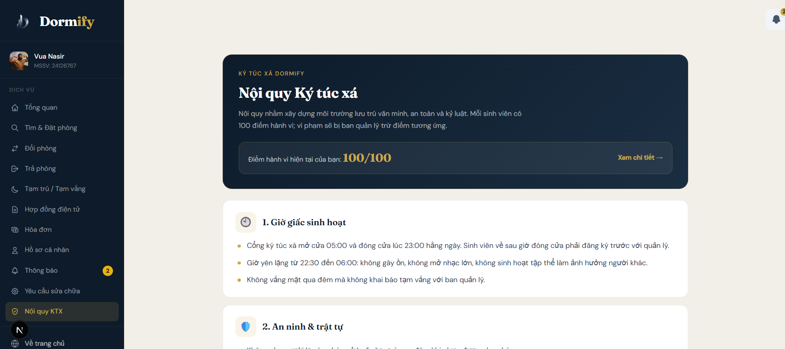
- PA3 asset screenshot evidence covering the basic flow and alternative flows for UC-COND-01.

**Relationships:**
- None.

**Traceability:** FR29, FM13

---

### UC-COND-02 — Apply Conduct-Score Deduction

> _Performed by:_ Trần Huỳnh Mạnh Đạt | _Reviewed by:_ Đào Duy Anh | _Edited by:_ Trần Huỳnh Mạnh Đạt

**Use-case ID:** UC-COND-02  
**Use-case name:** Apply Conduct-Score Deduction  
**Actor(s):** Dormitory Manager / System  
**Supporting Actor(s):** None  
**Description:** The system applies a configured conduct-score deduction when a recorded violation requires one.  
**Trigger:** The manager confirms a point-bearing violation.

**Preconditions:**
1. UC-COND-01 is in progress.
2. The selected rule defines a deduction or the manager has authorized a permitted adjustment.

**Basic Flow (Main Success Scenario):**
1. The system reads the student’s current conduct score.
2. The system calculates the deduction according to the rule and configured minimum score.
3. The manager reviews the resulting score.
4. The system updates the score and stores before/after values with the violation.
5. The system includes the deduction in the student notification.

**Alternative Flows:**
- A1. Warning-only incident: this use case is not invoked.
- A2. Deduction would fall below minimum: the score is limited to the configured minimum.
- A3. Rule configuration missing: the system requires an authorized manual value or blocks completion.

**Postconditions:**
- The conduct score and deduction history are updated.

**Special Requirements:**
- None.

**Prototype Screens:**
- 
- PA3 asset screenshot evidence covering the basic flow and alternative flows for UC-COND-02.

**Relationships:**
- Extends UC-COND-01 Record Student Violation.

**Traceability:** FR30

---

### UC-COND-03 — Perform Periodic Student Evaluation

> _Performed by:_ Trần Huỳnh Mạnh Đạt | _Reviewed by:_ Đào Duy Anh | _Edited by:_ Trần Huỳnh Mạnh Đạt

**Use-case ID:** UC-COND-03  
**Use-case name:** Perform Periodic Student Evaluation  
**Actor(s):** Dormitory Manager  
**Supporting Actor(s):** None  
**Description:** The manager records a periodic conduct evaluation for students by month, term, or academic year.  
**Trigger:** The manager starts an evaluation period.

**Preconditions:**
1. The actor is authenticated as Dormitory Manager.
2. An evaluation period is defined.

**Basic Flow (Main Success Scenario):**
1. The system lists eligible students and relevant violation/residence history.
2. The manager selects a student or bulk group and enters qualitative rating, comments, and permitted score adjustment.
3. The system validates that one final evaluation per student/period is maintained.
4. The manager saves draft or publishes the evaluation.
5. The system stores the evaluation and notifies the student when published.

**Alternative Flows:**
- A1. Existing evaluation: the manager edits the draft or creates a controlled revision.
- A2. Bulk evaluation: a baseline is applied and individual exceptions are edited.
- A3. Incomplete evaluation: it remains draft and is not visible to the student.

**Postconditions:**
- A periodic evaluation record exists in draft or published state.

**Special Requirements:**
- None.

**Prototype Screens:**
- 
- PA3 asset screenshot evidence covering the basic flow and alternative flows for UC-COND-03.

**Relationships:**
- None.

**Traceability:** FR30, FM14

---

### UC-COND-04 — View Evaluation History

> _Performed by:_ Trần Huỳnh Mạnh Đạt | _Reviewed by:_ Đào Duy Anh | _Edited by:_ Trần Huỳnh Mạnh Đạt

**Use-case ID:** UC-COND-04  
**Use-case name:** View Evaluation History  
**Actor(s):** Student  
**Supporting Actor(s):** None  
**Description:** A student views published periodic conduct evaluations and score changes.  
**Trigger:** The student opens Evaluation History.

**Preconditions:**
1. The student is authenticated.

**Basic Flow (Main Success Scenario):**
1. The system retrieves published evaluations belonging to the student.
2. The system displays period, rating, comments, score change, and publication date.
3. The student opens an evaluation to view details.

**Alternative Flows:**
- A1. No published evaluations: the system displays an empty state.
- A2. Draft evaluation: it is not visible.

**Postconditions:**
- No data is changed.

**Special Requirements:**
- None.

**Prototype Screens:**
- 
- PA3 asset screenshot evidence covering the basic flow and alternative flows for UC-COND-04.

**Relationships:**
- None.

**Traceability:** FR30, ST27

---

### UC-COND-05 — View Violation History

> _Performed by:_ Trần Huỳnh Mạnh Đạt | _Reviewed by:_ Đào Duy Anh | _Edited by:_ Trần Huỳnh Mạnh Đạt

**Use-case ID:** UC-COND-05  
**Use-case name:** View Violation History  
**Actor(s):** Student  
**Supporting Actor(s):** None  
**Description:** A student views recorded violations and related penalties.  
**Trigger:** The student opens Violation History.

**Preconditions:**
1. The student is authenticated.

**Basic Flow (Main Success Scenario):**
1. The system retrieves the student’s violation records.
2. The system displays rule, date, description, evidence availability, penalty, score deduction, and resulting score.
3. The student opens a record to view details.

**Alternative Flows:**
- A1. No violations: the system displays a positive empty state.
- A2. Restricted evidence: the system displays only permitted information.

**Postconditions:**
- No data is changed.

**Special Requirements:**
- None.

**Prototype Screens:**
- 
- PA3 asset screenshot evidence covering the basic flow and alternative flows for UC-COND-05.

**Relationships:**
- None.

**Traceability:** FR29, ST28

---

### UC-COND-06 — Appeal Recorded Violation

> _Performed by:_ Trần Huỳnh Mạnh Đạt | _Reviewed by:_ Đào Duy Anh | _Edited by:_ Trần Huỳnh Mạnh Đạt

**Use-case ID:** UC-COND-06  
**Use-case name:** Appeal Recorded Violation  
**Actor(s):** Student  
**Supporting Actor(s):** Dormitory Manager (notified)  
**Description:** A student who believes a recorded violation is wrong submits an appeal with a written reason so the management board can re-examine it instead of leaving the conduct-score deduction in place.  
**Trigger:** The student selects Appeal on one of their own violation records.

**Preconditions:**
1. The actor is authenticated as Student.
2. The violation belongs to the authenticated student.
3. The violation is in the `ACTIVE` state.

**Basic Flow (Main Success Scenario):**
1. The student opens their violation history and selects a violation that is still in effect.
2. The student enters the reason for the appeal.
3. The system validates that the violation identifier is well formed and that the reason is not blank.
4. The system verifies that the violation belongs to the authenticated student.
5. The system verifies that the violation is still `ACTIVE`.
6. The system moves the violation to `APPEAL_PENDING` and stores the appeal reason and the appeal timestamp.
7. The system notifies every System Admin and Dormitory Manager that a new appeal is waiting for review.
8. The system confirms to the student that the appeal was submitted and is awaiting review.

**Alternative Flows:**
- A1. Blank reason: the system rejects the request and asks for a reason; the violation state is unchanged.
- A2. Malformed violation identifier: the system rejects the request.
- A3. Violation belongs to another student: the system rejects the request as forbidden.
- A4. Violation is already `APPEAL_PENDING`, `REVOKED`, or `APPEAL_REJECTED`: the system rejects the request, because only a violation still in effect can be appealed.
- A5. Notification delivery fails: the appeal is still stored and the failure is logged without failing the request.

**Postconditions:**
- The violation is in `APPEAL_PENDING` with the appeal reason and appeal timestamp recorded.
- The conduct score is unchanged at this stage.
- The management board has been notified of the pending appeal.

**Special Requirements:**
- The endpoint requires JWT authentication and the `STUDENT` role.
- A student may only appeal their own violation.
- The appeal reason is limited to 500 characters.

**Prototype Screens:**
- No PA3 prototype screenshot exists for this PA4 conduct-appeal addition.
- Implementation evidence: `Domitory_Management_Backend/src/violations/violations.controller.ts` (`POST /api/violations/:id/appeal`), `ViolationsService.appealViolation`, `AppealViolationDto`, and `ViolationStatus`.

**Relationships:**
- Extends UC-COND-05 View Violation History.
- Precedes UC-COND-07 Review Violation Appeal.

**Traceability:** FR32, ST31

---

### UC-COND-07 — Review Violation Appeal

> _Performed by:_ Trần Huỳnh Mạnh Đạt | _Reviewed by:_ Đào Duy Anh | _Edited by:_ Trần Huỳnh Mạnh Đạt

**Use-case ID:** UC-COND-07  
**Use-case name:** Review Violation Appeal  
**Actor(s):** Dormitory Manager  
**Supporting Actor(s):** System Admin, Student (notified)  
**Description:** The management board works through the queue of pending appeals and either accepts an appeal — which revokes the violation and restores the deducted conduct score — or rejects it with a note.  
**Trigger:** The manager opens the appeal queue and decides on a pending appeal.

**Preconditions:**
1. The actor is authenticated as System Admin or Dormitory Manager.
2. The violation is in the `APPEAL_PENDING` state.

**Basic Flow (Main Success Scenario):**
1. The manager lists violations filtered by the `APPEAL_PENDING` state to see the review queue.
2. The manager opens an appeal and reads the student's reason together with the original violation record.
3. The manager chooses Accept or Reject and may add a review note.
4. The system validates the violation identifier and confirms that the violation is still `APPEAL_PENDING`.
5. The system records the review note, the reviewing account, and the review timestamp.
6. If the decision is Accept, the system moves the violation to `REVOKED` and restores the deducted points to the student's conduct score, capped at 100.
7. If the decision is Reject, the system moves the violation to `APPEAL_REJECTED` and leaves the conduct score unchanged.
8. The system notifies the student of the outcome, including the review note when the appeal was rejected.
9. The system returns the decision result together with the resulting conduct score when points were restored.

**Alternative Flows:**
- A1. Violation is not in `APPEAL_PENDING`: the system rejects the request, because only a pending appeal can be reviewed.
- A2. Malformed violation identifier: the system rejects the request.
- A3. Restoring points would exceed the maximum: the conduct score is capped at 100.
- A4. Student account no longer exists: the decision is still recorded and no score is restored.
- A5. Notification delivery fails: the decision is still stored and the failure is logged without failing the request.

**Postconditions:**
- The violation is in `REVOKED` or `APPEAL_REJECTED` with the reviewer, review timestamp, and review note recorded.
- On acceptance the deducted conduct points have been restored exactly once.
- The student has been notified of the outcome.

**Special Requirements:**
- The endpoint requires JWT authentication and the `ADMIN` or `DORMITORY_MANAGER` role.
- The decision value is restricted to `ACCEPT` or `REJECT`.
- The review note is limited to 500 characters.
- Conduct-score restoration must be idempotent: points are restored only on the transition into `REVOKED`.

**Prototype Screens:**
- No PA3 prototype screenshot exists for this PA4 conduct-appeal addition.
- Implementation evidence: `Domitory_Management_Backend/src/violations/violations.controller.ts` (`PATCH /api/violations/:id/review`), `ViolationsService.reviewAppeal`, `ReviewAppealDto`, and `ViolationsService.restoreScore`.

**Relationships:**
- Follows UC-COND-06 Appeal Recorded Violation.
- Reverses UC-COND-02 Apply Conduct-Score Deduction when the appeal is accepted.

**Traceability:** FR32, FM13

---

### UC-COND-08 — Revoke Recorded Violation

> _Performed by:_ Trần Huỳnh Mạnh Đạt | _Reviewed by:_ Đào Duy Anh | _Edited by:_ Trần Huỳnh Mạnh Đạt

**Use-case ID:** UC-COND-08  
**Use-case name:** Revoke Recorded Violation  
**Actor(s):** Dormitory Manager  
**Supporting Actor(s):** Student (notified)  
**Description:** When the management board discovers that a violation was recorded by mistake, it revokes the record directly — without waiting for the student to appeal — and the deducted conduct points are restored.  
**Trigger:** The manager selects Revoke on a violation record.

**Preconditions:**
1. The actor is authenticated as System Admin or Dormitory Manager.
2. The violation has not already been revoked.

**Basic Flow (Main Success Scenario):**
1. The manager opens the violation list and selects the record that was entered by mistake.
2. The system validates the violation identifier and confirms that the violation is not already `REVOKED`.
3. The system moves the violation to `REVOKED` and records the reviewing account and the review timestamp.
4. The system restores the deducted points to the student's conduct score, capped at 100.
5. The system notifies the student that the violation was revoked and the points returned.
6. The system returns the resulting conduct score.

**Alternative Flows:**
- A1. Violation is already `REVOKED`: the system rejects the request so that points are never restored twice.
- A2. Malformed violation identifier: the system rejects the request.
- A3. Violation is currently `APPEAL_PENDING` or `APPEAL_REJECTED`: direct revocation is still allowed and closes the appeal.
- A4. Restoring points would exceed the maximum: the conduct score is capped at 100.
- A5. Notification delivery fails: the revocation is still stored and the failure is logged without failing the request.

**Postconditions:**
- The violation is in `REVOKED` with the reviewer and review timestamp recorded.
- The deducted conduct points have been restored exactly once.
- The student has been notified.

**Special Requirements:**
- The endpoint requires JWT authentication and the `ADMIN` or `DORMITORY_MANAGER` role.
- Revocation must be idempotent with respect to the conduct score.

**Prototype Screens:**
- No PA3 prototype screenshot exists for this PA4 conduct-appeal addition.
- Implementation evidence: `Domitory_Management_Backend/src/violations/violations.controller.ts` (`DELETE /api/violations/:id`) and `ViolationsService.revokeViolation`.

**Relationships:**
- Alternative to UC-COND-07 Review Violation Appeal when no appeal was filed.
- Reverses UC-COND-02 Apply Conduct-Score Deduction.

**Traceability:** FR32, FM13

---

## 12. Notifications and Message Center

> _Performed by:_ Trần Huỳnh Mạnh Đạt | _Reviewed by:_ Đào Duy Anh | _Edited by:_ Trần Huỳnh Mạnh Đạt

Notifications, communication history, and targeted management announcements.

| ID | Use case | Primary actor |
| --- | --- | --- |
| UC-NOT-01 | View Notifications | Student |
| UC-NOT-02 | Use Message Center | Student |
| UC-NOT-03 | Send Announcement or Message | Dormitory Manager |

### UC-NOT-01 — View Notifications

> _Performed by:_ Trần Huỳnh Mạnh Đạt | _Reviewed by:_ Đào Duy Anh | _Edited by:_ Trần Huỳnh Mạnh Đạt

**Use-case ID:** UC-NOT-01  
**Use-case name:** View Notifications  
**Actor(s):** Student  
**Supporting Actor(s):** None  
**Description:** A student views system-generated and management notifications.  
**Trigger:** The student opens Notifications or selects the notification bell.

**Preconditions:**
1. The student is authenticated.

**Basic Flow (Main Success Scenario):**
1. The system retrieves notifications ordered newest first.
2. The system displays type, title, content, time, source, and read status.
3. The student opens a notification and follows an internal link where available.
4. The student marks one or all notifications as read.

**Alternative Flows:**
- A1. No notifications: the system displays an empty state.
- A2. Real-time connection unavailable: the page continues to show stored notifications and refreshes through normal requests.

**Postconditions:**
- Selected notification read status is updated.

**Special Requirements:**
- Automatic notifications are postconditions of related business use cases.

**Prototype Screens:**
- 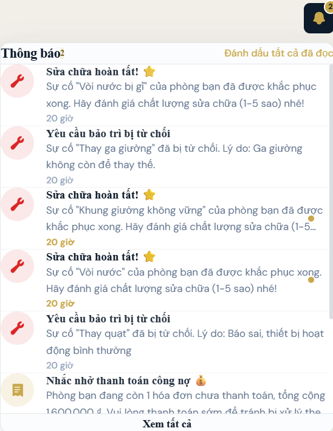
- 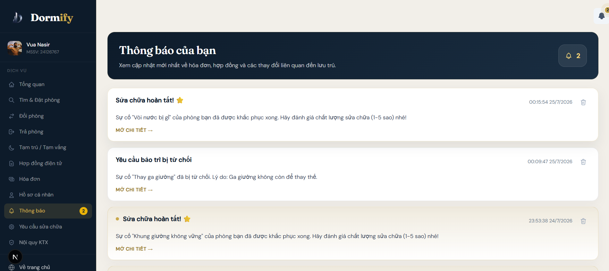
- PA3 asset screenshot evidence covering the basic flow and alternative flows for UC-NOT-01.

**Relationships:**
- None.

**Traceability:** ST25

---

### UC-NOT-02 — Use Message Center

> _Performed by:_ Trần Huỳnh Mạnh Đạt | _Reviewed by:_ Đào Duy Anh | _Edited by:_ Trần Huỳnh Mạnh Đạt

**Use-case ID:** UC-NOT-02  
**Use-case name:** Use Message Center  
**Actor(s):** Student  
**Supporting Actor(s):** None  
**Description:** A student views received messages and communication history in a centralized inbox.  
**Trigger:** The student opens Message Center.

**Preconditions:**
1. The student is authenticated.

**Basic Flow (Main Success Scenario):**
1. The system lists management messages and supported conversation threads.
2. The student filters by unread, sender, category, or date.
3. The student opens a message/thread and reads its history.
4. Where two-way communication is enabled, the student writes and sends a reply.

**Alternative Flows:**
- A1. Reply is not allowed for a broadcast/system message: the composer is disabled.
- A2. No messages: the system displays an empty state.
- A3. Send failure: the draft is preserved for retry.

**Postconditions:**
- Read status and any sent reply are stored.

**Special Requirements:**
- None.

**Prototype Screens:**
- 
- PA3 asset screenshot evidence covering the basic flow and alternative flows for UC-NOT-02.

**Relationships:**
- None.

**Traceability:** ST26

---

### UC-NOT-03 — Send Announcement or Message

> _Performed by:_ Trần Huỳnh Mạnh Đạt | _Reviewed by:_ Đào Duy Anh | _Edited by:_ Trần Huỳnh Mạnh Đạt

**Use-case ID:** UC-NOT-03  
**Use-case name:** Send Announcement or Message  
**Actor(s):** Dormitory Manager  
**Supporting Actor(s):** None  
**Description:** The manager sends information to selected students, rooms, floors, buildings, or all residents.  
**Trigger:** The manager opens Announcement / Message Management.

**Preconditions:**
1. The actor is authenticated as Dormitory Manager.

**Basic Flow (Main Success Scenario):**
1. The manager enters title, message, category, priority, and optional attachment.
2. The manager selects target audience: individual students, rooms, floors, buildings, or all students.
3. The system previews recipient count and validates the target.
4. The manager confirms sending.
5. The system creates recipient notifications/messages, delivers real-time updates where possible, and records broadcast history.

**Alternative Flows:**
- A1. No eligible recipients: sending is blocked.
- A2. Partial delivery failure: successful deliveries remain and failures are reported/retried.
- A3. Scheduled announcement, if enabled: the system stores it and sends at the configured time.

**Postconditions:**
- Messages/notifications are created for targeted recipients and a send history exists.

**Special Requirements:**
- Access to broadcast targeting must be restricted and audited.

**Prototype Screens:**
- 
- 
- PA3 asset screenshot evidence covering the basic flow and alternative flows for UC-NOT-03.

**Relationships:**
- None.

**Traceability:** FR11, FR22, FR23, FR25, FR26, FR28, FR29

---

## 13. AI Chatbot Assistance

> _Performed by:_ Trần Huỳnh Mạnh Đạt | _Reviewed by:_ Đào Duy Anh | _Edited by:_ Trần Huỳnh Mạnh Đạt

Authenticated Dormify AI assistance, source-backed chatbot answers, personalized invoice/profile responses, answer feedback, and administrator knowledge-base maintenance.

| ID | Use case | Primary actor |
| --- | --- | --- |
| UC-AI-01 | Ask Dormify AI Question | Authenticated User |
| UC-AI-02 | Submit AI Answer Feedback | Authenticated User |
| UC-AI-03 | Review AI Answer Feedback | System Admin |
| UC-AI-04 | Rebuild AI Knowledge Base | System Admin |

### UC-AI-01 — Ask Dormify AI Question

> _Performed by:_ Trần Huỳnh Mạnh Đạt | _Reviewed by:_ Đào Duy Anh | _Edited by:_ Trần Huỳnh Mạnh Đạt

**Use-case ID:** UC-AI-01  
**Use-case name:** Ask Dormify AI Question  
**Actor(s):** Authenticated User  
**Supporting Actor(s):** Ollama AI Runtime  
**Description:** A logged-in user asks Dormify AI a dormitory-related question and receives a Vietnamese answer based on the chatbot knowledge base and, when relevant, the user's permitted personal dormitory data.  
**Trigger:** The authenticated user opens the Dormify AI widget and submits a typed question or a suggested starter question.

**Preconditions:**
1. The user is authenticated with a valid JWT.
2. The backend `ChatbotModule` is registered and reachable.
3. The Ollama runtime is available for full generated answers.
4. The chatbot knowledge base has been ingested for document-backed answers.

**Basic Flow (Main Success Scenario):**
1. The system displays the floating Dormify AI widget only after a user is logged in.
2. The user opens the widget and enters a question about dormitory rules, procedures, invoices, room information, contracts, or related residence services.
3. The frontend sends the message, recent chat history, and JWT to the backend chatbot streaming endpoint.
4. The backend validates the JWT and sanitizes the recent conversation history.
5. If the question is a follow-up, the backend combines it with the latest relevant user turn for retrieval while preserving the current question for answer generation.
6. The backend retrieves related knowledge chunks by combining MongoDB vector search with normalized keyword search.
7. If the question asks about the user's own room, contract, conduct score, or invoices, the backend retrieves only that authenticated user's permitted profile, room, contract, and recent invoice context.
8. If the question targets a specific personal invoice, the backend prepares a structured invoice card containing room fee, electricity fee, water fee, total amount, due date, and status.
9. The backend sends the system prompt, retrieved knowledge, personal context, invoice-card flag, and recent history to the Ollama chat model.
10. The backend streams status, generated text, source labels, invoice-card data, or not-found events back to the frontend.
11. The frontend displays the answer as streamed text, shows source chips when document sources are available, renders the invoice card when provided, and stores the short conversation history for the current browser session.

**Alternative Flows:**
- A1. Empty message: the system asks the user to enter a message and does not run retrieval.
- A2. Small-talk message: the backend skips knowledge retrieval and returns a short friendly response.
- A3. No relevant knowledge or personal context found: the system states that the available documents do not contain the requested information and shows suggested questions or navigation options.
- A4. Ollama unavailable or busy: the backend returns an error indicating that the local chatbot is unavailable.
- A5. User closes the widget during streaming: the frontend aborts the request and keeps any text already received.
- A6. Unauthorized or expired token: the request is rejected and no chatbot answer is generated.
- A7. Personal invoice query has no matching room or invoice: the system answers from available document context without an invoice card.

**Postconditions:**
- The chatbot answer, sources, invoice card, or not-found guidance is visible in the widget.
- The current browser session retains recent chat turns unless the user starts a new conversation.
- No dormitory business records are changed by asking a question.

**Special Requirements:**
- Chatbot access requires JWT authentication.
- The answer must be written in Vietnamese and should not invent information outside the provided context.
- Personal context must be limited to the authenticated user and only used when the question is personal.
- Invoice amounts must be rendered from structured backend data instead of being regenerated by the language model.
- The backend uses `CHAT_MODEL`, `EMBED_MODEL`, `OLLAMA_URL`, `CHATBOT_SCORE_THRESHOLD`, `CHATBOT_SEARCH_LIMIT`, and keyword-search settings to control chatbot behavior.

**Prototype Screens:**
- No PA3 prototype screenshot exists for this PA4 AI addition.
- Implementation evidence: `Domitory_Management_Frontend/app/components/ChatbotWidget.tsx`, `Domitory_Management_Backend/src/chatbot/chatbot.controller.ts`, and `Domitory_Management_Backend/src/chatbot/chatbot.service.ts`.

**Relationships:**
- Related to UC-FIN-08 View Invoices and UC-FIN-09 Pay Invoice when an invoice card is returned.
- Extended by UC-AI-02 Submit AI Answer Feedback.

**Traceability:** FR31, ST29, MT09, PA4-AI-01

---

### UC-AI-02 — Submit AI Answer Feedback

> _Performed by:_ Trần Huỳnh Mạnh Đạt | _Reviewed by:_ Đào Duy Anh | _Edited by:_ Trần Huỳnh Mạnh Đạt

**Use-case ID:** UC-AI-02  
**Use-case name:** Submit AI Answer Feedback  
**Actor(s):** Authenticated User  
**Supporting Actor(s):** None  
**Description:** A logged-in user rates a chatbot answer with an up or down verdict so the team can identify helpful answers, weak answers, and missing knowledge.  
**Trigger:** The user selects the thumbs-up or thumbs-down action under a Dormify AI answer.

**Preconditions:**
1. The user is authenticated.
2. A chatbot answer has been generated in the current conversation.

**Basic Flow (Main Success Scenario):**
1. The user selects thumbs up or thumbs down for a chatbot answer.
2. The frontend immediately updates the selected feedback state in the widget.
3. The frontend identifies the user question immediately before the chatbot answer.
4. The frontend sends the question, answer, source labels, verdict, and not-found flag to the chatbot feedback endpoint.
5. The backend validates the authenticated user ID, verdict value, and question text.
6. The backend saves or updates one `ChatFeedback` record for the `(user, question)` pair.
7. The system confirms that the feedback was stored.

**Alternative Flows:**
- A1. User selects the same verdict again: the frontend clears the local selected state and does not create a new backend feedback request.
- A2. Invalid verdict: the backend rejects the request because only `UP` and `DOWN` are accepted.
- A3. Missing question: the backend rejects the request because feedback must be linked to a question.
- A4. Feedback request fails: the frontend restores the previous local feedback state.

**Postconditions:**
- The latest feedback verdict for the user and question is stored.
- Source labels and the not-found flag are retained for later review when provided.

**Special Requirements:**
- Only authenticated users may submit chatbot feedback.
- A user may have only one stored feedback record per question; later feedback overwrites the earlier verdict.
- Stored question and answer text are length-limited before persistence.

**Prototype Screens:**
- No PA3 prototype screenshot exists for this PA4 AI addition.
- Implementation evidence: `ChatbotWidget.tsx` feedback controls, `ChatbotController.submitFeedback`, and `ChatFeedbackSchema`.

**Relationships:**
- Extends UC-AI-01 Ask Dormify AI Question.
- Provides records reviewed in UC-AI-03 Review AI Answer Feedback.

**Traceability:** FR31, ST29, MT09, PA4-AI-02

---

### UC-AI-03 — Review AI Answer Feedback

> _Performed by:_ Trần Huỳnh Mạnh Đạt | _Reviewed by:_ Đào Duy Anh | _Edited by:_ Trần Huỳnh Mạnh Đạt

**Use-case ID:** UC-AI-03  
**Use-case name:** Review AI Answer Feedback  
**Actor(s):** System Admin  
**Supporting Actor(s):** None  
**Description:** A system administrator reviews stored chatbot feedback to find incorrect answers, missing knowledge, and recurring negative responses.  
**Trigger:** The administrator requests the chatbot feedback list.

**Preconditions:**
1. The actor is authenticated as System Admin.
2. One or more chatbot feedback records may exist.

**Basic Flow (Main Success Scenario):**
1. The administrator opens or calls the chatbot feedback review function.
2. The system verifies the `ADMIN` role.
3. The administrator optionally filters the list to negative feedback only.
4. The backend retrieves feedback records, prioritizes negative records, sorts recent updates first, and populates the user's full name and student ID where available.
5. The system displays or returns the question, answer, sources, verdict, not-found flag, user reference, and update time.
6. The administrator uses the feedback to decide whether chatbot documents, prompts, thresholds, or source data need improvement.

**Alternative Flows:**
- A1. Non-admin actor attempts access: the system rejects the request with an authorization error.
- A2. No feedback records exist: the system returns an empty list.
- A3. Negative-only filter returns no results: the system shows no matching negative feedback.

**Postconditions:**
- No chatbot feedback records are changed by viewing the list.
- The administrator has review evidence for chatbot quality improvement.

**Special Requirements:**
- The feedback review endpoint must remain restricted to `ADMIN`.
- Returned user information should be limited to identifying fields needed for review, currently full name and student ID.

**Prototype Screens:**
- No PA3 prototype screenshot exists for this PA4 AI addition.
- Implementation evidence: `GET /api/chatbot/feedback`, `@Roles('ADMIN')`, and `ChatbotService.listFeedback`.

**Relationships:**
- Uses records created by UC-AI-02 Submit AI Answer Feedback.
- May lead to UC-AI-04 Rebuild AI Knowledge Base after documentation improvements.

**Traceability:** FR31, PA4-AI-03

---

### UC-AI-04 — Rebuild AI Knowledge Base

> _Performed by:_ Trần Huỳnh Mạnh Đạt | _Reviewed by:_ Đào Duy Anh | _Edited by:_ Trần Huỳnh Mạnh Đạt

**Use-case ID:** UC-AI-04  
**Use-case name:** Rebuild AI Knowledge Base  
**Actor(s):** System Admin  
**Supporting Actor(s):** Ollama AI Runtime  
**Description:** A system administrator rebuilds the Dormify AI knowledge base from Markdown documents so chatbot retrieval reflects the latest dormitory rules, procedures, and use-case knowledge.  
**Trigger:** The administrator triggers chatbot data ingestion after document changes or during maintenance.

**Preconditions:**
1. The actor is authenticated as System Admin.
2. Markdown knowledge files exist under the backend chatbot documents directory.
3. Ollama is available for embedding generation.
4. MongoDB is reachable for storing knowledge records.

**Basic Flow (Main Success Scenario):**
1. The administrator invokes the chatbot ingestion function.
2. The system verifies the `ADMIN` role.
3. The backend recursively reads Markdown files from `src/chatbot/docs`.
4. The backend clears existing knowledge records.
5. For each Markdown file, the backend identifies the document title and current section headings.
6. The backend splits content into retrieval chunks and prefixes each stored chunk with a source label containing document and section context.
7. The backend requests embeddings from Ollama for each chunk.
8. The backend stores each chunk in MongoDB with title, content, embedding vector, and normalized keyword-search text.
9. The system returns a completion message with the number of ingested chunks and source files.

**Alternative Flows:**
- A1. No Markdown files found: the system returns a message explaining that no source files were available.
- A2. Embedding generation fails for a chunk: the system logs the error and continues processing other chunks where possible.
- A3. Ollama unavailable: ingestion cannot generate embeddings and the administrator must restore the AI runtime before retrying.
- A4. Non-admin actor attempts access: the system rejects the request with an authorization error.

**Postconditions:**
- The chatbot knowledge collection is rebuilt from the current Markdown source files.
- Future chatbot questions use the updated vector and keyword-search corpus.

**Special Requirements:**
- Knowledge ingestion is an administrator-only maintenance operation.
- Stored chunks must keep source labels so chatbot answers can display compact source chips.
- Keyword-search text must be normalized when chunks are stored so Vietnamese queries without accents can still match relevant documents.

**Prototype Screens:**
- No PA3 prototype screenshot exists for this PA4 AI addition.
- Implementation evidence: `POST /api/chatbot/ingest`, `ChatbotService.ingestData`, `KnowledgeSchema`, and `scripts/run-ingest.ts`.

**Relationships:**
- Supports UC-AI-01 Ask Dormify AI Question by preparing the retrieval corpus.
- May be triggered after UC-AI-03 Review AI Answer Feedback identifies missing or outdated source material.

**Traceability:** FR31, PA4-AI-04

---

## 14. Functional Requirement Traceability

> _Performed by:_ Trần Huỳnh Mạnh Đạt | _Reviewed by:_ Đào Duy Anh | _Edited by:_ Trần Huỳnh Mạnh Đạt

| Functional requirement | Related use cases | Coverage |
| --- | --- | --- |
| FR01 | UC-AUTH-01 | Covered |
| FR02 | UC-AUTH-02, UC-AUTH-03, UC-AUTH-04, UC-PRO-03 | Covered |
| FR03 | UC-PRO-01, UC-PRO-02, UC-STAY-01, UC-STAY-02, UC-STAY-03, UC-STU-01 | Covered |
| FR04 | UC-ADM-01 | Covered |
| FR05 | UC-ADM-02 | Covered |
| FR06 | UC-ADM-03 | Covered |
| FR07 | UC-ADM-04 | Covered |
| FR08 | — | Removed from scope |
| FR09 | UC-ROOM-01 | Covered |
| FR10 | UC-STU-01 | Covered |
| FR11 | UC-ROOM-04, UC-ROOM-05, UC-ROOM-06 | Covered |
| FR12 | UC-ROOM-07 | Covered |
| FR13 | UC-ROOM-08, UC-ROOM-09, UC-ROOM-10 | Covered |
| FR14 | UC-CON-01, UC-CON-02, UC-CON-03, UC-CON-04 | Covered |
| FR15 | UC-CON-02 | Covered |
| FR16 | UC-CON-03 | Covered |
| FR17 | UC-CON-04, UC-CON-06 | Covered |
| FR18 | UC-CHK-01, UC-CHK-02 | Covered |
| FR19 | UC-CHK-02, UC-CHK-03 | Covered |
| FR20 | UC-CHK-03 | Covered |
| FR21 | UC-CHK-04 | Covered |
| FR22 | UC-FIN-01, UC-FIN-02, UC-FIN-03, UC-FIN-07, UC-FIN-08, UC-FIN-09, UC-FIN-10, UC-FIN-11 | Covered |
| FR23 | UC-FIN-04, UC-FIN-05, UC-FIN-07 | Covered |
| FR24 | UC-FIN-06 | Covered |
| FR25 | UC-RES-01, UC-RES-05 | Covered |
| FR26 | UC-MNT-01, UC-MNT-03 | Covered |
| FR27 | UC-MNT-03 | Covered |
| FR28 | UC-MNT-02, UC-MNT-04, UC-MNT-05, UC-MNT-06, UC-MNT-07, UC-MNT-08, UC-MNT-09, UC-MNT-10 | Covered |
| FR29 | UC-COND-01, UC-COND-05 | Covered |
| FR30 | UC-COND-02, UC-COND-03, UC-COND-04 | Covered |
| FR31 | UC-AI-01, UC-AI-02, UC-AI-03, UC-AI-04 | Covered |
| FR32 | UC-COND-06, UC-COND-07, UC-COND-08 | Covered |

## 15. Student Feature Traceability

> _Performed by:_ Trần Huỳnh Mạnh Đạt | _Reviewed by:_ Đào Duy Anh | _Edited by:_ Trần Huỳnh Mạnh Đạt

| Student features | Related use cases |
| --- | --- |
| ST01–ST03 Personal profile | UC-PRO-01, UC-PRO-02, UC-PRO-03 |
| ST04–ST06 Residence information | UC-STAY-01, UC-STAY-02, UC-STAY-03 |
| ST07–ST10 Room rental | UC-ROOM-02, UC-ROOM-03, UC-ROOM-04, UC-ROOM-05 |
| ST11–ST12 Contract | UC-CON-05, UC-CON-06 |
| ST13–ST16 Invoice and payment | UC-FIN-08, UC-FIN-09, UC-FIN-10, UC-FIN-11 |
| ST17–ST18 Repair requests | UC-MNT-01, UC-MNT-02 |
| ST19–ST20 Feedback and suggestions | UC-FBK-01, UC-FBK-02 |
| ST21–ST24 Residence declarations | UC-RES-01, UC-RES-02, UC-RES-03, UC-RES-04 |
| ST25–ST26 Notifications | UC-NOT-01, UC-NOT-02 |
| ST27–ST28 Evaluation and violations | UC-COND-04, UC-COND-05 |
| ST29–ST30 Dormify AI assistance | UC-AI-01, UC-AI-02 |
| ST31 Violation appeal | UC-COND-06 |

## 16. Maintenance Staff Feature Traceability

> _Performed by:_ Trần Huỳnh Mạnh Đạt | _Reviewed by:_ Đào Duy Anh | _Edited by:_ Trần Huỳnh Mạnh Đạt

| Maintenance features | Related use cases |
| --- | --- |
| MT01 | UC-MNT-05 |
| MT02 | UC-MNT-06 |
| MT03–MT04 | UC-MNT-07 |
| MT05–MT06 | UC-MNT-08 |
| MT07 | UC-MNT-09 |
| MT08 | UC-MNT-10 |
| MT09 AI assistant | UC-AI-01, UC-AI-02 |

## 17. Floor Manager Function Reassignment

> _Performed by:_ Trần Huỳnh Mạnh Đạt | _Reviewed by:_ Đào Duy Anh | _Edited by:_ Trần Huỳnh Mạnh Đạt

| Former Floor Manager functions | Responsible role and use cases |
| --- | --- |
| FM01–FM02 View students and residence information | Dormitory Manager — UC-STU-01 |
| FM03 Track room conditions | Dormitory Manager — UC-ROOM-01 |
| FM04–FM09 Manage meter readings | Dormitory Manager — UC-FIN-01 |
| FM10–FM12 Track residence declarations | Dormitory Manager — UC-RES-05 |
| FM13 Record violations | Dormitory Manager — UC-COND-01, UC-COND-07, UC-COND-08 |
| FM14 Perform periodic evaluations | Dormitory Manager — UC-COND-03 |
| FM15 Receive feedback | Dormitory Manager — UC-FBK-03 |
| FM16 Track repair requests | Dormitory Manager — UC-MNT-04 |

*End of Use-Case Specification — Version 1.2 / PA4*
