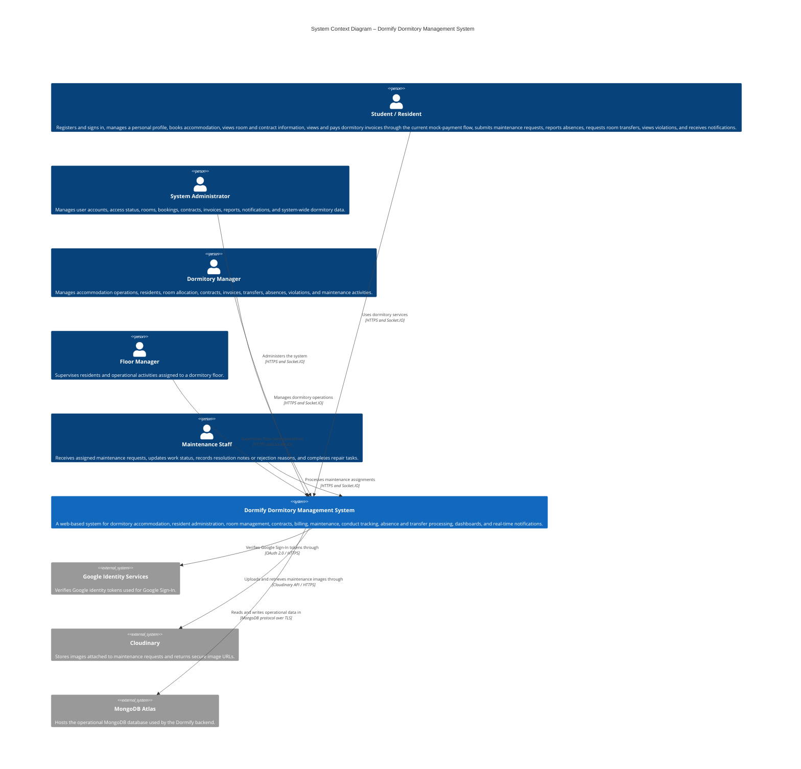
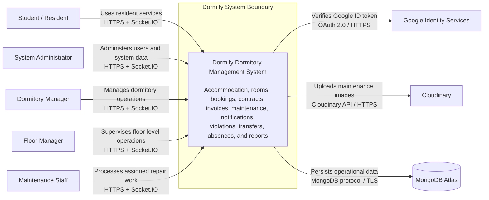

# B. Software Architecture: System Context Diagram

**Project:** Dormify – Dormitory Management System  
**Assignment:** PA4-2026  
**Architecture View:** C4 Model – Level 1 (System Context)  
**Source Baseline:** Latest `main` branches of the frontend and backend repositories reviewed on August 1, 2026

## 1. Purpose

**Performed by:** Trần Huỳnh Mạnh Đạt | **Reviewed by:** Đào Duy Anh | **Edited by:** Trần Huỳnh Mạnh Đạt

This section formally documents the high-level architecture of the Dormify Dormitory Management System. It describes the technologies currently used by the implementation, the people who interact with the system, the external software systems on which Dormify depends, and the relationships among them.

The architecture description is based on the current source code in:

- `Domitory_Management_Frontend`
- `Domitory_Management_Backend`

The System Context view treats Dormify as one software system. Internal applications, modules, databases, and implementation details are summarized here and may be expanded later in a C4 Level 2 Container Diagram.

---

## 2. System Overview

**Performed by:** Trần Huỳnh Mạnh Đạt | **Reviewed by:** Đào Duy Anh | **Edited by:** Trần Huỳnh Mạnh Đạt

Dormify is a web-based information system used to manage dormitory accommodation and daily residential operations. It provides role-based interfaces for students, administrators, dormitory managers, floor managers, and maintenance staff.

The current backend is organized into the following business modules:

- Authentication
- User and resident management
- Room management
- Room booking and accommodation registration
- Contract management
- Invoice and utility-fee management
- Maintenance request management
- Real-time notifications
- Student violations and conduct management
- Room transfer management
- Temporary absence management

The frontend provides separate protected application areas for:

- Students
- Administrative and management roles
- Maintenance staff

---

## 3. Architecture Scope

**Performed by:** Trần Huỳnh Mạnh Đạt | **Reviewed by:** Đào Duy Anh | **Edited by:** Trần Huỳnh Mạnh Đạt

### 3.1 Included in the current architecture

**Performed by:** Trần Huỳnh Mạnh Đạt | **Reviewed by:** Đào Duy Anh | **Edited by:** Trần Huỳnh Mạnh Đạt

This document includes components and integrations that are directly supported by the current repositories:

- Next.js web frontend
- NestJS backend API
- MongoDB database through Mongoose
- JWT-based authentication and authorization
- Google Sign-In
- Socket.IO real-time notifications
- Cloudinary image storage for maintenance evidence
- NestJS scheduled jobs for overdue invoice processing
- Role-based access for students, administrators, dormitory managers, floor managers, and maintenance staff

### 3.2 Not represented as active external systems

**Performed by:** Trần Huỳnh Mạnh Đạt | **Reviewed by:** Đào Duy Anh | **Edited by:** Trần Huỳnh Mạnh Đạt

The following items are not shown as active external systems in the context diagram:

- **Online payment gateway:** the current invoice module uses an internal mock-payment flow and administrative payment confirmation. No real third-party payment gateway is integrated.
- **Email/OTP provider:** `nodemailer` exists in backend dependencies, but no active email or OTP module is registered in the current root application module.
- **Generative AI service:** the Google Generative AI package exists in dependencies, but no active AI module or service is registered in the current root application module.

These technologies may be shown in a future-state architecture after they are fully integrated.

---

## 4. Technology Stack

**Performed by:** Trần Huỳnh Mạnh Đạt | **Reviewed by:** Đào Duy Anh | **Edited by:** Trần Huỳnh Mạnh Đạt

### 4.1 Frontend

**Performed by:** Trần Huỳnh Mạnh Đạt | **Reviewed by:** Đào Duy Anh | **Edited by:** Trần Huỳnh Mạnh Đạt

| Technology | Current architectural responsibility |
|---|---|
| **Next.js 16** | Provides the web application framework, routing, layouts, server-side route protection, and production build process. |
| **React 19** | Implements reusable user-interface components and interactive pages. |
| **TypeScript 5** | Provides static typing for frontend code. |
| **Tailwind CSS 4** | Provides utility-based styling and responsive layouts. |
| **Next.js Proxy** | Protects `/student`, `/admin`, and `/staff` routes by checking JWT data stored in cookies and redirecting users to the correct role-specific dashboard. |
| **Google OAuth React Client** | Obtains Google identity tokens for Google Sign-In. |
| **Socket.IO Client** | Receives real-time notifications from the backend. |
| **Recharts** | Displays dashboard statistics and reporting charts. |
| **Lucide React and React Icons** | Provides icons for the user interface. |

The frontend runs in the user's web browser and communicates with the backend through HTTP requests and Socket.IO connections.

---

### 4.2 Backend

**Performed by:** Trần Huỳnh Mạnh Đạt | **Reviewed by:** Đào Duy Anh | **Edited by:** Trần Huỳnh Mạnh Đạt

| Technology | Current architectural responsibility |
|---|---|
| **NestJS 11** | Implements the backend application as modular controllers, services, guards, gateways, and scheduled jobs. |
| **Node.js** | Runs the backend application. |
| **TypeScript** | Provides static typing for backend source code. |
| **REST-style HTTP APIs** | Expose authentication and dormitory-management functions to the frontend. |
| **JWT** | Authenticates HTTP requests and Socket.IO connections. |
| **Passport JWT** | Supports JWT authentication strategies and protected endpoints. |
| **bcrypt** | Hashes and verifies local account passwords. |
| **class-validator / class-transformer** | Validate and transform incoming DTO data using a global validation pipe. |
| **Socket.IO / NestJS WebSockets** | Deliver private and broadcast real-time notifications. |
| **NestJS Schedule** | Runs internal scheduled tasks, including overdue-invoice processing. |
| **Cloudinary SDK** | Uploads maintenance-request images and stores their secure URLs. |

The backend listens on port `3001` in the current implementation and is the authoritative security and business-logic boundary.

---

### 4.3 Database

**Performed by:** Trần Huỳnh Mạnh Đạt | **Reviewed by:** Đào Duy Anh | **Edited by:** Trần Huỳnh Mạnh Đạt

| Technology | Current architectural responsibility |
|---|---|
| **MongoDB** | Stores users, rooms, bookings, contracts, invoices, maintenance requests, notifications, violations, transfers, and absences. |
| **MongoDB Atlas connection** | The backend README and environment configuration use `MONGO_URI` for a MongoDB Atlas connection string. |
| **Mongoose** | Defines schemas, references, validation rules, queries, and persistence logic. |

MongoDB is accessed only through the NestJS backend. Browser clients do not access the database directly.

---

### 4.4 Authentication and Authorization

**Performed by:** Trần Huỳnh Mạnh Đạt | **Reviewed by:** Đào Duy Anh | **Edited by:** Trần Huỳnh Mạnh Đạt

Dormify supports two authentication methods:

1. Local login using email or student ID and password.
2. Google Sign-In using a Google identity token.

After authentication, the backend issues a JWT containing the user's ID, email, role, and access status.

The current role model includes:

| Role | Main responsibility |
|---|---|
| `STUDENT` | Uses resident-facing dormitory services. |
| `ADMIN` | Performs system-wide administrative operations. |
| `DORMITORY_MANAGER` | Manages dormitory accommodation and operations. |
| `FLOOR_MANAGER` | Oversees residents and operations at floor level. |
| `MAINTENANCE_STAFF` | Processes assigned repair and maintenance requests. |

The frontend uses role information for navigation and route gating. The backend remains responsible for final authentication, authorization, and data-access enforcement.

---

### 4.5 Real-Time Notifications

**Performed by:** Trần Huỳnh Mạnh Đạt | **Reviewed by:** Đào Duy Anh | **Edited by:** Trần Huỳnh Mạnh Đạt

The backend implements a Socket.IO notification gateway.

During connection:

1. The client sends its JWT through the Socket.IO handshake.
2. The backend verifies the token.
3. The connection is rejected if the token is missing or invalid.
4. An authenticated user joins a private room named `user_<userId>`.
5. The backend emits `newNotification` events either to one private user room or to all connected users.

Notifications are currently used for events such as:

- New maintenance requests
- Maintenance assignments
- Completed or rejected maintenance work
- Maintenance-service ratings
- Successful invoice payment
- Overdue invoices

---

### 4.6 File and Image Storage

**Performed by:** Trần Huỳnh Mạnh Đạt | **Reviewed by:** Đào Duy Anh | **Edited by:** Trần Huỳnh Mạnh Đạt

The maintenance module integrates with Cloudinary.

Students may attach an image when creating a maintenance request. The backend validates that the uploaded file is an image, uploads it to a configured Cloudinary folder, and stores the returned secure URL with the maintenance record.

Cloudinary is therefore an external software system in the System Context Diagram.

---

### 4.7 Scheduling

**Performed by:** Trần Huỳnh Mạnh Đạt | **Reviewed by:** Đào Duy Anh | **Edited by:** Trần Huỳnh Mạnh Đạt

The backend uses `@nestjs/schedule` for internal background processing.

The invoice service currently runs a scheduled overdue-invoice check. The job:

- Searches for pending invoices whose due date has passed.
- Changes their status to `OVERDUE`.
- Records the overdue time.
- Creates real-time notifications for affected students.

Because this scheduler is implemented inside the NestJS application, it is part of Dormify rather than an external system in the Level 1 diagram.

---

## 5. C4 Model – Level 1 System Context Diagram

**Performed by:** Trần Huỳnh Mạnh Đạt | **Reviewed by:** Đào Duy Anh | **Edited by:** Trần Huỳnh Mạnh Đạt

### 5.1 Primary C4 Mermaid Diagram

**Performed by:** Trần Huỳnh Mạnh Đạt | **Reviewed by:** Đào Duy Anh | **Edited by:** Trần Huỳnh Mạnh Đạt

---

### 5.2 Mermaid Flowchart Compatibility Version

**Performed by:** Trần Huỳnh Mạnh Đạt | **Reviewed by:** Đào Duy Anh | **Edited by:** Trần Huỳnh Mạnh Đạt

Some Markdown renderers do not enable Mermaid's `C4Context` extension. The following standard Mermaid flowchart represents the same Level 1 context and is more broadly compatible.

---

## 6. Diagram Explanation

**Performed by:** Trần Huỳnh Mạnh Đạt | **Reviewed by:** Đào Duy Anh | **Edited by:** Trần Huỳnh Mạnh Đạt

### 6.1 Dormify System

**Performed by:** Trần Huỳnh Mạnh Đạt | **Reviewed by:** Đào Duy Anh | **Edited by:** Trần Huỳnh Mạnh Đạt

The central element is the **Dormify Dormitory Management System**. At C4 Level 1, the Next.js frontend, NestJS backend, Socket.IO gateway, scheduled jobs, and domain modules are treated as one software system.

Dormify provides a single role-based web platform for managing accommodation and resident-related processes. The system receives requests from authenticated users, applies business and authorization rules in the backend, stores operational data in MongoDB, uploads maintenance evidence to Cloudinary, and sends real-time notifications through Socket.IO.

---

### 6.2 Human Actors

**Performed by:** Trần Huỳnh Mạnh Đạt | **Reviewed by:** Đào Duy Anh | **Edited by:** Trần Huỳnh Mạnh Đạt

### Student / Resident

Students use Dormify to access resident-facing services, including:

- Creating an account and signing in
- Using Google Sign-In
- Managing profile information
- Viewing dormitory and room information
- Registering or booking accommodation
- Viewing contract information
- Viewing room invoices
- Completing the current simulated invoice-payment process
- Submitting maintenance requests with images
- Tracking maintenance status and rating completed repairs
- Requesting room transfers
- Reporting temporary absences
- Viewing recorded violations and conduct information
- Receiving real-time notifications

### System Administrator

The System Administrator has system-wide administrative responsibility, including:

- Managing user accounts and role assignments
- Locking accounts and recording lock reasons
- Managing rooms and accommodation data
- Reviewing bookings
- Managing contracts and invoices
- Confirming payments
- Monitoring maintenance requests
- Managing violations, transfers, and absences
- Viewing statistics and administrative dashboards
- Sending or receiving operational notifications

### Dormitory Manager

The Dormitory Manager performs business and operational management rather than low-level system administration. This actor manages accommodation processes, resident allocation, contracts, billing, maintenance coordination, conduct records, room transfers, and absences.

In the frontend, the Dormitory Manager is authorized to access the administrative application area together with other management roles.

### Floor Manager

The Floor Manager supervises residents and operational activities associated with a dormitory floor. This role is represented separately because it exists explicitly in the backend role model, even though it currently shares the main administrative frontend area.

### Maintenance Staff

Maintenance Staff members:

- View maintenance requests assigned to them
- Update work status
- Record repair completion notes
- Reject requests with a reason when appropriate
- Trigger notifications to residents through status updates

The backend prevents maintenance staff from modifying requests that are not assigned to them.

---

## 6.3 External Software Systems

**Performed by:** Trần Huỳnh Mạnh Đạt | **Reviewed by:** Đào Duy Anh | **Edited by:** Trần Huỳnh Mạnh Đạt

### Google Identity Services

Dormify supports Google Sign-In.

The frontend obtains a Google identity token and sends it to the backend. The backend uses the Google authentication library to verify the token and extract the user's verified identity. Dormify then creates or retrieves the corresponding local user and issues its own JWT.

Google is responsible only for identity verification. Dormify remains responsible for local roles, account status, room assignment, and authorization.

### Cloudinary

Cloudinary stores images attached to maintenance requests.

The backend:

1. Validates the uploaded file type.
2. Converts or prepares the image data for upload.
3. Uploads the image to a configured Cloudinary folder.
4. Receives a secure URL.
5. Stores that URL in the maintenance-request record.

Students and staff access the image through Dormify rather than interacting directly with Cloudinary credentials.

### MongoDB Atlas

MongoDB Atlas hosts the application's operational database.

The backend connects using the `MONGO_URI` environment variable and Mongoose. It stores data for all current domain modules. Direct browser-to-database access is not permitted.

Although a database is commonly shown inside a C4 Level 2 Container Diagram, MongoDB Atlas is included in this Level 1 diagram because it is an externally managed software dependency explicitly required by the project's technology-stack description.

---

## 7. Main System Relationships

**Performed by:** Trần Huỳnh Mạnh Đạt | **Reviewed by:** Đào Duy Anh | **Edited by:** Trần Huỳnh Mạnh Đạt

| Source | Destination | Relationship | Technology |
|---|---|---|---|
| Student / Resident | Dormify | Uses resident and accommodation services | HTTPS, Socket.IO |
| System Administrator | Dormify | Manages accounts, configuration, and system-wide records | HTTPS, Socket.IO |
| Dormitory Manager | Dormify | Manages dormitory business operations | HTTPS, Socket.IO |
| Floor Manager | Dormify | Supervises floor-level resident operations | HTTPS, Socket.IO |
| Maintenance Staff | Dormify | Processes assigned maintenance work | HTTPS, Socket.IO |
| Dormify | Google Identity Services | Verifies Google identity tokens | OAuth 2.0, HTTPS |
| Dormify | Cloudinary | Stores maintenance images | Cloudinary API, HTTPS |
| Dormify | MongoDB Atlas | Persists and queries operational data | MongoDB protocol over TLS |

---

## 8. Internal Responsibilities Hidden at Level 1

**Performed by:** Trần Huỳnh Mạnh Đạt | **Reviewed by:** Đào Duy Anh | **Edited by:** Trần Huỳnh Mạnh Đạt

The following elements are inside the Dormify system boundary and are intentionally not drawn as separate systems in the context diagram:

- Next.js frontend application
- NestJS REST API
- Authentication and authorization guards
- User module
- Room module
- Booking module
- Contract module
- Invoice module
- Maintenance module
- Notification WebSocket gateway
- Violation module
- Transfer module
- Absence module
- Scheduled overdue-invoice job
- Reporting and dashboard logic

These elements should be shown separately in a **C4 Level 2 Container Diagram** or **C4 Level 3 Component Diagram**, not in the Level 1 System Context Diagram.

---

## 9. Architectural Characteristics

**Performed by:** Trần Huỳnh Mạnh Đạt | **Reviewed by:** Đào Duy Anh | **Edited by:** Trần Huỳnh Mạnh Đạt

### 9.1 Security

**Performed by:** Trần Huỳnh Mạnh Đạt | **Reviewed by:** Đào Duy Anh | **Edited by:** Trần Huỳnh Mạnh Đạt

- Passwords are hashed using bcrypt.
- The backend issues and verifies JWTs.
- Socket.IO connections require a valid JWT during the handshake.
- User roles control access to protected functions.
- Account status can be set to `ACTIVE` or `LOCKED`.
- The frontend blocks navigation to inappropriate role areas.
- The backend remains the final authority for data access.
- Uploaded maintenance files are validated as images.
- MongoDB and external service credentials are loaded from environment variables.

### 9.2 Maintainability

**Performed by:** Trần Huỳnh Mạnh Đạt | **Reviewed by:** Đào Duy Anh | **Edited by:** Trần Huỳnh Mạnh Đạt

- The backend follows a modular NestJS structure.
- Each major business capability has its own controller, service, schemas, and DTOs.
- The frontend separates authentication, student, administration, staff, shared components, context, and utility code.
- TypeScript is used across both repositories.
- DTO validation is enabled globally.

### 9.3 Reliability

**Performed by:** Trần Huỳnh Mạnh Đạt | **Reviewed by:** Đào Duy Anh | **Edited by:** Trần Huỳnh Mạnh Đạt

- Invalid DTO properties are filtered by the global validation pipe.
- Invoice creation checks for duplicates.
- Payment operations protect against repeated payment.
- Scheduled overdue processing updates only pending invoices.
- Notification failures are handled without rolling back already completed business operations.
- Maintenance status rules prevent unauthorized staff updates.
- Rejected maintenance requests require a reason.

### 9.4 Scalability

**Performed by:** Trần Huỳnh Mạnh Đạt | **Reviewed by:** Đào Duy Anh | **Edited by:** Trần Huỳnh Mạnh Đạt

- The frontend and backend are separate applications and can be deployed independently.
- The backend uses stateless JWT authentication for HTTP APIs.
- MongoDB Atlas can be scaled independently from the application server.
- Cloudinary separates image storage from the backend server.
- Socket.IO can later use a shared adapter if the backend is deployed across multiple instances.

### 9.5 Usability

**Performed by:** Trần Huỳnh Mạnh Đạt | **Reviewed by:** Đào Duy Anh | **Edited by:** Trần Huỳnh Mạnh Đạt

- Users are redirected to dashboards based on role.
- Students, management users, and maintenance staff have separate work areas.
- Real-time notifications reduce the need for manual status checking.
- Dashboard charts provide operational summaries.
- Google Sign-In reduces login friction.

---

## 10. Architectural Decisions and Corrections from the Earlier Sample

**Performed by:** Trần Huỳnh Mạnh Đạt | **Reviewed by:** Đào Duy Anh | **Edited by:** Trần Huỳnh Mạnh Đạt

The repository review changes several assumptions from the earlier generic sample:

| Earlier assumption | Repository-based correction |
|---|---|
| Frontend uses React with Vite | The current frontend uses **Next.js 16** with React 19. |
| A real online payment gateway is integrated | Payment is currently an **internal mock-payment or admin-confirmation flow**. |
| Email/OTP is an active external service | Nodemailer is installed, but no active email/OTP module is registered in the current application root. |
| AI maintenance routing and RAG chatbot are active | The AI package is installed, but no active AI module is registered in the current application root. |
| Only Student, Admin, and Maintenance Staff are modeled | The backend also explicitly defines **Dormitory Manager** and **Floor Manager** roles. |
| A generic cloud file service is used | The maintenance implementation specifically integrates with **Cloudinary**. |
| The scheduler is an external system | The scheduler is an **internal NestJS scheduled service**. |
| Invoice reminders run monthly only | The current implementation checks overdue invoices through an internal recurring cron job. |

---

## 11. Assumptions and Constraints

**Performed by:** Trần Huỳnh Mạnh Đạt | **Reviewed by:** Đào Duy Anh | **Edited by:** Trần Huỳnh Mạnh Đạt

- The current diagram reflects the `main` branches reviewed on August 1, 2026.
- Deployment providers for the frontend and backend are not confirmed by the repositories and are therefore not shown.
- MongoDB Atlas availability is required for persistence.
- Google Sign-In depends on Google Identity Services.
- Maintenance image upload depends on valid Cloudinary configuration.
- Real-time notifications require an active Socket.IO connection.
- The current payment function does not transfer real money.
- AI and email features should not be described as deployed external integrations until their modules are implemented and registered.
- The frontend's role-based proxy improves navigation security, but authoritative access control must always remain in the backend.

---

## 12. Conclusion

**Performed by:** Trần Huỳnh Mạnh Đạt | **Reviewed by:** Đào Duy Anh | **Edited by:** Trần Huỳnh Mạnh Đạt

The repository-based System Context Diagram presents Dormify as one web-based dormitory-management software system used by five human roles:

- Student / Resident
- System Administrator
- Dormitory Manager
- Floor Manager
- Maintenance Staff

The current implementation depends on three confirmed external software systems:

- Google Identity Services for Google Sign-In
- Cloudinary for maintenance image storage
- MongoDB Atlas for managed database hosting

The diagram intentionally excludes a real payment gateway, email/OTP service, and generative AI service because the current source code does not show them as active runtime integrations. This keeps the PA4 architecture document aligned with the implemented system rather than planned features or unused dependencies.
