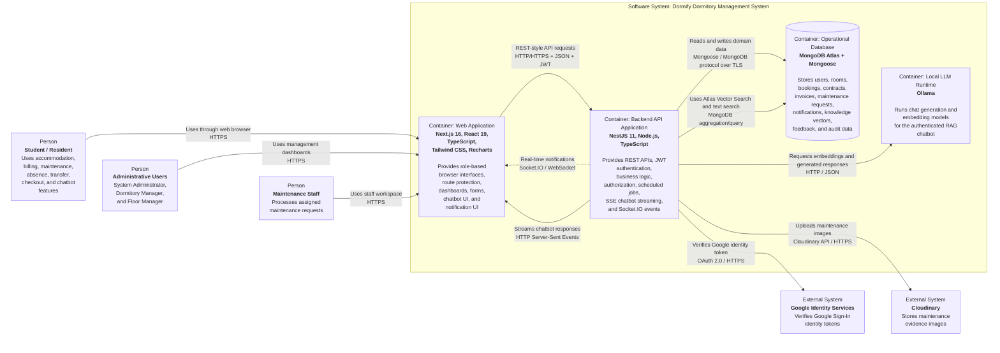
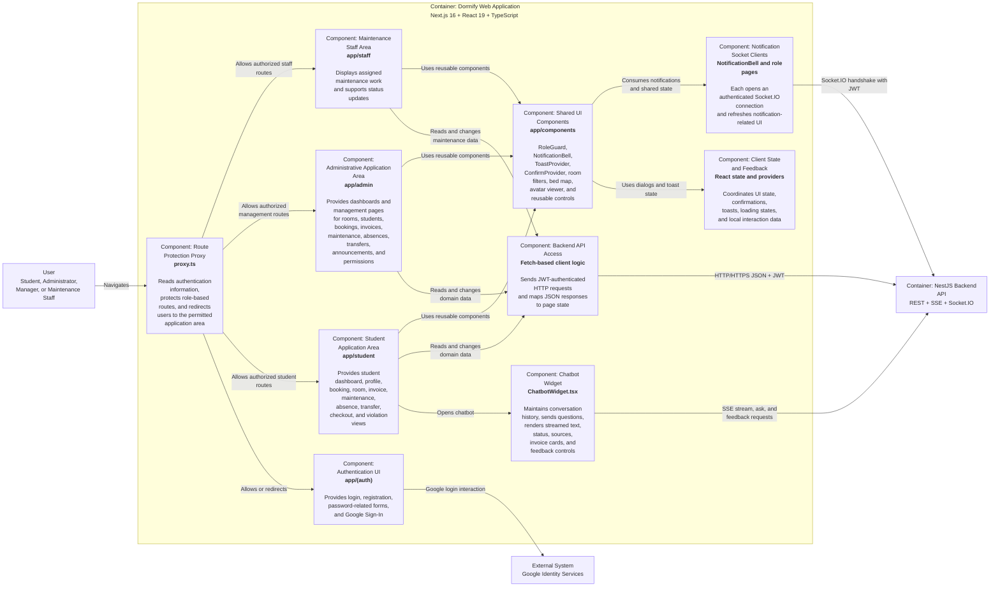

<!-- Recovered from the accompanying PA4 PDF after the pre-sync Markdown was unavailable. The Mermaid diagrams below were reconstructed from the rendered PDF diagrams. -->

# Software Architecture: Container Diagram and Component Diagrams

**Project:** Dormify – Dormitory Management System  
**Assignment:** PA4-2026  
**Architecture View:** C4 Model Level 2 and Level 3  
**Source Baseline:** Latest repository state reviewed on August 8, 2026

## 1. Purpose

**Performed by:   Trần Huỳnh Mạnh Đạt |   Reviewed by:   Đào Duy Anh |   Edited by:   Trần Huỳnh Mạnh Đạt**

This section documents the internal software architecture of Dormify using:
- **C4 Level 2 – Container Diagram**
- **C4 Level 3 – Frontend Component Diagram**
- **C4 Level 3 – Backend Component Diagram**

The diagrams reflect the current implementation in:
- [Domitory_Management_Frontend](https://github.com/ddanh2436/Domitory_Management_Frontend.git)
- [Domitory_Management_Backend](https://github.com/ddanh2436/Domitory_Management_Backend.git)

All diagrams use standard Mermaid `flowchart`   syntax with C4-style labels so that they can be rendered by
common Markdown tools.
## 2. C4 Level 2 – Container Diagram

**Performed by:   Trần Huỳnh Mạnh Đạt |   Reviewed by:   Đào Duy Anh |   Edited by:   Trần Huỳnh Mạnh Đạt**

### 2.1 Container Diagram

**Performed by:   Trần Huỳnh Mạnh Đạt |   Reviewed by:   Đào Duy Anh |   Edited by:   Trần Huỳnh Mạnh Đạt**



### 2.2 Container Descriptions

**Performed by:   Trần Huỳnh Mạnh Đạt |   Reviewed by:   Đào Duy Anh |   Edited by:   Trần Huỳnh Mạnh Đạt**

#### 2.2.1 Web Application

**Performed by:   Trần Huỳnh Mạnh Đạt |   Reviewed by:   Đào Duy Anh |   Edited by:   Trần Huỳnh Mạnh Đạt**

### Responsibility

The Web Application is the browser-based user interface of Dormify. It provides:
- Public authentication pages
- Student dashboards and resident services
- Administrative dashboards
- Maintenance staff workspace
- Role-based navigation
- Forms and tables for domain operations
- Dashboard charts
- Real-time notification display
- AI chatbot user interface
- Confirmation dialogs, toast messages, and shared visual components
### Technology
| **Technology** | **Purpose** |
| --- | --- |
| Next.js 16 | Application framework, App Router, layouts, routing, and production build |
| React 19 | Interactive UI components |
| TypeScript 5 | Static typing |
| Tailwind CSS 4 | Responsive styling |
| Recharts | Administrative and operational charts |
| Socket.IO Client | Real-time notifications |
| Google OAuth React | Google Sign-In UI |
| Lucide React / React Icons | Icons |

#### Communication

The Web Application communicates with:

- The Backend API through HTTP/HTTPS JSON requests
- The Backend Socket.IO gateway through WebSocket or Socket.IO fallback transport
- The Backend chatbot streaming endpoint through Server-Sent Events
- Google Identity Services indirectly during Google Sign-In

JWT data is used for authenticated API calls, role checks, and protected navigation.

---

### 2.2.2 Backend API Application

**Performed by:** Trần Huỳnh Mạnh Đạt | **Reviewed by:** Đào Duy Anh | **Edited by:** Trần Huỳnh Mạnh Đạt

#### Responsibility

The Backend API Application is the main business and security boundary. It provides:

- Local and Google authentication
- JWT creation and verification
- Role-based authorization
- User and profile management
- Room and bed management
- Booking and accommodation registration
- Room assignment
- Contract management
- Invoice and fee management
- Maintenance request processing
- Notification persistence and real-time delivery
- Violation and conduct management
- Temporary absence management
- Room transfer management
- Checkout and refund processing
- Audit logging 
- RAG chatbot and personalized student queries
- Scheduled overdue-invoice processing

#### Technology

| **Technology** | **Purpose** |
| --- | --- |
| NestJS 11 | Modular backend framework |
| Node.js | Runtime |
| TypeScript | Static typing |
| Mongoose | MongoDB object modeling |
| Passport JWT | Authentication strategy |
| bcrypt | Password hashing |
| class-validator | Request validation |
| Socket.IO | Real-time notifications |
| RxJS | Chatbot streaming event flow |
| NestJS Schedule | Scheduled background jobs |
| Google Auth Library | Google token verification |
| Cloudinary SDK | Image upload |
| Native `fetch` | Calls Ollama HTTP endpoints |

#### Communication

The Backend API communicates with:

- The Web Application using HTTP/HTTPS, JSON, SSE, and Socket.IO
- MongoDB Atlas through Mongoose
- Google Identity Services using token verification
- Cloudinary using HTTPS API calls
- Ollama using local or network HTTP calls

The current backend listens on port `3001`.

---

### 2.2.3 Operational Database

**Performed by:** Trần Huỳnh Mạnh Đạt | **Reviewed by:** Đào Duy Anh | **Edited by:** Trần Huỳnh Mạnh Đạt

#### Responsibility

The Operational Database stores all persistent business data, including:

- User accounts and profiles
- Roles and access status
- Rooms and room occupancy
- Bookings
- Room assignments
- Contracts
- Invoices and payment status
- Maintenance requests
- Notifications
- Violations
- Transfers
- Absences
- Checkout records
- Audit logs
- C hatbot knowledge chunks
- Vector embeddings
- Chatbot feedback

#### Technology
- MongoDB Atlas
- Mongoose schemas and models
- MongoDB text indexes
- MongoDB Atlas Vector Search

#### Communication

Only the Backend API accesses the database. The frontend never connects directly to MongoDB.

The chatbot uses both:
- Vector similarity search
- MongoDB text search

The results are merged before context is sent to the AI runtime.
### 2.2.4 Google Identity Services

**Performed by:** Trần Huỳnh Mạnh Đạt | **Reviewed by:** Đào Duy Anh | **Edited by:** Trần Huỳnh Mạnh Đạt

#### Responsibility

Google Identity Services validates Google accounts used for Google Sign-In.

The frontend obtains an identity token and sends it to the backend. The backend verifies the token, resolves or creates the local Dormify account, and returns a Dormify JWT.

#### Communication

- OAuth 2.0 / OpenID-style identity token
- HTTPS

---

### 2.2.5 Cloudinary

**Performed by:** Trần Huỳnh Mạnh Đạt | **Reviewed by:** Đào Duy Anh | **Edited by:** Trần Huỳnh Mạnh Đạt

#### Responsibility

Cloudinary stores images attached to maintenance requests.

The backend uploads image data and saves the returned secure URL in MongoDB.

#### Communication

- Cloudinary SDK
- HTTPS

---

### 2.2.6 Ollama AI Runtime

**Performed by:** Trần Huỳnh Mạnh Đạt | **Reviewed by:** Đào Duy Anh | **Edited by:** Trần Huỳnh Mạnh Đạt

#### Responsibility

Ollama executes the models used by the chatbot:

- Chat generation model
- Text embedding model

The default models in the current backend are:

- `qwen2.5:3b`
- `nomic-embed-text`

The Ollama endpoint defaults to:

```text
http://localhost:11434
```

It may be changed using environment variables.

#### Communication

The backend calls Ollama using HTTP JSON requests for:

- `/api/embeddings`
- Chat generation or streaming operations

Ollama is represented as a separate container-level dependency because it runs as a separate process from NestJS.

---

# 3. C4 Level 3 – Frontend Component Diagram

**Performed by:** Trần Huỳnh Mạnh Đạt | **Reviewed by:** Đào Duy Anh | **Edited by:** Trần Huỳnh Mạnh Đạt

## 3.1 Scope

**Performed by:** Trần Huỳnh Mạnh Đạt | **Reviewed by:** Đào Duy Anh | **Edited by:** Trần Huỳnh Mạnh Đạt

The frontend component diagram focuses on the components that best represent the internal structure:

- Authentication and route protection
- Role-based application areas
- Shared UI components
- Notification communication
- Chatbot communication
- Backend API access

The frontend repository uses the Next.js App Router and organizes pages mainly under:

- `app/(auth)`
- `app/student`
- `app/admin`
- `app/staff`
- `app/components`
- `app/context`
- `app/utils`

---

## 3.2 Frontend Component Diagram

**Performed by:** Trần Huỳnh Mạnh Đạt | **Reviewed by:** Đào Duy Anh | **Edited by:** Trần Huỳnh Mạnh Đạt



## 3.3 Frontend Component Descriptions

**Performed by:** Trần Huỳnh Mạnh Đạt | **Reviewed by:** Đào Duy Anh | **Edited by:** Trần Huỳnh Mạnh Đạt

### 3.3.1 Route Protection Proxy

**Performed by:** Trần Huỳnh Mạnh Đạt | **Reviewed by:** Đào Duy Anh | **Edited by:** Trần Huỳnh Mạnh Đạt

#### Responsibility

The Route Protection Proxy executes before protected page access. It:

- Checks authentication information
- Reads role data
- Protects student, administrative, and staff URL areas
- Redirects unauthenticated users
- Redirects authenticated users away from areas they are not authorized to use

#### Relationships

- Receives navigation requests from the browser
- Routes users to Authentication UI or the appropriate role-specific area
- Complements backend authorization but does not replace it

---

### 3.3.2 Authentication UI

**Performed by:** Trần Huỳnh Mạnh Đạt | **Reviewed by:** Đào Duy Anh | **Edited by:** Trần Huỳnh Mạnh Đạt

#### Responsibility

The Authentication UI provides:

- Local login
- User registration
- Google Sign-In
- Authentication-related feedback and redirection

#### Relationships

- Communicates with Google Identity Services for the client-side Google login flow
- Sends login and registration data to the Backend API
- Receives a Dormify JWT and role information
- Redirects the user to the correct application area

---

### 3.3.3 Student Application Area

**Performed by:** Trần Huỳnh Mạnh Đạt | **Reviewed by:** Đào Duy Anh | **Edited by:** Trần Huỳnh Mạnh Đạt

#### Responsibility

The Student Application Area contains resident-facing pages and workflows, including:

- Dashboard
- Profile
- Room and bed information
- Accommodation booking
- Contract information
- Invoices and current simulated payment flow
- Maintenance request submission
- Maintenance status and rating
- Absence reporting
- Transfer requests
- Checkout requests
- Violation and conduct information
- Notifications
- Chatbot access

#### Relationships

- Uses Shared UI Components
- Sends HTTP requests through Backend API Access
- Uses the current per-component Socket.IO notification clients for real-time updates
- Opens the Chatbot Widget

---

### 3.3.4 Administrative Application Area

**Performed by:** Trần Huỳnh Mạnh Đạt | **Reviewed by:** Đào Duy Anh | **Edited by:** Trần Huỳnh Mạnh Đạt

#### Responsibility

The Administrative Application Area supports administrators and management roles. It provides pages for:

- Dashboard statistics
- Student management
- Room management
- Booking management
- Invoice management
- Maintenance management
- Absence management
- Transfer management
- Announcements
- Permissions and account access
- Profile management

#### Relationships

- Uses Shared UI Components
- Calls the Backend API
- Receives Socket.IO notifications
- Displays statistics using Recharts

---

### 3.3.5 Maintenance Staff Area

**Performed by:** Trần Huỳnh Mạnh Đạt | **Reviewed by:** Đào Duy Anh | **Edited by:** Trần Huỳnh Mạnh Đạt

#### Responsibility

The Maintenance Staff Area provides the focused operational interface for maintenance workers. It:

- Displays assigned requests
- Shows request details and evidence
- Allows status updates
- Supports completion or rejection information

#### Relationships

- Calls the maintenance endpoints in the Backend API
- Receives real-time assignment and status notifications
- Uses common feedback components

---
### 3.3.6 Shared UI Components

#### Responsibility

Shared UI Components provide reusable application behavior and presentation.

Important current components include:

| **Component** | **Responsibility** |
| --- | --- |
| `RoleGuard` | Restricts rendering based on role |
| `NotificationBell` | Displays notifications |
| `ToastProvider` | Displays transient success and error messages |
| `ConfirmProvider` | Provides confirmation dialogs |
| `ChatbotWidget` | Provides AI assistant interaction |
| `RoomFilterBar` | Filters room data |
| `VisualBedMap` | Displays room-bed occupancy visually |
| `AvatarLightbox` | Enlarges profile or evidence images |

#### Relationships

These components are used by student, administrative, and staff pages.

---

### 3.3.7 Notification Socket Clients

**Performed by:** Trần Huỳnh Mạnh Đạt | **Reviewed by:** Đào Duy Anh | **Edited by:** Trần Huỳnh Mạnh Đạt

#### Responsibility

The current frontend does not mount `SocketContext.tsx`. Instead, `NotificationBell`, `StudentLayout`, `student/page.tsx`, and `staff/page.tsx` each create their own Socket.IO client connection.

These notification clients:

- Send the JWT during the connection handshake
- Subscribe to `newNotification` events or refresh notification-related UI
- Close their own connection when the containing component unmounts

#### Relationships

- Connect directly to the Backend Notification Gateway
- Are owned by the components that need realtime updates; `SocketContext.tsx` remains unused infrastructure

---

### 3.3.8 Chatbot Widget

#### Responsibility

The Chatbot Widget is a substantial frontend component that:

- Sends chatbot questions
- Includes recent conversation history
- Consumes Server-Sent Events
- Displays streaming text
- Displays processing status
- Displays retrieved source labels
- Displays structured invoice cards
- Displays not-found suggestions
- Submits positive or negative answer feedback

#### Relationships

- Calls `/api/chatbot/stream`
- Calls chatbot feedback endpoints
- Receives typed streaming events from the backend
- Is embedded in authenticated application layouts

---

### 3.3.9 Backend API Access

**Performed by:** Trần Huỳnh Mạnh Đạt | **Reviewed by:** Đào Duy Anh | **Edited by:** Trần Huỳnh Mạnh Đạt

#### Responsibility

The frontend currently uses fetch-based request logic to:

- Add authorization information
- Send JSON payloads
- Parse responses
- Update page-level React state
- Report request errors to the UI

#### Relationships

- Used by authentication and all role-specific application areas
- Communicates only with the NestJS Backend API

---

# 4. C4 Level 3 – Backend Component Diagram

**Performed by:** Trần Huỳnh Mạnh Đạt | **Reviewed by:** Đào Duy Anh | **Edited by:** Trần Huỳnh Mạnh Đạt

## 4.1 Scope

**Performed by:** Trần Huỳnh Mạnh Đạt | **Reviewed by:** Đào Duy Anh | **Edited by:** Trần Huỳnh Mạnh Đạt

The backend contains many domain modules. The Level 3 diagram focuses on the most representative architectural components:

- API and security layer
- Core residence-management modules
- Finance and contract modules
- Maintenance and notification modules
- Checkout and audit modules
- AI chatbot module
- Persistence integration
- External integration adapters

The current root `AppModule` registers:

- `AuthModule`
- `UsersModule`
- `RoomsModule`
- `BookingsModule`
- `InvoicesModule`
- `ContractsModule`
- `MaintenanceModule`
- `NotificationsModule`
- `ViolationsModule`
- `TransfersModule`
- `AbsencesModule`
- `CheckoutsModule`
- `AssignmentsModule`
- `AuditLogsModule`
- `ChatbotModule`

---

## 4.2 Backend Component Diagram

**Performed by:** Trần Huỳnh Mạnh Đạt | **Reviewed by:** Đào Duy Anh | **Edited by:** Trần Huỳnh Mạnh Đạt


```mermaid
flowchart TB
    WEB["Container: Next.js Web Application"]
    GOOGLE["External System: Google Identity Services"]
    CLOUDINARY["External System: Cloudinary"]
    DB[("Container: MongoDB Atlas<br/>Operational data + vector index")]
    OLLAMA["Container: Local LLM Runtime<br/>Ollama"]

    subgraph API["Container: Dormify Backend API<br/>NestJS 11 + TypeScript"]
        CONTROLLERS["Component: HTTP Controllers<br/>NestJS Controllers<br/>REST endpoints, DTOs, and JSON responses"]
        AUTH["Component: Authentication and Authorization<br/>AuthModule, JwtAuthGuard, RolesGuard<br/>Local and Google login, JWTs, and role access"]
        USERRES["Component: User and Residence Management<br/>Users, Rooms, Bookings, Assignments<br/>Accounts, profiles, rooms, beds, bookings, allocations"]
        LIFECYCLE["Component: Resident Lifecycle Management<br/>Transfers, Absences, Checkouts<br/>Temporary absence, transfers, checkout and departure workflows"]
        FINANCE["Component: Contract and Finance Management<br/>Contracts, Invoices<br/>Contracts, fees, invoice status, mock payment, overdue processing"]
        MAINTENANCE["Component: Maintenance Management<br/>MaintenanceModule<br/>Requests, evidence, assignments, status transitions, ratings"]
        CONDUCT["Component: Conduct Management<br/>Violations<br/>Resident violation and conduct records"]
        NOTIFY["Component: Notification Service and Gateway<br/>NotificationsModule + Socket.IO Gateway<br/>Notifications, socket authentication, private rooms, events"]
        CHAT["Component: RAG Chatbot<br/>ChatbotModule<br/>Conversation history, personalized data lookup, hybrid retrieval,<br/>SSE responses, ingestion, and feedback"]
        AUDIT["Component: Audit Logging<br/>AuditLogsModule<br/>Activity records and traceability"]
        JOBS["Component: Scheduled Jobs<br/>NestJS Schedule<br/>Recurring jobs such as overdue-invoice processing"]
        CLOUDADAPTER["Component: Cloudinary Integration<br/>Cloudinary SDK<br/>Uploads maintenance evidence images"]
        GOOGLEADAPTER["Component: Google Identity Adapter<br/>google-auth-library<br/>Verifies Google identity tokens"]
        PERSIST["Component: Persistence Layer<br/>Mongoose Models and Schemas<br/>Domain mapping, queries, aggregation access,<br/>Atlas Vector Search and text search"]
        OLLAMACLIENT["Component: Ollama Client<br/>HTTP fetch client<br/>Requests embeddings and generated responses"]
    end

    WEB -->|"HTTP JSON requests"| CONTROLLERS
    CONTROLLERS -->|"Calls business services"| AUTH
    CONTROLLERS -->|"Calls business services"| USERRES
    CONTROLLERS -->|"Calls business services"| LIFECYCLE
    CONTROLLERS -->|"Calls business services"| FINANCE
    CONTROLLERS -->|"Calls business services"| MAINTENANCE
    CONTROLLERS -->|"Calls business services"| CONDUCT
    CONTROLLERS -->|"Calls chatbot operations<br/>SSE chatbot stream"| CHAT
    CONTROLLERS -->|"Socket.IO connection"| NOTIFY
    JOBS -->|"Updates expired invoices"| FINANCE
    USERRES -->|"Creates notifications"| NOTIFY
    LIFECYCLE -->|"Creates notifications"| NOTIFY
    FINANCE -->|"Creates notifications"| NOTIFY
    MAINTENANCE -->|"Emits request and status events"| NOTIFY
    MAINTENANCE -->|"Uploads evidence"| CLOUDADAPTER
    CLOUDADAPTER -->|"HTTPS API"| CLOUDINARY
    AUTH -->|"Verifies Google token<br/>HTTPS token verification"| GOOGLEADAPTER
    GOOGLEADAPTER --> GOOGLE
    AUTH -->|"Reads/updates users"| PERSIST
    USERRES -->|"Reads/writes entities"| PERSIST
    LIFECYCLE -->|"Reads/writes lifecycle records"| PERSIST
    FINANCE -->|"Reads/writes contracts and invoices"| PERSIST
    MAINTENANCE -->|"Reads/writes maintenance records"| PERSIST
    CONDUCT -->|"Reads/writes violations"| PERSIST
    NOTIFY -->|"Persists notifications"| PERSIST
    CHAT -->|"Reads knowledge, feedback, users, contracts, invoices, and rooms"| PERSIST
    AUDIT -->|"Stores audit records"| PERSIST
    PERSIST -->|"Mongoose / MongoDB protocol"| DB
    CHAT -->|"Requests embedding and chat output"| OLLAMACLIENT
    OLLAMACLIENT -->|"HTTP JSON"| OLLAMA

    classDef component fill:#1168BD,stroke:#0b4884,color:#ffffff
    classDef external fill:#8C8C8C,stroke:#5f5f5f,color:#ffffff
    class WEB,GOOGLE,CLOUDINARY,DB,OLLAMA external
    class CONTROLLERS,AUTH,USERRES,LIFECYCLE,FINANCE,MAINTENANCE,CONDUCT,NOTIFY,CHAT,AUDIT,JOBS,CLOUDADAPTER,GOOGLEADAPTER,PERSIST,OLLAMACLIENT component
```

## 4.3 Backend Component Descriptions

**Performed by:** Trần Huỳnh Mạnh Đạt | **Reviewed by:** Đào Duy Anh | **Edited by:** Trần Huỳnh Mạnh Đạt

### 4.3.1 HTTP Controllers

**Performed by:** Trần Huỳnh Mạnh Đạt | **Reviewed by:** Đào Duy Anh | **Edited by:** Trần Huỳnh Mạnh Đạt

#### Responsibility

NestJS controllers form the HTTP entry layer. They:

- Define routes
- Receive query, path, and body parameters
- Apply guards and role decorators
- Receive authenticated user data
- Delegate work to services
- Return JSON or SSE responses

The chatbot controller also provides a Server-Sent Events endpoint.

#### Relationships

- Called by the frontend
- Uses authentication and authorization guards
- Delegates to domain services

---
### 4.3.2 Authentication and Authorization

**Performed by:** Trần Huỳnh Mạnh Đạt | **Reviewed by:** Đào Duy Anh | **Edited by:** Trần Huỳnh Mạnh Đạt

#### Responsibility

The security component includes:

- Local authentication
- Google authentication
- Password verification using bcrypt
- JWT generation
- JWT request authentication
- Socket authentication support
- Role-based authorization
- Locked-account enforcement

#### Relationships

- Reads user records through Mongoose
- Uses the Google Identity Adapter
- Protects domain controllers
- Supplies authenticated user identity to services

---

### 4.3.3 User and Residence Management

**Performed by:** Trần Huỳnh Mạnh Đạt | **Reviewed by:** Đào Duy Anh | **Edited by:** Trần Huỳnh Mạnh Đạt

#### Responsibility

This component groups modules that manage:

- User accounts
- Student profiles
- Dormitory rooms
- Beds and occupancy
- Booking requests
- Resident-room assignments

#### Relationships

- Persists users, rooms, bookings, and assignments
- Supports contracts, invoices, transfers, and maintenance
- May record administrative actions in the Audit Logging component

---

### 4.3.4 Contract and Finance Management

**Performed by:** Trần Huỳnh Mạnh Đạt | **Reviewed by:** Đào Duy Anh | **Edited by:** Trần Huỳnh Mạnh Đạt

#### Responsibility

This component manages:

- Dormitory contracts
- Monthly fee records
- Electricity and water fees
- Invoice creation
- Invoice status
- Administrative payment confirmation
- Current mock-payment flow
- Overdue invoice detection

#### Relationships

- Reads resident and room data
- Stores contracts and invoices
- Sends payment and overdue notifications
- Is invoked by Scheduled Jobs
- No real third-party payment gateway is currently integrated.
### 4.3.5 Resident Lifecycle Management

**Performed by:   Trần Huỳnh Mạnh Đạt |   Reviewed by:   Đào Duy Anh |   Edited by:   Trần Huỳnh Mạnh Đạt**

#### Responsibility

This component handles processes that occur during or at the end of residence:
- Temporary absence reports
- Room transfer requests
- Checkout requests
- Deposit and refund-related data
- Resident departure processing
#### Relationships

- Uses user, room, assignment, contract, and invoice data
- Sends notifications
- Records traceable operations through audit logs
### 4.3.6 Conduct Management

**Performed by:   Trần Huỳnh Mạnh Đạt |   Reviewed by:   Đào Duy Anh |   Edited by:   Trần Huỳnh Mạnh Đạt**

#### Responsibility

The Violations module manages:
- Resident violations
- Conduct-related records
- Administrative review data

#### Relationships

- Associates violation data with users
- Exposes records to student and management interfaces
- Stores records through Mongoose

### 4.3.7 Maintenance Management

**Performed by:   Trần Huỳnh Mạnh Đạt |   Reviewed by:   Đào Duy Anh |   Edited by:   Trần Huỳnh Mạnh Đạt**

#### Responsibility

The Maintenance module:
- Creates maintenance requests
- Accepts image evidence
- Validates the requesting student
- Stores room and requester information
- Supports staff assignment
- Restricts staff to assigned requests
- Enforces maintenance status transitions
- Requires rejection reasons
- Stores completion and resolution notes
- Accepts resident ratings
- Produces notifications throughout the workflow

#### Relationships

- Uses Cloudinary Integration for images
- Uses Persistence Layer for maintenance records
- Sends events through Notification Service and Gateway
- Uses user and room data

### 4.3.8 Notification Service and Gateway

**Performed by:** Trần Huỳnh Mạnh Đạt | **Reviewed by:** Đào Duy Anh | **Edited by:** Trần Huỳnh Mạnh Đạt

#### Responsibility

This component combines persisted notifications and real-time delivery.

The gateway:

1. Receives the JWT in the Socket.IO handshake.
2. Verifies the token.
3. Disconnects invalid clients.
4. Joins the user to a private room named `user_<userId>`.
5. Emits `newNotification` events to individual users or broadcasts.

#### Relationships

- Receives notification requests from invoice, maintenance, and lifecycle modules
- Stores notifications in MongoDB
- Sends events to the frontend's active Socket.IO clients

---

### 4.3.9 Audit Logging

**Performed by:** Trần Huỳnh Mạnh Đạt | **Reviewed by:** Đào Duy Anh | **Edited by:** Trần Huỳnh Mạnh Đạt

#### Responsibility

The Audit Logs module records important operations to improve:

- Traceability
- Accountability
- Administrative review
- Debugging and investigation

#### Relationships

- Receives significant actions from business modules
- Stores records in MongoDB
- May be queried by authorized management users

---

### 4.3.10 RAG Chatbot

**Performed by:** Trần Huỳnh Mạnh Đạt | **Reviewed by:** Đào Duy Anh | **Edited by:** Trần Huỳnh Mạnh Đạt

#### Responsibility

The Chatbot module provides an authenticated AI assistant.

Its current responsibilities include:
- Receiving normal and streaming questions
- Accepting recent chat history
- Detecting follow-up questions
- Handling greetings without unnecessary retrieval
- Generating embeddings
- Running MongoDB Atlas Vector Search
- Running MongoDB text search
- Merging vector and keyword results
- Applying relevance thresholds
- Returning source labels
- Reading personalized student data
- Returning structured invoice cards
- Streaming status, text, sources, invoices, and not-found events
- Storing thumbs-up and thumbs-down feedback
- Allowing administrators to view feedback
- Allowing administrators to trigger knowledge ingestion

#### Personalized data

The chatbot may read:
- User profile data
- Contract data
- Invoice data
- Room data
- This enables questions such as:
- Which room am I staying in?
- What is my contract status?
- Which invoices are unpaid?

#### Relationships

- Protected by JWT and role guards
- Reads several MongoDB collections
- Uses MongoDB Atlas Vector Search
- Calls Ollama for embeddings and chat generation
- Streams responses directly to the frontend Chatbot Widget

---

### 4.3.11 Scheduled Jobs

**Performed by:   Trần Huỳnh Mạnh Đạt |   Reviewed by:   Đào Duy Anh |   Edited by:   Trần Huỳnh Mạnh Đạt**

#### Responsibility

- The scheduler runs internal recurring operations.
- A representative current task checks invoices and:
- Finds pending invoices past their due date
- Changes them to   OVERDUE
- Records the overdue time
- Creates student notifications
#### Relationships

- Calls Contract and Finance Management
- Uses Notification Service
- Runs inside the NestJS process
### 4.3.12 Persistence Layer

**Performed by:   Trần Huỳnh Mạnh Đạt |   Reviewed by:   Đào Duy Anh |   Edited by:   Trần Huỳnh Mạnh Đạt**

#### Responsibility

- The Persistence Layer consists of Mongoose schemas and models. It:
- Maps TypeScript domain structures to MongoDB documents
- Defines collection relationships
- Performs queries and updates
- Supports population of referenced documents
- Runs aggregation pipelines
- Supports text and vector retrieval for chatbot knowledge
#### Relationships

All business modules access MongoDB through this layer.

---

### 4.3.13 External Integration Adapters

**Performed by:** Trần Huỳnh Mạnh Đạt | **Reviewed by:** Đào Duy Anh | **Edited by:** Trần Huỳnh Mạnh Đạt

#### Google Identity Adapter

Verifies Google ID tokens and returns trusted identity information to `AuthModule`.

#### Cloudinary Integration

Uploads maintenance images and returns secure URLs.

#### Ollama Client

Calls the configured Ollama endpoint to:

- Generate embeddings
- Generate chatbot responses
- Support streamed AI output

Adapters keep integration code separate from most domain logic; the self-hosted Ollama runtime is modeled as an internal container, while Google Identity Services and Cloudinary are external systems.

---

## 5. Main Communication Mechanisms

**Performed by:   Trần Huỳnh Mạnh Đạt |   Reviewed by:   Đào Duy Anh |   Edited by:   Trần Huỳnh Mạnh Đạt**
# 5. Main Communication Mechanisms

**Performed by:** Trần Huỳnh Mạnh Đạt | **Reviewed by:** Đào Duy Anh | **Edited by:** Trần Huỳnh Mạnh Đạt

| **Source** | **Destination** | **Mechanism** | **Purpose** |
| --- | --- | --- | --- |
| Browser | Next.js Web Application | HTTPS | Loads pages and user interface |
| Web Application | Backend API | HTTP/HTTPS + JSON | Authentication and business operations |
| Web Application | Backend API | JWT | Authenticated requests |
| Notification socket clients | Notification Gateway | Socket.IO | Real-time notification delivery |
| Chatbot Widget | Chatbot Controller | HTTP + SSE | Streaming chatbot responses |
| Backend | MongoDB Atlas | Mongoose / MongoDB TLS | Persistent domain data |
| Chatbot | MongoDB Atlas | Vector Search + text search | RAG knowledge retrieval |
| Backend | Google Identity Services | HTTPS | Google token verification |
| Maintenance | Cloudinary | HTTPS API | Evidence image storage |
| Chatbot | Ollama | HTTP + JSON | Embedding and text generation |

---

# 6. Important Implementation Notes

**Performed by:** Trần Huỳnh Mạnh Đạt | **Reviewed by:** Đào Duy Anh | **Edited by:** Trần Huỳnh Mạnh Đạt

## 6.1 Frontend authorization is not the final security boundary

**Performed by:** Trần Huỳnh Mạnh Đạt | **Reviewed by:** Đào Duy Anh | **Edited by:** Trần Huỳnh Mạnh Đạt

The frontend uses:

- Route protection
- Role guards
- Conditional navigation

However, all sensitive operations must also be protected by backend guards and role checks. A user may bypass frontend UI restrictions by sending requests directly.

---

## 6.2 The chatbot is now an active implemented component

**Performed by:** Trần Huỳnh Mạnh Đạt | **Reviewed by:** Đào Duy Anh | **Edited by:** Trần Huỳnh Mạnh Đạt

Unlike an earlier architecture draft, the current backend registers `ChatbotModule` in `AppModule`.

The current implementation uses:

- Ollama
- `qwen2.5:3b`
- `nomic-embed-text`
- MongoDB Atlas Vector Search
- MongoDB text search
- Server-Sent Events
- Chat feedback persistence
- Personalized invoice, contract, room, and user data

Therefore, Ollama and the RAG Chatbot must now appear in the architecture diagrams.

---

## 6.3 Payment remains internal

**Performed by:** Trần Huỳnh Mạnh Đạt | **Reviewed by:** Đào Duy Anh | **Edited by:** Trần Huỳnh Mạnh Đạt

Invoice payment currently uses:

- A simulated student payment action
- Administrative payment confirmation

No real banking, card, wallet, or payment-gateway container should be shown until one is integrated in source code.

---
## 6.4 The database is one logical container

**Performed by:** Trần Huỳnh Mạnh Đạt | **Reviewed by:** Đào Duy Anh | **Edited by:** Trần Huỳnh Mạnh Đạt

Although MongoDB stores many collections, C4 Level 2 represents it as one database container.

Individual schemas and collections belong in code-level or data-model documentation rather than separate Level 2 containers.

---

## 6.5 Scheduled processing is part of the backend container

**Performed by:** Trần Huỳnh Mạnh Đạt | **Reviewed by:** Đào Duy Anh | **Edited by:** Trần Huỳnh Mạnh Đạt

NestJS Schedule runs in the backend process. It is therefore modeled as a Level 3 backend component, not as a separate Level 2 container.

---

# 7. Architecture Consistency Checklist

**Performed by:** Trần Huỳnh Mạnh Đạt | **Reviewed by:** Đào Duy Anh | **Edited by:** Trần Huỳnh Mạnh Đạt

Before submission, the team should verify:

- [ ] `AppModule` still registers the modules shown in this document.
- [ ] Frontend directories still match the component areas shown.
- [ ] Chatbot still uses Ollama and MongoDB Atlas Vector Search.
- [ ] No real payment gateway has been added without updating the diagrams.
- [ ] Any new external email, OTP, storage, or AI service is added to Level 1 and Level 2.
- [ ] Any new independently deployed application is added as a Level 2 container.
- [ ] New major frontend or backend modules are reflected in Level 3 diagrams.
- [ ] Communication labels match the implementation protocol.
- [ ] Technology versions are checked before the final PA4 submission.

---

# 8. Conclusion

**Performed by:** Trần Huỳnh Mạnh Đạt | **Reviewed by:** Đào Duy Anh | **Edited by:** Trần Huỳnh Mạnh Đạt

The current Dormify architecture consists of three main internal containers:

1. A Next.js web application
2. A NestJS backend API application
3. A MongoDB Atlas operational database

The system integrates with:

- Google Identity Services
- Cloudinary
- Ollama

The frontend is organized into authentication, student, administrative, maintenance staff, shared component, socket, and chatbot areas.

The backend follows a modular NestJS architecture and separates authentication, residence management, finance, maintenance, notifications, resident lifecycle, audit logging, and RAG chatbot responsibilities.

These diagrams are aligned with the repository state reviewed on August 8, 2026 and should be updated whenever the implementation changes.
