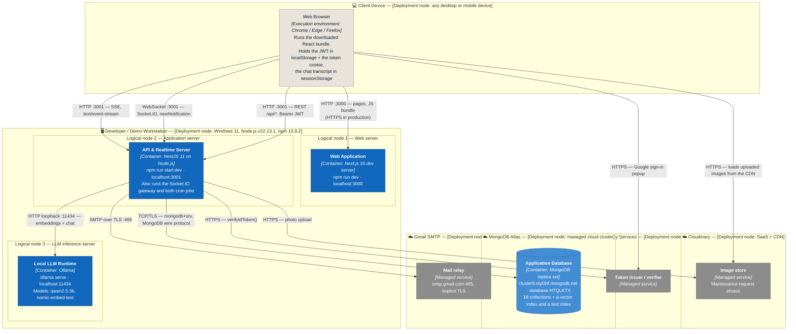

# Deployment Diagram (Dormify)

**Performed by:** Đào Duy Anh | **Reviewed by:** Trần Huỳnh Mạnh Đạt | **Edited by:** Đào Duy Anh

> Verified against the running system on 2026-08-07. Sources: `src/backend/src/main.ts` (listen port, CORS, body limit), `src/backend/.env` (which variables are actually set), `src/backend/src/auth/mail.service.ts` (SMTP host/port defaults), `src/backend/src/chatbot/chatbot.service.ts` (Ollama URL and model defaults), `src/backend/package.json` + `src/frontend/package.json` (start scripts), `src/frontend/.env.local`, `src/frontend/app/utils/apiClient.ts` and `app/context/SocketContext.tsx` (which host the browser connects to). Maps the four containers defined in [`c4-level2.md`](./c4-level2.md) onto the infrastructure that runs them.

This diagram answers a different question from the C4 levels: not *what* the software is made of, but *where each piece actually runs*. Dormify is currently a **development / demo deployment**: the three containers the team wrote all run as separate Node.js processes on one workstation, while the database and the file store are managed cloud services. There is no container image, no reverse proxy, no CI/CD pipeline and no cloud host for the application code yet — so, following the PA4 instruction for locally-run systems, **each container is drawn as its own logical node** inside the workstation.

## Diagram

**Performed by:** Đào Duy Anh | **Reviewed by:** Trần Huỳnh Mạnh Đạt | **Edited by:** Đào Duy Anh

## Nodes

**Performed by:** Đào Duy Anh | **Reviewed by:** Trần Huỳnh Mạnh Đạt | **Edited by:** Đào Duy Anh

| Node | Hardware / service | Containers or components running on it | Inbound protocols |
| --- | --- | --- | --- |
| **Client Device** | Any desktop or mobile device with a modern browser. No installation — Dormify is a web application. | The downloaded React/Next.js bundle, plus browser storage: the JWT in `localStorage`, the `token` cookie read by `proxy.ts`, and the chat transcript in `sessionStorage`. | — (initiates all its own connections) |
| **Developer / Demo Workstation — logical node 1: Web server** | The team's own machine (Windows 11, Node.js v22.13.1). Started with `npm run dev` in `src/frontend`. | **Web Application** container — the Next.js dev server on port **3000**, including server-side rendering and the `proxy.ts` route gate. | HTTP on 3000 from the browser. |
| **…logical node 2: Application server** | Same machine, separate Node.js process, started with `npm run start:dev` in `src/backend`. | **API & Realtime Server** container — the whole NestJS app on port **3001**: REST controllers, the Socket.IO gateway, the SSE chat endpoint, the global audit interceptor and both `@Cron` jobs. | HTTP, WebSocket and SSE on 3001 from the browser. CORS is enabled globally so the browser may call it from `:3000`. |
| **…logical node 3: LLM inference server** | Same machine, started with `ollama serve`; CPU inference (a 3-billion-parameter model is deliberately small enough not to require a GPU). | **Local LLM Runtime** container on port **11434**, serving `qwen2.5:3b` for generation and `nomic-embed-text` for embeddings. | HTTP on 11434 over the loopback interface — reachable only from the application server, never from the browser. |
| **MongoDB Atlas** | Managed MongoDB cluster (`cluster0.olyl3hf.mongodb.net`), shared-tier deployment. Because Atlas always provisions a **replica set**, the multi-document transactions in bookings, checkouts and transfers work without any extra setup. | **Application Database** container — the `HTQLKTX` database: 16 collections, plus the Atlas Vector Search index and the text index on `knowledge`. | MongoDB wire protocol over TLS (`mongodb+srv`), from the application server only. |
| **Cloudinary** | SaaS image storage with CDN delivery. | Maintenance-request photos, under the folder named by `CLOUDINARY_MAINTENANCE_FOLDER`. | HTTPS from the application server (upload) and from the browser (image delivery). |
| **Gmail SMTP** | Google's SMTP relay, `smtp.gmail.com:465`, authenticated with an app password. | Outbound password-reset emails. | SMTP over implicit TLS from the application server. |
| **Google Identity Services** | Google's SaaS identity endpoints. | Google sign-in. Note this node is contacted **twice**: the browser obtains the ID token, then the application server independently verifies it. | HTTPS from both the browser and the application server. |

## Communication protocols between nodes

**Performed by:** Đào Duy Anh | **Reviewed by:** Trần Huỳnh Mạnh Đạt | **Edited by:** Đào Duy Anh

| From → To | Protocol | Port | Purpose |
| --- | --- | --- | --- |
| Browser → Web server | HTTP (HTTPS once hosted) | 3000 | Pages, JS/CSS bundle, server-side route gating |
| Browser → Application server | HTTP/JSON with `Authorization: Bearer` | 3001 | Every CRUD operation under `/api/*` |
| Browser → Application server | WebSocket (Socket.IO), JWT in the handshake | 3001 | `newNotification` push events |
| Browser → Application server | HTTP with `text/event-stream` | 3001 | Streamed chatbot answers |
| Browser → Cloudinary | HTTPS | 443 | Downloading maintenance photos from the CDN |
| Browser → Google | HTTPS | 443 | Google sign-in, returns an ID token |
| Application server → Atlas | MongoDB wire protocol over TLS (`mongodb+srv`) | 27017 (SRV-resolved) | All reads, writes and transactions |
| Application server → Ollama | HTTP over loopback | 11434 | Embeddings and streamed chat completion |
| Application server → Cloudinary | HTTPS | 443 | Photo upload |
| Application server → Gmail SMTP | SMTP over implicit TLS | 465 | Password-reset emails |
| Application server → Google | HTTPS | 443 | ID-token verification |

**The browser talks to two ports, not one.** There is no reverse proxy in front of the two Node processes, so the frontend on `:3000` serves the UI while the browser calls the API directly on `:3001`. That is why `app.enableCors()` is needed in `main.ts`, and why `NEXT_PUBLIC_API_URL` must be an absolute URL rather than a relative path.

## Configuration per node

**Performed by:** Đào Duy Anh | **Reviewed by:** Trần Huỳnh Mạnh Đạt | **Edited by:** Đào Duy Anh

Configuration is file-based; there is no secret manager. Neither env file is committed.

| Node | File | Variables actually set | Variables left at their code defaults |
| --- | --- | --- | --- |
| Web server | `src/frontend/.env.local` | `NEXT_PUBLIC_API_URL=http://localhost:3001/api` | — |
| Application server | `src/backend/.env` | `MONGO_URI`, `JWT_SECRET`, `FRONTEND_URL=http://localhost:3000`, `SMTP_USER`, `SMTP_PASS`, `CLOUDINARY_CLOUD_NAME`, `CLOUDINARY_API_KEY`, `CLOUDINARY_API_SECRET`, `CLOUDINARY_MAINTENANCE_FOLDER` | `SMTP_HOST` → `smtp.gmail.com`, `SMTP_PORT` → `465`, `OLLAMA_URL` → `http://localhost:11434`, `CHAT_MODEL` → `qwen2.5:3b`, `EMBED_MODEL` → `nomic-embed-text`, and the five `CHATBOT_*` retrieval thresholds |

Two configuration facts are worth calling out because they affect deployment:

* **`JWT_SECRET` is fail-fast.** `AuthModule` throws at startup if it is missing, rather than signing tokens with `undefined` — a missing secret stops the deployment instead of silently producing forgeable tokens.
* **A missing SMTP credential degrades instead of failing.** `MailService` falls back to printing the reset link to the server console, so the password-reset flow can be demonstrated on a machine with no mail account configured.

## Startup order and operational notes

**Performed by:** Đào Duy Anh | **Reviewed by:** Trần Huỳnh Mạnh Đạt | **Edited by:** Đào Duy Anh

1. **Ollama first** (`ollama serve`, with both models pulled). The API server starts fine without it, but every chatbot request will fail — this is the most common demo mistake.
2. **Application server** (`cd src/backend && npm run start:dev`). Mongoose connects to Atlas during bootstrap, so the workstation needs internet access and its IP must be on the Atlas access list.
3. **Web server** (`cd src/frontend && npm run dev`), then open `http://localhost:3000`.

Operational characteristics of this topology:

* **Single instance, so the cron jobs are safe.** The per-minute overdue-invoice sweep and the daily contract-expiry reminder run inside the one API process. Running two API instances behind a load balancer would fire both jobs twice; a production deployment would need to pin the scheduler to a single instance or move to an external scheduler.
* **Socket.IO state is in-process.** `NotificationsGateway` keeps its live-socket map in a local `Map`. With one instance this is correct; scaling out would require a Socket.IO adapter (e.g. Redis) so a notification finds the user whichever instance holds their socket.
* **No TLS locally.** Tokens travel in clear text over loopback, which is acceptable for development but means HTTPS termination is a prerequisite for any real deployment.

## Planned production topology — not yet built

**Performed by:** Đào Duy Anh | **Reviewed by:** Trần Huỳnh Mạnh Đạt | **Edited by:** Đào Duy Anh

Recorded for completeness; **none of this is implemented**, and the diagram above is the deployment as it exists at submission time.

| Container | Candidate target | Note |
| --- | --- | --- |
| Web Application | Vercel | Native Next.js host; `npm run build` output deploys unchanged. |
| API & Realtime Server | A small VM or container host (Render, Railway, AWS EC2) | Needs a long-lived process — WebSocket and SSE rule out short-lived serverless functions. |
| Application Database | MongoDB Atlas | Already cloud-hosted; nothing to move. |
| Local LLM Runtime | **The open problem.** | Free PaaS tiers cannot run a 3B model, so this container needs either a GPU/CPU VM of its own or a switch to a hosted model API — which would also move dormitory data off the team's own infrastructure, reversing the privacy property recorded in [`c4-level1.md`](./c4-level1.md). |
