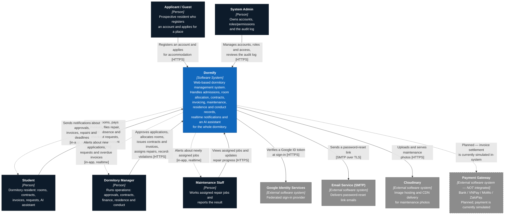

# C4 Model — Level 1: System Context Diagram (Dormify)

**Performed by:** `<member>` | **Reviewed by:** `<member>` | **Edited by:** `<member>`

> Verified against the codebase on 2026-08-08. Sources: backend `src/app.module.ts`, `src/auth/auth.controller.ts`, `src/auth/auth.service.ts`, `src/auth/mail.service.ts`, `src/invoices/invoices.controller.ts`, `src/maintenance/maintenance.service.ts`, `src/chatbot/chatbot.service.ts`, `src/users/schemas/user.schema.ts`, all `@Roles(...)` declarations; frontend `proxy.ts`, `app/layout.tsx`. Consistent with `use-case-model.md` §1 (actors) and `c4-level2.md` (Level 2).

This is the highest level of the C4 model. Dormify is drawn as **a single black box**: the diagram deliberately says nothing about Next.js, NestJS or MongoDB. Its only job is to answer three questions for someone seeing the project for the first time — *who uses this system, what does it do for them, and what other systems does it depend on?* The technology lives one level down, in the Container diagram.

## Diagram

**Performed by:** `<member>` | **Reviewed by:** `<member>` | **Edited by:** `<member>`

**Reading the diagram.** Dark boxes are people, the blue box is the system this project builds, grey boxes are systems somebody else operates. Solid arrows are calls Dormify makes or receives today; dashed arrows are either information flowing *back* to a person (notifications the system pushes without being asked) or, in the Payment Gateway's case, an integration that is documented but not yet built.

## Actors (people)

**Performed by:** `<member>` | **Reviewed by:** `<member>` | **Edited by:** `<member>`

| Actor | Who they are | What they use Dormify for |
| --- | --- | --- |
| **Applicant / Guest** | Someone who is not yet a resident. They can create an account and browse available rooms without being signed in — room listing is the one endpoint the backend leaves unguarded. | Register an account, browse rooms, submit a residence application. |
| **Student** | A dormitory resident, and by far the highest-volume user. | Book a room, view and extend the contract, view and settle invoices, file maintenance / room-transfer / absence / checkout requests, send feedback, read announcements, and ask the AI assistant about rules or their own invoices. |
| **Dormitory Manager** | Runs day-to-day operations. Backed by two RBAC roles, `DORMITORY_MANAGER` and `FLOOR_MANAGER` — see the modeling note below. | Approve or reject applications, run automatic room allocation, issue and terminate contracts, generate invoices and chase debts, assign repair jobs, process transfers, absences and checkouts, record rule violations and handle appeals. |
| **System Admin** | Owns the system itself rather than the dormitory. | Create and lock accounts, assign roles and access status, publish announcements, review the audit log, and manage the AI assistant's knowledge base and answer feedback. |
| **Maintenance Staff** | Technicians who carry out repairs. | See the jobs assigned to them and update status and results. |

**Modeling note — Applicant / Guest.** The use-case model treats this as a distinct actor, and so does this diagram, because their goal (*become* a resident) is genuinely different from a resident's. In the code they are not a separate role: registration creates a `STUDENT` account, and the applicant/resident distinction is expressed by whether that user holds an active contract.

**Modeling note — Floor Manager.** As in the use-case model and the Container diagram, Floor Manager is presented as part of the Dormitory Manager actor for readability. `FLOOR_MANAGER` remains a real, distinct role in `users.schema.ts` and still guards several endpoints (transfers, absences, booking review, contract listing, violation lookup). This is a presentation choice only; no code was changed.

## External software systems

**Performed by:** `<member>` | **Reviewed by:** `<member>` | **Edited by:** `<member>`

| System | Why Dormify depends on it | Direction and protocol |
| --- | --- | --- |
| **Google Identity Services** | Lets students sign in with their existing Google account instead of another password. The browser obtains an ID token; Dormify verifies it server-side before issuing its own session token, so a forged token cannot get in. | Dormify → Google, HTTPS |
| **Email Service (SMTP)** | The only channel Dormify has to reach a user who cannot sign in. Used for the password-reset link — a random token, stored hashed, valid for 15 minutes. If no SMTP credentials are configured the link is written to the server console instead, so development works without a mail account. | Dormify → SMTP server, SMTP over TLS |
| **Cloudinary** | Stores and serves the photos students attach to maintenance requests. Keeping binary files out of the database keeps the database small and lets images be delivered from a CDN. | Dormify → Cloudinary, HTTPS |
| **Payment Gateway** | Would settle invoices through a bank or e-wallet. **Not integrated.** Today a student "pays" through `PATCH /api/invoices/:id/pay-mock`, which simply marks the invoice paid, and the wallet logos on the payment screen are static images. It is drawn here because the use-case model commits to it as a future actor. | None today; planned HTTPS |

## Modeling decisions worth stating

**Performed by:** `<member>` | **Reviewed by:** `<member>` | **Edited by:** `<member>`

1. **The AI assistant's model server is *inside* the box.** Dormify runs its own Ollama instance rather than calling a paid AI API, so at this level it is simply part of the system and does not appear as an external dependency. It becomes visible one level down, as a container. This is a real architectural property, not a diagramming shortcut: no dormitory data — invoices, contracts, room assignments — leaves the team's own infrastructure when a student uses the assistant.
2. **MongoDB Atlas is not drawn here either.** It is Dormify's own database, not a third-party system Dormify integrates with. C4 convention puts a system's own datastore at the Container level, which is exactly where the Level 2 diagram shows it.
3. **"Scheduled Trigger" is not an external actor.** The use-case model lists it as an actor for the time-based operations (marking invoices overdue, sending expiry reminders). Those jobs are implemented as `@Cron` handlers running inside Dormify's own API server, so at Level 1 they are internal behaviour, not an outside system asking Dormify to do something. Showing a system's own scheduler as an external actor would overstate its dependencies.
4. **Email only — not SMS.** The use-case model names an "Email / SMS Service". Only email is implemented (Nodemailer over SMTP); there is no SMS provider in the codebase, so this diagram names the dependency accurately.
5. **Password reset uses a link, not an OTP.** The use-case model describes reset "OTP codes"; the implementation emails a one-time reset **link** carrying a hashed 15-minute token. The diagram follows the code. This discrepancy should be corrected in the revised use-case specification.
6. **Notifications are drawn as arrows back to people.** Dormify pushes information users did not ask for — an approval, a new invoice, a newly assigned repair job. Showing only user-to-system arrows would hide half of what the system does, so those flows are drawn as dashed arrows returning to the actor.
