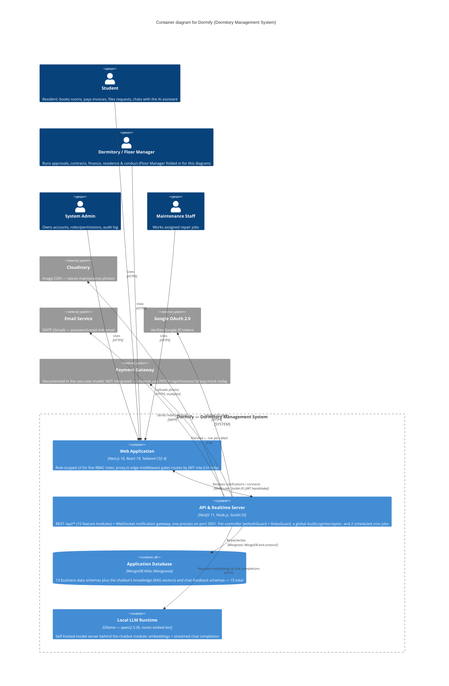

# C4 Model — Level 2: Container Diagram (Dormify)

**Performed by:** Trần Hoàng Quốc Khánh | **Reviewed by:** Đào Duy Anh | **Edited by:** Trần Hoàng Quốc Khánh

> Reviewed against the codebase on 2026-08-08. Sources: backend `src/app.module.ts`, `src/main.ts`, every `src/*/*.controller.ts` / `*.service.ts` / `*.module.ts` / `*.schema.ts`, `src/notifications/notifications.gateway.ts`, `src/chatbot/chatbot.service.ts`, `src/auth/auth.service.ts`, `src/auth/mail.service.ts`, `src/audit-logs/audit-logs.module.ts`; frontend `proxy.ts`; `system_plan.md`, `use-case-model.md`.

This zooms one level into the **Dormify** software system from the Level 1 System Context view. It shows every container — a separately runnable/deployable unit — the technology it is actually built with, and the protocol each connection uses in the running application.

## Diagram

**Performed by:** Trần Hoàng Quốc Khánh | **Reviewed by:** Đào Duy Anh | **Edited by:** Trần Hoàng Quốc Khánh

> Note: `System_Ext(payment, ...)` and its `Rel` are included for completeness against the use-case model's documented actor, but represent a **planned, unimplemented** integration — see the modeling notes below. If your Mermaid renderer doesn't support the `C4Container` diagram type (GitHub's does; older renderers may not), the same information is in the tables below.

## People

**Performed by:** Trần Hoàng Quốc Khánh | **Reviewed by:** Đào Duy Anh | **Edited by:** Trần Hoàng Quốc Khánh

| Actor | Who they are | Reaches the system via |
| --- | --- | --- |
| **Student** | Dormitory resident: browses/books rooms, pays invoices, files repair/transfer/checkout requests, talks to the AI assistant. | Web Application, browser |
| **Dormitory / Floor Manager** | Runs day-to-day operations: approvals, contracts, finance, residence & conduct oversight. Floor Manager is folded into this actor for diagramming — see note below. | Web Application, browser |
| **System Admin** | Owns accounts, roles/permissions, and the audit log. | Web Application, browser |
| **Maintenance Staff** | Works assigned repair jobs and updates their status. | Web Application, browser |

**Modeling note — Floor Manager.** This diagram folds the Floor Manager into the Dormitory Manager actor for readability, matching `use-case-model.md` §1. The backend keeps `FLOOR_MANAGER` as a distinct RBAC role in `users.schema.ts`, guarding several endpoints directly — this is a presentation simplification only, not a code change.

## Containers

**Performed by:** Trần Hoàng Quốc Khánh | **Reviewed by:** Đào Duy Anh | **Edited by:** Trần Hoàng Quốc Khánh

| Container | Technology | Responsibility | Talks to (protocol) |
| --- | --- | --- | --- |
| **Web Application** | Next.js 16 (App Router), React 19, TypeScript, Tailwind CSS 4 | Serves the role-scoped UI (`/admin`, `/student`, `/staff`, `/(auth)`); edge middleware (`proxy.ts`) reads the JWT cookie to gate routes by role, as a UX convenience only — not a security boundary. | **API & Realtime Server** — REST/JSON over HTTPS with a Bearer JWT for regular calls, plus a persistent WebSocket (Socket.IO, JWT handshake) for realtime notifications. |
| **API & Realtime Server** | NestJS 11, Node.js, Socket.IO | One process, port 3001. 15 feature modules behind `/api/*` (`auth`, `users`, `rooms`, `bookings`, `invoices`, `contracts`, `maintenance`, `notifications`, `violations`, `transfers`, `absences`, `checkouts`, `assignments`, `audit-logs`, `chatbot`). Each controller applies `JwtAuthGuard` + `RolesGuard` via `@UseGuards(...)` (not registered globally in `main.ts`); a global `AuditLogInterceptor` is registered once as an `APP_INTERCEPTOR` provider in `audit-logs.module.ts` and logs every mutating request. A Socket.IO gateway pushes realtime notifications; `@nestjs/schedule` (`ScheduleModule.forRoot()`) runs 2 cron jobs — overdue-invoice marking every minute and a daily 8am contract-expiry reminder. | **Application Database** — Mongoose driver over the MongoDB wire protocol. **Local LLM Runtime** — plain HTTP (embeddings + chat completion). **Cloudinary** — HTTPS, multipart upload. **Email Service** — SMTP. **Google OAuth 2.0** — HTTPS. |
| **Application Database** | MongoDB Atlas via Mongoose | System of record for users, rooms, bookings, contracts, invoices, maintenance, transfers, checkouts, absences, violations, notifications, announcements, and the audit log (13 business-data schemas) — plus the chatbot's `knowledge` schema (embedding vectors + text index for RAG) and `chat-feedback` schema (👍/👎 on answers). 15 registered schemas in total. | — (only ever called by the API & Realtime Server; never called directly by the Web Application) |
| **Local LLM Runtime** | Ollama | Self-hosted model server backing the AI assistant module: `nomic-embed-text` embeds knowledge chunks and questions for the RAG similarity search; `qwen2.5:3b` generates the streamed chat answer. | — (only ever called by the API & Realtime Server, over plain HTTP on `localhost:11434`) |

### Two things that look like containers but aren't

- **Realtime Gateway.** Notifications go over Socket.IO, but the gateway is a `@WebSocketGateway` class (`NotificationsGateway`) registered as a provider inside `notifications.module.ts`, running in the same Nest app as the REST controllers (same `app.module.ts`, same `main.ts` bootstrap, same port 3001). It's a *component* of the API & Realtime Server container, not a second deployable — the diagram draws one box with two protocols, not two boxes.
- **Route proxy.** `proxy.ts` (Next 16's middleware) decodes the JWT to redirect by role but never verifies the signature — the secret only lives on the API server. It's a component inside the Web Application container; the real authorization boundary is the guard chain on every backend call.

## External systems

**Performed by:** Trần Hoàng Quốc Khánh | **Reviewed by:** Đào Duy Anh | **Edited by:** Trần Hoàng Quốc Khánh

| System | Purpose | Called by | Protocol |
| --- | --- | --- | --- |
| **Cloudinary** | Hosts maintenance-request photos (`maintenance.service.ts`, via `cloudinary.uploader.upload`). | API & Realtime Server | HTTPS, multipart upload |
| **Email Service** | Delivers the password-reset **link** email (a signed, hashed token valid for 15 minutes — not a one-time code; `mail.service.ts` / `auth.service.ts`). Gmail account via Nodemailer; if `SMTP_USER`/`SMTP_PASS` aren't set, the link is logged to the console instead (dev mode). | API & Realtime Server | SMTP |
| **Google OAuth 2.0** | Verifies the Google ID token from the frontend's `@react-oauth/google` sign-in button (`google-auth-library` `OAuth2Client` server-side, in `auth.service.ts`). | API & Realtime Server | HTTPS |
| **Payment Gateway** | Documented in the use-case model as an actor (bank / VNPay / MoMo / ZaloPay). **Not integrated** — `PATCH /invoices/:id/pay-mock` simulates a paid invoice, and the wallet logos in the UI (`Momo.png`, `ZaloPay.png`, `ViettelPay.jpg`) are static images. | — (not integrated) | — |

## Modeling decisions worth stating

**Performed by:** Trần Hoàng Quốc Khánh | **Reviewed by:** Đào Duy Anh | **Edited by:** Trần Hoàng Quốc Khánh

1. **The database is a container, not an external system.** Even though MongoDB Atlas is someone else's infrastructure, Dormify owns every collection's schema and every query against it — the same convention used for a managed Postgres/RDS instance.
2. **Ollama is drawn inside the boundary.** Unlike Cloudinary or Google, nobody else operates it — it's a process this team runs specifically to serve the chatbot feature, so it's modeled as an internal container even though it runs as a separate host/process from the API server.
3. **One API process, two protocols.** There is no separate gateway or BFF: REST, the WebSocket notification push, JWT auth, and the cron scheduler all live in the single NestJS deployable.
4. **Auth is enforced per-controller, trusted once.** The frontend's `proxy.ts` gates routes for UX; the only real trust boundary is the backend guard chain (`JwtAuthGuard` + `RolesGuard`), applied via `@UseGuards(...)` on each controller rather than globally in `main.ts` — consistent with `system_plan.md`'s note on route protection.
5. **The diagram shows what's built, not the vision doc.** Payment Gateway appears as a dashed, external system with no live `Rel` because `system_plan.md` and the code agree it's simulated — drawing an aspirational integration as a solid line would mislead the next engineer who reads this diagram.
