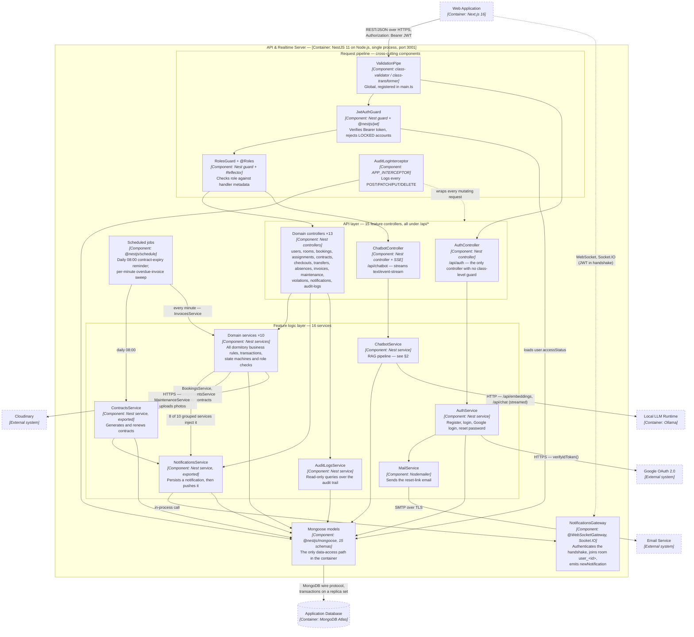
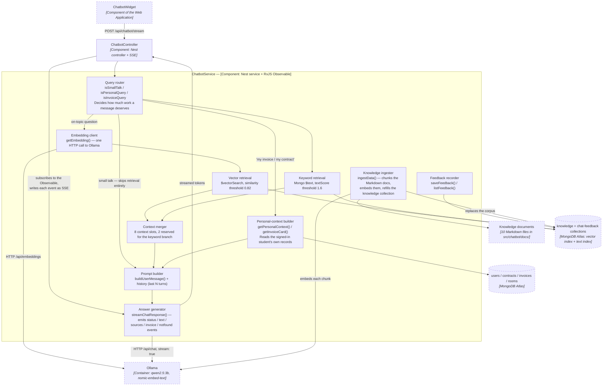
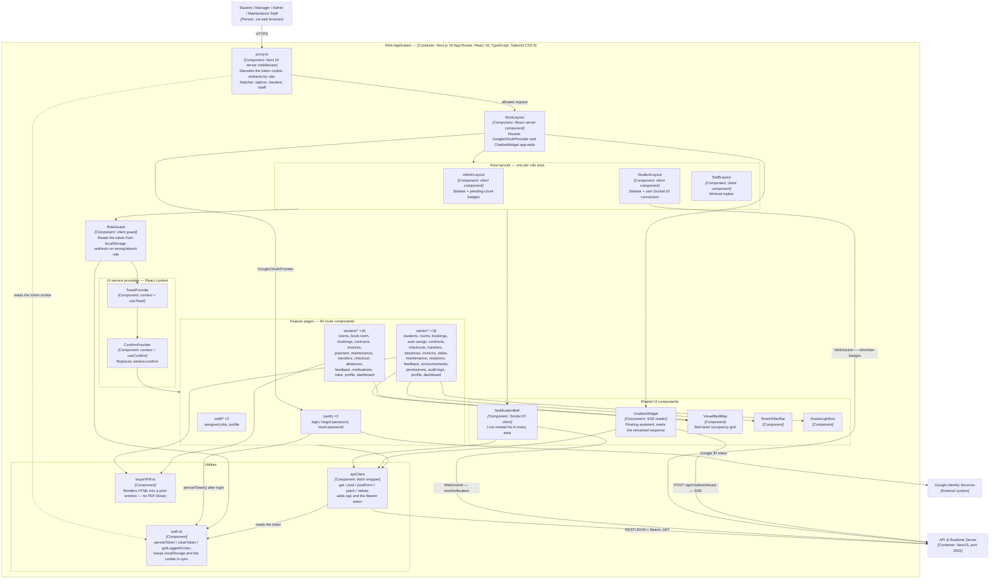

# C4 Model — Level 3: Component Diagrams (Dormify)

**Performed by:** `<member>` | **Reviewed by:** `<member>` | **Edited by:** `<member>`

> Verified against the codebase on 2026-08-08. Sources: backend `src/main.ts`, `src/app.module.ts`, all 15 feature `*.module.ts` / `*.controller.ts` files and their service implementations, `src/auth/jwt-auth.guard.ts`, `src/auth/roles.guard.ts`, `src/auth/roles.decorator.ts`, `src/auth/mail.service.ts`, `src/audit-logs/audit-log.interceptor.ts`, `src/notifications/notifications.gateway.ts`, `src/bookings/bookings.service.ts`, `src/contracts/contracts.service.ts`, `src/maintenance/maintenance.service.ts`, `src/chatbot/chatbot.service.ts`, `src/chatbot/chatbot.controller.ts`; frontend `proxy.ts`, `app/layout.tsx`, `app/{admin,student,staff}/layout.tsx`, `app/components/*`, `app/utils/*`, `app/context/SocketContext.tsx`. Builds on `c4-level2.md` (Level 2).

This document zooms one level further than the Container diagram. Level 2 showed **four containers**; Level 3 opens the two containers the team actually writes code in — the **Web Application** and the **API & Realtime Server** — and shows the components inside each, what each is responsible for, and how they call one another.

Per the PA4 brief, these diagrams use **standard Mermaid flowchart syntax with C4-style labelling** (`[Component: technology]` under each name) rather than Mermaid's experimental `C4Component` type. At this level a container holds too many components for the experimental renderer to lay out legibly, and the brief explicitly allows the flowchart form.

**Notation.** Solid arrows are runtime calls, labelled with the protocol or mechanism. Boxes with a dashed border are things *outside* the container being zoomed into (other containers or external systems), drawn only so the boundary is visible. `×N` on a box means N sibling components of the same kind collapsed into one shape.

---

## 1. Backend — API & Realtime Server

**Performed by:** `<member>` | **Reviewed by:** `<member>` | **Edited by:** `<member>`

### 1.1. Component diagram

### 1.2. Components and responsibilities

| Component | Technology | Responsibility | Relationships |
| --- | --- | --- | --- |
| **ValidationPipe** | `class-validator` + `class-transformer`, registered globally in `main.ts` | First thing every request meets. Strips unknown fields (`whitelist: true`) and coerces types (`transform` + `enableImplicitConversion`), so a service never sees an unvalidated DTO. | Runs before the guards; hands the request on to the controller layer. |
| **JwtAuthGuard** | Nest `CanActivate` + `@nestjs/jwt` | Extracts the `Bearer` token, verifies its signature, then **re-reads the user from MongoDB** to check `accessStatus` — so an admin locking an account takes effect immediately, without waiting for the 1-day token to expire. Attaches `role` and `accessStatus` to `request.user`. | Applied via `@UseGuards(...)` on 14 of 15 feature controllers (`RoomsController` applies it per-method so room browsing stays public). Reads the `User` model. Always runs before `RolesGuard`. |
| **RolesGuard + `@Roles`** | Nest guard + `Reflector` | Reads the `'roles'` metadata the `@Roles(...)` decorator wrote on the handler and compares it to `request.user.role`. No metadata means no role restriction. | Depends on `JwtAuthGuard` having populated `request.user` — the two are always listed together in `@UseGuards()`. |
| **AuditLogInterceptor** | Nest interceptor registered once as `APP_INTERCEPTOR` in `audit-logs.module.ts` | Wraps every HTTP request; for `POST/PATCH/PUT/DELETE` it writes who did what, from which IP, and with which status code — **including failed requests** (it taps both `next` and `error`). Writing is fire-and-forget so a logging failure can never break a response. | Global, so it needs no wiring from other modules. Writes through the `AuditLog` model. Skips `/api/audit-logs` to avoid logging the log reader. |
| **AuthController** | Nest controller, `/api/auth` | Registration, local login, Google login, forgot/reset password. Deliberately the **only** controller without class-level guards — these endpoints must be reachable without a token. | Calls `AuthService` only. |
| **Domain controllers (×13)** | Nest controllers, `/api/<domain>` | Thin HTTP adapters: bind route + DTO, declare the required roles, delegate to a service, return its result. No business rules live here. | Guard chain above them; exactly one matching domain service below them. |
| **ChatbotController** | Nest controller + raw Express `Response` | Five routes: `POST ask` (non-streamed), `POST stream` (Server-Sent Events), `POST feedback` (👍/👎), `GET feedback` (admin listing), and `POST ingest` (admin re-indexes the knowledge base). For `stream` it sets `text/event-stream`, subscribes to the service's RxJS `Observable`, writes each event as `data: {...}`, and unsubscribes when the client disconnects. | Calls `ChatbotService`. Guarded like any other controller. |
| **AuthService** | Nest service | bcrypt password hashing (10 salt rounds), JWT issuing (1-day expiry), Google ID-token verification, and a hashed, 15-minute reset token. | Injects `MailService`; calls Google's `OAuth2Client`; reads/writes the `User` model. |
| **MailService** | Nodemailer over SMTP | Sends the password-reset link. If `SMTP_USER`/`SMTP_PASS` are absent it logs the link to the console instead, so development works without a mail account. | Used only by `AuthService`. |
| **Domain services (×13)** | Nest services | Where the system actually lives: eligibility rules, approval state machines, multi-document transactions, occupancy arithmetic, fee calculation, photo upload, cron handlers. | `BookingsService` and `AssignmentsService` call the exported `ContractsService`; **9 of the 13** call `NotificationsService`; all of them go through Mongoose models. `MaintenanceService` is the only one that talks to Cloudinary. |
| **NotificationsService** | Nest service, exported by `NotificationsModule` | The single fan-out point for user-facing events: persists a `Notification` document (with a TTL — 30 days unread, 10 days after being read) and then asks the gateway to push it. | Imported by 9 domain modules. Depends on `NotificationsGateway`; owns the `Notification`, `Announcement` and `User` models. |
| **ChatbotService** | Nest service + RxJS | The retrieval-augmented-generation pipeline — detailed in §2. | Calls Ollama over HTTP; reads `Knowledge`, `ChatFeedback`, and — for personalised answers — `User`, `Contract`, `Invoice`, `Room`. |
| **AuditLogsService** | Nest service | Read side of the audit trail: paged, filterable queries for the admin screen. The write side is the interceptor. | Reads the `AuditLog` model. |
| **NotificationsGateway** | `@WebSocketGateway` + Socket.IO | Verifies the JWT presented in the socket handshake, drops unauthenticated sockets, joins each client to a private `user_<id>` room, and tracks the live socket per user. Exposes `sendToUser` / `sendToAll`. | Called in-process by `NotificationsService`. Lives in the same Nest app and the same port as the REST controllers — a component, not a container (see Level 2). |
| **Scheduled jobs** | `@nestjs/schedule` (`ScheduleModule.forRoot()`) | Two `@Cron` handlers written as ordinary service methods: `ContractsService.remindExpiringContracts()` daily at 08:00, and `InvoicesService.handleOverdueInvoicesCron()` every minute. | They reuse the same services and the same `NotificationsService` as HTTP requests do — nothing is duplicated for the scheduler. |
| **Mongoose models** | `@nestjs/mongoose`, 15 schemas registered with `MongooseModule.forFeature` | The container's only data-access mechanism. There is no repository layer: services inject `Model<T>` directly. | Every service, the `JwtAuthGuard`, and the audit interceptor depend on them; they in turn speak the MongoDB wire protocol to Atlas. |

### 1.3. The three rules the backend layering follows

1. **Controller → service → model, never a shortcut.** No controller touches a Mongoose model, and no service issues an HTTP response. The one deliberate exception is `ChatbotController`, which holds the raw Express `Response` because SSE has to write to the socket incrementally.
2. **Cross-module reuse happens through exported services, not through shared collections — with one exception.** `NotificationsModule` exports `NotificationsService` and `ContractsModule` exports `ContractsService`; that is how bookings create contracts and how nine modules send notifications. The exception is `ChatbotModule`, which registers other domains' schemas (`User`, `Contract`, `Invoice`, `Room`) directly so it can read a student's real data for personalised answers. It is read-only, but it does bypass those domains' services — worth revisiting if their rules grow.
3. **Side effects happen after the data is safe.** `BookingsService.approveBooking()` is the clearest example: booking status, room occupancy, room status, the student's room field and the generated contract all commit inside **one MongoDB transaction**; only *after* `commitTransaction()` does it send the notification, inside its own `try/catch` so a notification failure cannot roll back a successful approval.

---

## 2. Backend zoom — the AI Assistant (chatbot) component

**Performed by:** `<member>` | **Reviewed by:** `<member>` | **Edited by:** `<member>`

`ChatbotService` is the single most structurally interesting component in the backend: it is the only one that talks to a fourth container, the only one that streams, and the only one that combines two different search strategies. This sub-diagram opens it up.

| Component | Responsibility | Relationships |
| --- | --- | --- |
| **Query router** | Classifies the incoming message before spending money on it: small talk skips retrieval, a "my invoice" question triggers the personal branch, everything else goes to hybrid search. | Entry point for every request; decides which of the branches below run. |
| **Embedding client** | Turns text into a 768-dimension vector via `nomic-embed-text`. Used both at query time and during ingestion. | The only component that calls Ollama's embeddings endpoint. |
| **Vector retrieval** | Atlas `$vectorSearch` over the `knowledge` collection, keeping hits above a 0.82 cosine threshold. | Consumes the embedding client; feeds the merger. |
| **Keyword retrieval** | A parallel `$text` search with a `textScore` floor of 1.6, calibrated on the project's own 309-chunk corpus. It catches exact-term questions (e.g. a specific fee name) where the vector search drifts. | Independent of the embedding client; feeds the merger. |
| **Context merger** | Combines both branches into at most 8 chunks, reserving 2 slots for keyword hits so a precise match can never be crowded out by semantically-similar prose. | Between the two retrieval components and the prompt builder. |
| **Personal-context builder** | For questions about the user's own situation, loads their contract, room and invoices and returns a **structured invoice card** rather than asking a 3-billion-parameter model to draw a table. | Reads four other domains' collections; its output is rendered by the widget as a real table. |
| **Prompt builder** | Assembles the system instruction, the retrieved context, the personal context and the last few conversation turns. | Feeds the generator only. |
| **Answer generator** | Streams `qwen2.5:3b` output as an RxJS `Observable` of typed events (`status`, `text`, `sources`, `invoice`, `notfound`), post-processing the model's habit of echoing the question or trailing an apology. | Subscribed by `ChatbotController`, which turns each event into one SSE frame. |
| **Knowledge ingester** | Admin-triggered (`POST /api/chatbot/ingest`): walks the Markdown files, chunks them by heading, embeds each chunk and rewrites the `knowledge` collection. | The only writer of the knowledge base; also runnable offline via `scripts/run-ingest.ts`. |
| **Feedback recorder** | Stores 👍/👎 on individual answers with the question, answer and cited sources, so the team can see which topics the bot answers badly. | Written by any user; read by admins through `GET /api/chatbot/feedback`. |

---

## 3. Frontend — Web Application

**Performed by:** `<member>` | **Reviewed by:** `<member>` | **Edited by:** `<member>`

### 3.1. Component diagram

### 3.2. Components and responsibilities

| Component | Technology | Responsibility | Relationships |
| --- | --- | --- | --- |
| **proxy.ts** | Next.js 16 server middleware (the successor to `middleware.ts`) | The first component to see a request for `/admin`, `/student` or `/staff`. Decodes the JWT from the `token` cookie, redirects to `/login` when it is missing or expired (deleting the stale cookie), and bounces a user who wanders into the wrong area to their own dashboard. **It decodes but does not verify the signature** — the secret lives on the backend — so it is a UX layer, never the security boundary. | Depends on the cookie written by `auth.ts`. Runs before any React component. |
| **RootLayout** | React server component (`app/layout.tsx`) | Sets the document shell and the Inter font, wraps everything in `GoogleOAuthProvider`, and mounts `ChatbotWidget` once at the app level so the assistant follows the user across every page. | Parent of all three area layouts and of the auth pages. |
| **AdminLayout / StudentLayout / StaffLayout** | Client components | Each renders its area's navigation, the profile header and `NotificationBell`, and establishes the nesting `RoleGuard → ToastProvider → ConfirmProvider → page`. `AdminLayout` additionally polls booking and maintenance counts for its sidebar badges; `StudentLayout` opens its own Socket.IO connection to refresh them live. | Children of `RootLayout`; parents of every feature page in their area. |
| **RoleGuard** | Client component | Client-side re-check of the same rule the proxy enforces: reads the decoded token from `localStorage`, redirects to `/login` or to the correct dashboard, and shows a spinner until the check passes — which also prevents a flash of another role's UI. | Used by all three area layouts; depends on `auth.ts`. |
| **ToastProvider / ConfirmProvider** | React context + hooks | Application-wide feedback primitives. `useToast()` replaces ad-hoc alert banners; `useConfirm()` replaces `window.confirm` for destructive actions so confirmation dialogs match the design system. | Provided by every area layout, consumed by nearly every page. |
| **Feature pages (40)** | Client components under `app/(auth)`, `app/admin`, `app/student`, `app/staff` | One page per use case. Each owns its own local state, calls `apiClient`, and renders its own tables/forms. There is no global store (no Redux/Zustand) and no shared data-fetching cache — a deliberate simplification, at the cost of some duplicated fetch logic between sibling pages. | Consume `apiClient`, the two providers, and the shared UI components. |
| **NotificationBell** | Client component + `socket.io-client` | Renders the unread badge and dropdown. Fetches the backlog over REST, then opens its **own** Socket.IO connection (stripping the trailing `/api` from the API URL, authenticating with the token) and prepends every `newNotification` event. Mark-as-read and delete go back over REST. | Mounted by all three area layouts; uses `apiClient` for REST and talks to `NotificationsGateway` for realtime. |
| **ChatbotWidget** | Client component + `fetch` streaming reader | The floating AI assistant. Renders only for a signed-in user, keeps the transcript in **`sessionStorage`** (not `localStorage`, because the conversation can contain invoices and room data), posts to `/api/chatbot/stream`, reads the response body with a `ReadableStream` reader, and renders each SSE event by type — text, source chips, a formatted invoice card, or a "not in the documents" block with suggestions. Sends 👍/👎 back through `apiClient`. | Mounted once by `RootLayout`; the only frontend component that consumes SSE. |
| **VisualBedMap / RoomFilterBar / AvatarLightbox** | Presentational components | Bed-level occupancy grid (shared by the admin room manager and the student booking page), the reusable room search/filter bar, and the avatar zoom overlay. | Pure props-in components; no network access of their own. |
| **apiClient** | `fetch` wrapper | The single door to the backend. Normalises the base URL (appending `/api` if the environment variable omits it), attaches `Authorization: Bearer <token>` from `localStorage`, and exposes `get/post/postForm/patch/delete`. `postForm` omits the JSON content type so the browser can set the multipart boundary — that is how maintenance photos are uploaded. | Used by every page and by `NotificationBell` and `ChatbotWidget`; reads the token that `auth.ts` persisted. |
| **auth.ts** | Plain TypeScript module | The token's owner. `persistToken()` writes **both** `localStorage` (for `apiClient` and the sockets) and the `token` cookie (for `proxy.ts`); `clearToken()` clears both; `getLoggedInUser()` decodes the payload and self-clears an expired token. Also maps a role to its dashboard path. | The one dependency shared by the proxy, `RoleGuard`, `apiClient` and the login page. |
| **exportPdf.ts** | Browser print window | Renders a styled contract or invoice into a pop-up and calls the browser's print dialogue. Deliberately library-free, which sidesteps the Vietnamese font-embedding problems of client-side PDF libraries. | Used by the admin and student contract and invoice pages. |

### 3.3. How a request flows through the frontend

For a protected page the order is fixed: **`proxy.ts` (server, cookie) → `RootLayout` → area layout → `RoleGuard` (client, `localStorage`) → providers → page → `apiClient` → backend**. The two guard components check the same claim from two different stores, which is why `auth.ts` must write both — a token in `localStorage` alone leaves the proxy thinking the user is anonymous.

---

## 4. Consistency notes

**Performed by:** `<member>` | **Reviewed by:** `<member>` | **Edited by:** `<member>`

Because the brief penalises any gap between these diagrams and the code, the following observations are recorded rather than smoothed over:

1. **Each realtime consumer opens its own socket.** `NotificationBell`, `StudentLayout`, `student/page.tsx` and `staff/page.tsx` each call `io(...)` independently, so a student on their dashboard holds two connections to the gateway. `app/context/SocketContext.tsx` provides a `SocketProvider`/`useSocket` pair that would consolidate them, **but nothing imports it** — it is currently dead code. The diagram shows what runs today (per-component sockets); consolidating onto the context is a small, worthwhile refactor for PA5.
2. **`InvoicesModule` exports `InvoicesService`, but no module imports it.** Harmless, but it implies a cross-module dependency that does not exist; the export can be dropped.
3. **`RoomsController` is the one controller guarded per-method rather than per-class**, so that anonymous visitors can browse available rooms. This is intentional and is why the diagram does not show every controller behind the guard chain.
4. **The Google client ID is hard-coded** in both `auth.service.ts` and `app/layout.tsx` rather than read from configuration. Not a secret, but it is the one piece of environment-specific data that is not in an `.env` file.
