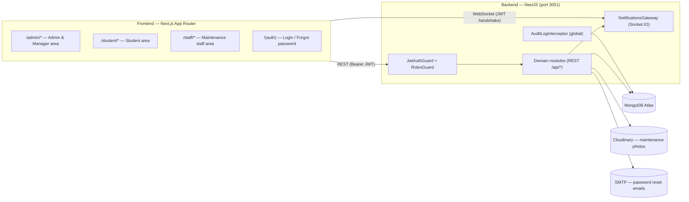

# System Plan — Dormify (Dormitory Management System)

> Last updated: 2026-07-18 — rewritten to reflect the actual implemented architecture.

## 1. High-Level Architecture

Route protection has two layers: `proxy.ts` on the frontend (reads the JWT cookie, redirects by role) is a UX layer only; real authorization is enforced by the NestJS guards on every API call.

## 2. Database Collections (MongoDB / Mongoose)

| Collection | Purpose | Key fields |
| --- | --- | --- |
| `users` | Accounts for all 5 roles | `email`, `passwordHash`, `role`, `accessStatus` (+`blockReason`), `fullName`, `mssv`, `cccd`, `gender`, `behaviorScore` (0–100), `room` (ref), `isTempResident` |
| `rooms` | Dormitory rooms | `name`, `building`, `floor`, `capacity`, `currentOccupancy`, `price`, `status` (AVAILABLE/FULL/MAINTENANCE), `genderType` (MALE/FEMALE/MIXED), `facilities[]`, virtual `occupants` |
| `bookings` | Room booking requests | `user`, `room`, `status` (PENDING/APPROVED/REJECTED/CANCELLED) |
| `contracts` | Rental contracts | `booking`, `user`, `room`, `contractNumber` (unique), `startDate`, `endDate`, `rentalFee`, `status` (ACTIVE/EXPIRED/TERMINATED), `terms`, `lastReminderAt` |
| `invoices` | Monthly bills per room | `room`, `month`, `year`, `roomFee`, `electricityFee`, `waterFee`, `totalAmount`, `dueDate`, `status` (PENDING/PAID/OVERDUE), unique index `(room, month, year)` |
| `maintenances` | Repair requests | `user`, `room`, `title`, `description`, `imageUrl`, `priority`, `status`, `assignedTo`, `resolvedAt`, `rating` (1–5) |
| `transfers` | Room-change requests | `user`, `fromRoom`, `toRoom`, `reason`, `status`, `processedAt` |
| `checkouts` | Room checkout (FR18–21) | `user`, `room`, `contract`, `reason`, `expectedDate`, `status`, `damages[]` (itemName, fee, note), `depositAmount`, `compensationAmount`, `refundAmount`, `adminNote`, `processedAt` |
| `absences` | Overnight-absence declarations | `user`, dates, `status`, `processedAt` |
| `violations` | Rule violations & conduct points | `student`, `reason`, `points`, `scoreAfter` |
| `notifications` / `announcements` | Realtime + broadcast messages | `recipient`, `title`, `message`, `type`, `link`, read state |
| `auditlogs` | System activity log (FR06) | `user`, `userEmail`, `userRole`, `method`, `path`, `action`, `statusCode`, `ip`; TTL 180 days |

## 3. Backend Modules & API Surface (NestJS)

All routes are prefixed with `/api` and guarded by `JwtAuthGuard` + `RolesGuard` unless noted. A global `AuditLogInterceptor` records every mutating request (POST/PATCH/PUT/DELETE).

| Module | Main endpoints | Roles |
| --- | --- | --- |
| `auth` | `POST /auth/register`, `/auth/login`, `/auth/google`, `/auth/forgot-password`, `/auth/reset-password` | Public |
| `users` | `GET/PATCH /users/profile`, `GET /users/students`, `GET /users/maintenance-staff`, `PATCH /users/:id/block\|unblock`, access-control endpoints, `DELETE /users/:id` | Student / Admin |
| `rooms` | CRUD `/rooms`, search with filters, `GET /rooms/me` | Admin manages, all read |
| `bookings` | `POST /bookings`, `GET /bookings(/me)`, approve/reject | Student / Managers |
| `assignments` | `GET /assignments/preview`, `POST /assignments/auto` — bulk auto-assignment (FR12) | Admin, Dorm Manager |
| `transfers` | `POST /transfers`, `GET /transfers(/me)`, cancel / approve / reject | Student / Managers |
| `checkouts` | `POST /checkouts`, `GET /checkouts(/me)`, cancel / `PATCH :id/complete` (asset inspection + deposit refund) / reject | Student / Managers |
| `contracts` | `GET /contracts(/my-contract)`, `POST /contracts/extend`, `POST /contracts/terminate` | Student / Admin |
| `invoices` | CRUD + `generate-bulk`, `pay`, `pay-mock`, `trigger-overdue`, `stats/revenue`, **debts:** `GET /invoices/debts`, `POST /invoices/debts/:roomId/remind`, `POST /invoices/debts/remind-all` (FR23) | Managers / Student pays |
| `maintenance` | `POST /maintenance` (photo upload), `GET /maintenance(/me, /assigned/me)`, assign, status updates, rating, `stats/status` | Student / Managers / Staff |
| `absences` | request / cancel / approve / reject | Student / Managers |
| `violations` | `POST /violations`, `GET /violations/me`, `GET /violations/student/:id` — auto-deducts `behaviorScore` | Managers / Student |
| `notifications` | list, mark read; Socket.IO gateway pushes `newNotification` to `user_<id>` rooms | All |
| `audit-logs` | `GET /audit-logs?page&limit&method&search` (FR06) | Admin only |

### Scheduled jobs (cron)

* Daily 8AM — remind contracts expiring within 7 days (per-contract cooldown of 3 days).
* Daily — mark overdue invoices and notify all students of the room.

## 4. Frontend Route Map (Next.js App Router)

| Area | Pages |
| --- | --- |
| `(auth)` | `/login`, `/forgot-password`, `/reset-password` |
| `student` | dashboard (real activity log + realtime), `rooms`, `rooms/[id]`, `book-room`, `bookings`, `transfers`, `checkout`, `absences`, `contracts`, `invoices`, `payment/[id]`, `maintenance`, `notifications`, `profile`, `rules` |
| `admin` | dashboard (charts), `rooms`, `students`, `permissions`, `bookings`, `auto-assign`, `transfers`, `checkouts`, `absences`, `announcements`, `invoices`, `debts`, `contracts`, `maintenance`, `audit-logs`, `profile` |
| `staff` | assigned-jobs dashboard (filters, search, avg rating, realtime), `profile` |

## 5. Key Design Decisions

1. **Concurrency safety** — every operation that changes room occupancy (booking approval, transfer, checkout, auto-assignment) uses guarded updates (`$expr: currentOccupancy < capacity`) and, where multiple documents change together (transfer approval, checkout completion), a MongoDB transaction.
2. **Deposit convention** — the system does not collect deposits at contract signing yet; checkout uses a snapshot of one month's rent as the deposit, adjustable by the manager during inspection.
3. **Audit logging is fire-and-forget** — logging failures never affect the API response; request bodies are never stored (password safety).
4. **Notifications are best-effort** — a failed notification never rolls back a business operation; sends happen after the transaction commits.
5. **Vietnamese UI, English docs** — user-facing copy is Vietnamese by design; project documents follow PA3 guidelines (English, Markdown, Mermaid).
