# Use-Case Model - Dormify Dormitory Management System

**Performed by:** Trần Huỳnh Mạnh Đạt | **Reviewed by:** Đào Duy Anh | **Edited by:** Đào Duy Anh

## 1. Actors

**Performed by:** Trần Huỳnh Mạnh Đạt | **Reviewed by:** Đào Duy Anh | **Edited by:** Đào Duy Anh

| Actor | Description |
| --- | --- |
| **Applicant / Guest** | A person who has not yet become a dormitory resident and submits preliminary information to apply for accommodation. |
| **Student** | A dormitory resident who manages personal information, room applications, contracts, invoices, residence declarations, repair requests, feedback, and conduct information. |
| **System Admin** | Manages system accounts, roles, permissions, audit logs, and the administration dashboard. |
| **Dormitory Manager** | Performs dormitory operations, including room, student, contract, finance, residence, maintenance, feedback, and conduct management. |
| **Maintenance Staff** | Receives assigned maintenance jobs and updates repair progress and results. |
| **Google OAuth Provider** | External authentication provider used for Google login. |
| **Email / SMS Service** | Sends contact notifications and password-reset OTP codes. |
| **Payment Gateway** | Processes invoice payments through supported payment methods such as banks, VNPay, MoMo, or ZaloPay. |
| **Scheduled Trigger** | Initiates time-based automated operations such as marking overdue invoices and sending debt reminders. |

The **System Admin** and **Dormitory Manager** are separate roles. They are not generalized into a common Manager actor because they have different responsibilities and access permissions.

---

## 2. Authentication and Personal Profile

**Performed by:** Trần Huỳnh Mạnh Đạt | **Reviewed by:** Đào Duy Anh | **Edited by:** Đào Duy Anh

### 2.1 Use-Case Diagram

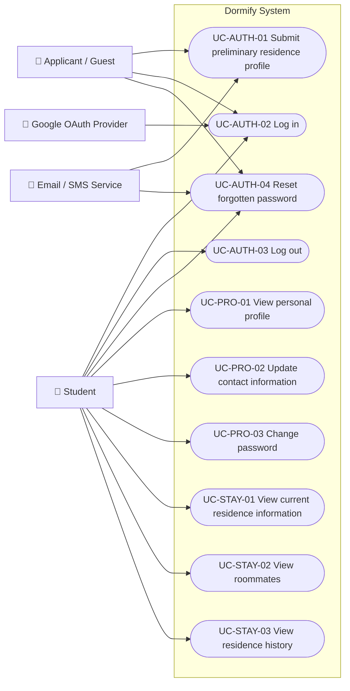

### 2.2 Use-Case Summary

| ID | Use case | Primary actor |
| --- | --- | --- |
| UC-AUTH-01 | Submit preliminary residence profile | Applicant / Guest |
| UC-AUTH-02 | Log in | Applicant / Guest, Student |
| UC-AUTH-03 | Log out | Student |
| UC-AUTH-04 | Reset forgotten password | Applicant / Guest, Student |
| UC-PRO-01 | View personal profile | Student |
| UC-PRO-02 | Update contact information | Student |
| UC-PRO-03 | Change password | Student |
| UC-STAY-01 | View current residence information | Student |
| UC-STAY-02 | View roommates | Student |
| UC-STAY-03 | View residence history | Student |

### Notes

- `UC-AUTH-02` supports login using email, citizen identification number, or Google authentication.
- Google login is treated as an alternative flow of `UC-AUTH-02`, not as a separate use case.
- `UC-AUTH-04` sends an OTP through the configured email or SMS service.
- Students may update contact information only.
- Identity-related information such as full name, date of birth, and identification number may only be updated by authorized management roles.
- Current residence information includes building, floor, room, and bed.

---

## 3. System Administration

**Performed by:** Trần Huỳnh Mạnh Đạt | **Reviewed by:** Đào Duy Anh | **Edited by:** Đào Duy Anh

### 3.1 Use-Case Diagram

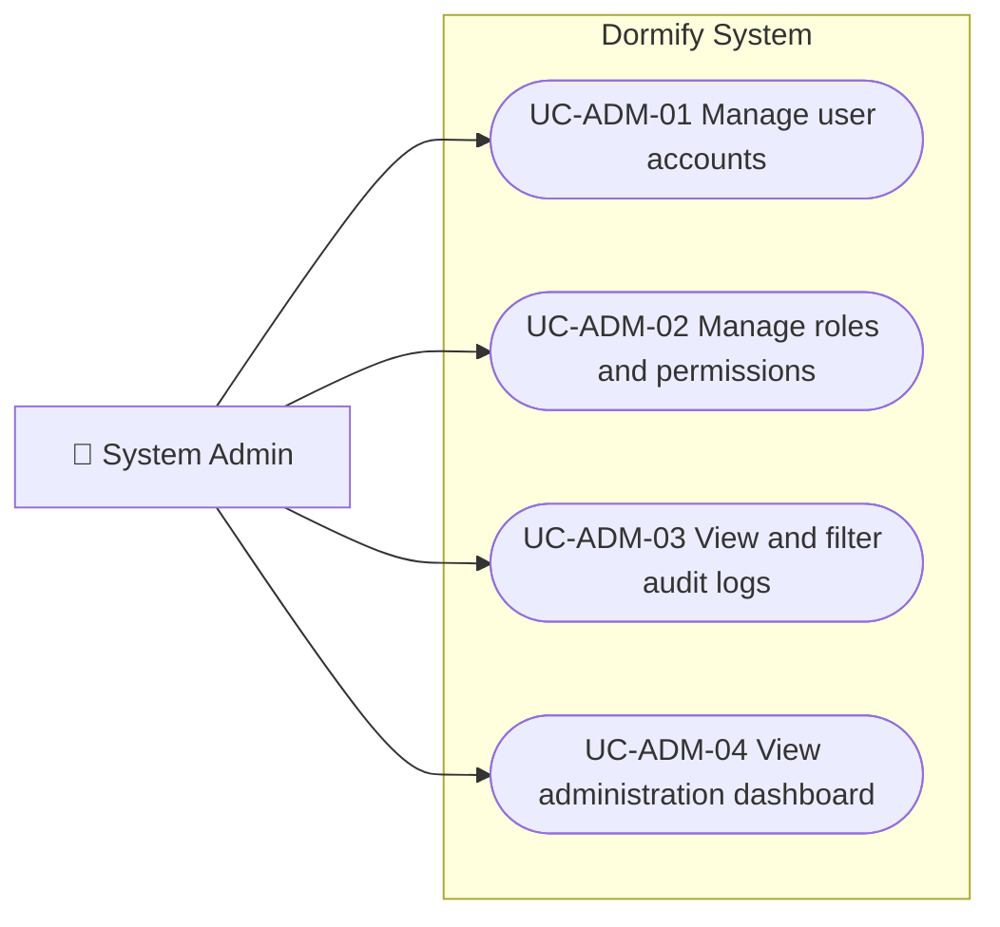

### 3.2 Use-Case Summary

| ID | Use case | Main operations |
| --- | --- | --- |
| UC-ADM-01 | Manage user accounts | View, lock, unlock, deactivate, or delete user accounts |
| UC-ADM-02 | Manage roles and permissions | Create roles, assign permissions, assign roles, and revoke access |
| UC-ADM-03 | View and filter audit logs | Review actions, users, timestamps, changed data, and used functions |
| UC-ADM-04 | View administration dashboard | View system statistics, warnings, and operational summaries |

`FR08 - Back up and restore data` is not included because it has been removed from the current project scope.

---

## 4. Room and Student Management

**Performed by:** Trần Huỳnh Mạnh Đạt | **Reviewed by:** Đào Duy Anh | **Edited by:** Đào Duy Anh

### 4.1 Use-Case Diagram

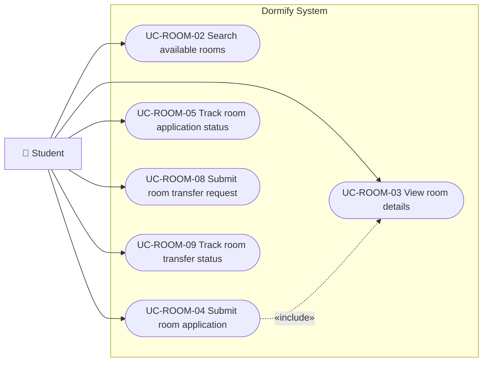

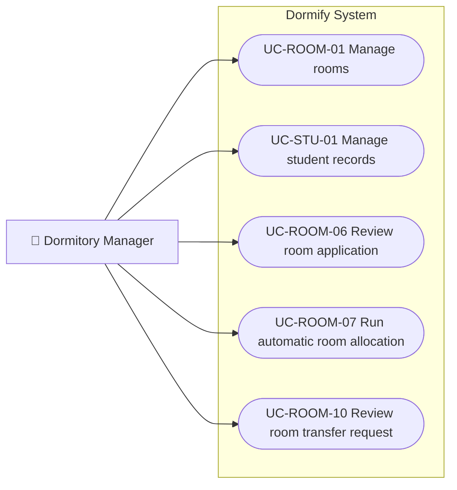

### 4.2 Use-Case Summary

| ID | Use case | Main operations |
| --- | --- | --- |
| UC-ROOM-01 | Manage rooms | Add, update, remove, view, and mark rooms as under maintenance |
| UC-STU-01 | Manage student records | View, edit, filter, and review room-rental history |
| UC-ROOM-02 | Search available rooms | Search by room type, building, price, and available beds |
| UC-ROOM-03 | View room details | View room information, price, capacity, and available beds |
| UC-ROOM-04 | Submit room application | Submit a request to rent a selected room |
| UC-ROOM-05 | Track room application status | View pending, approved, or rejected status |
| UC-ROOM-06 | Review room application | Check the applicant profile and approve or reject the application |
| UC-ROOM-07 | Run automatic room allocation | Allocate students based on preferences, gender, capacity, and availability |
| UC-ROOM-08 | Submit room transfer request | Request a transfer to another room |
| UC-ROOM-09 | Track room transfer status | View the processing status of a transfer request |
| UC-ROOM-10 | Review room transfer request | Approve or reject a transfer and record transfer history |

### Reassigned Floor Manager Responsibilities

Because the Floor Manager role has been removed:

- Viewing students by floor is handled in `UC-STU-01`.
- Viewing residence information is handled in `UC-STU-01`.
- Monitoring room conditions by floor is handled in `UC-ROOM-01`.
- Dormitory Manager screens should support filtering by building and floor.

---

## 5. Contract Management

**Performed by:** Trần Huỳnh Mạnh Đạt | **Reviewed by:** Đào Duy Anh | **Edited by:** Đào Duy Anh

### 5.1 Use-Case Diagram

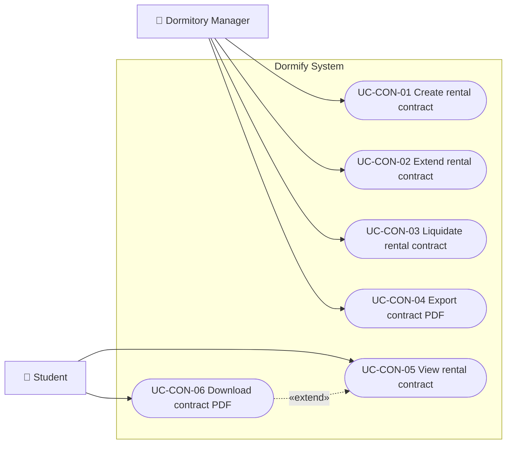

### 5.2 Use-Case Summary

| ID | Use case | Primary actor |
| --- | --- | --- |
| UC-CON-01 | Create rental contract | Dormitory Manager |
| UC-CON-02 | Extend rental contract | Dormitory Manager |
| UC-CON-03 | Liquidate rental contract | Dormitory Manager |
| UC-CON-04 | Export contract PDF | Dormitory Manager |
| UC-CON-05 | View rental contract | Student |
| UC-CON-06 | Download contract PDF | Student |

A rental contract may be created after a room application or automatic room allocation has been approved.

---

## 6. Checkout and Deposit Refund

**Performed by:** Trần Huỳnh Mạnh Đạt | **Reviewed by:** Đào Duy Anh | **Edited by:** Đào Duy Anh

### 6.1 Use-Case Diagram

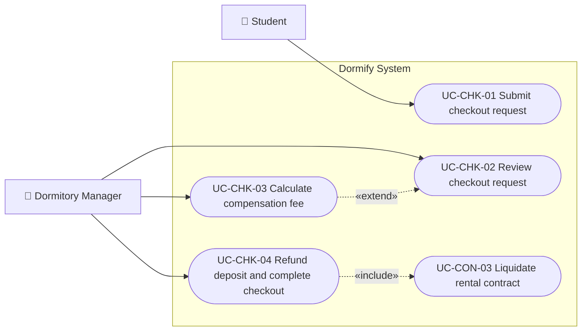

### 6.2 Use-Case Summary

| ID | Use case | Description |
| --- | --- | --- |
| UC-CHK-01 | Submit checkout request | Student requests to leave the assigned room |
| UC-CHK-02 | Review checkout request | Manager reviews and processes the request |
| UC-CHK-03 | Calculate compensation fee | Manager enters damaged or missing items and calculates deductions |
| UC-CHK-04 | Refund deposit and complete checkout | System calculates the remaining deposit and closes the stay |

### Scope Note

`FR19 - Inspect assets` has been removed as a standalone use case.

When necessary, damaged or missing items may be entered manually during checkout processing. Compensation calculation only occurs when deductions are recorded.

---

## 7. Finance and Meter Management

**Performed by:** Trần Huỳnh Mạnh Đạt | **Reviewed by:** Đào Duy Anh | **Edited by:** Đào Duy Anh

### 7.1 Use-Case Diagram

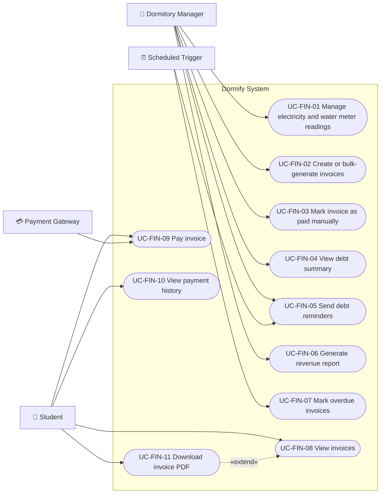

### 7.2 Use-Case Summary

| ID | Use case | Main operations |
| --- | --- | --- |
| UC-FIN-01 | Manage electricity and water meter readings | Enter opening and closing readings, upload meter photos, and view consumption history |
| UC-FIN-02 | Create or bulk-generate invoices | Create electricity, water, accommodation, or repair invoices |
| UC-FIN-03 | Mark invoice as paid manually | Confirm offline or manually verified payments |
| UC-FIN-04 | View debt summary | View unpaid and overdue amounts by student or room |
| UC-FIN-05 | Send debt reminders | Send manual or scheduled reminders |
| UC-FIN-06 | Generate revenue report | Generate monthly, quarterly, or yearly revenue reports |
| UC-FIN-07 | Mark overdue invoices | Automatically change eligible pending invoices to overdue |
| UC-FIN-08 | View invoices | View invoice list and invoice details |
| UC-FIN-09 | Pay invoice | Pay using a bank or supported electronic payment provider |
| UC-FIN-10 | View payment history | Review successful, pending, and failed payments |
| UC-FIN-11 | Download invoice PDF | Export an invoice as a PDF file |

### Reassigned Floor Manager Responsibilities

The following former Floor Manager functions are assigned to the Dormitory Manager:

- Enter electricity opening and closing readings.
- Enter water opening and closing readings.
- Upload meter photographs.
- Review electricity and water consumption history.

The payment methods supported by `UC-FIN-09` are alternative flows within the same use case, not separate use cases.

---

## 8. Residence Management

**Performed by:** Trần Huỳnh Mạnh Đạt | **Reviewed by:** Đào Duy Anh | **Edited by:** Đào Duy Anh

### 8.1 Use-Case Diagram

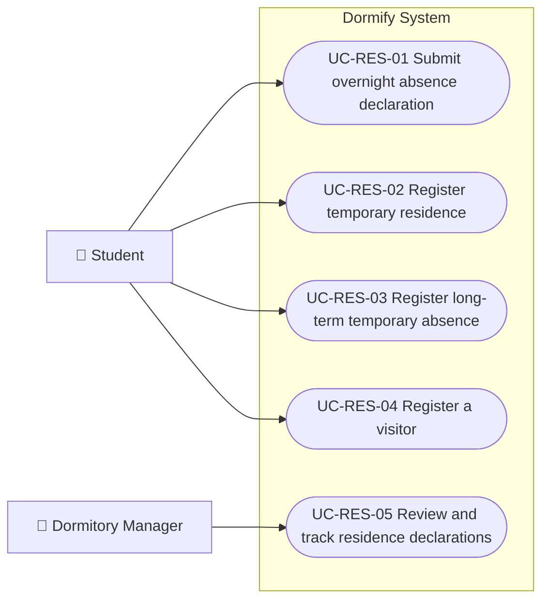

### 8.2 Use-Case Summary

| ID | Use case | Description |
| --- | --- | --- |
| UC-RES-01 | Submit overnight absence declaration | Student reports an overnight absence |
| UC-RES-02 | Register temporary residence | Student submits temporary residence information |
| UC-RES-03 | Register long-term temporary absence | Student reports a long-term absence |
| UC-RES-04 | Register a visitor | Student registers visitor information and visit time |
| UC-RES-05 | Review and track residence declarations | Manager views and processes residence-related declarations |

The Dormitory Manager assumes all residence-monitoring responsibilities previously assigned to the removed Floor Manager role.

---

## 9. Maintenance Management

**Performed by:** Trần Huỳnh Mạnh Đạt | **Reviewed by:** Đào Duy Anh | **Edited by:** Đào Duy Anh

### 9.1 Use-Case Diagram

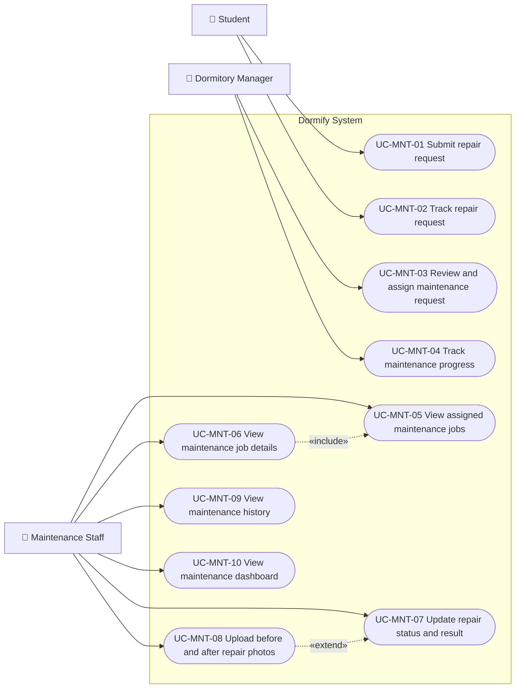

### 9.2 Use-Case Summary

| ID | Use case | Description |
| --- | --- | --- |
| UC-MNT-01 | Submit repair request | Student reports an incident and may attach photographs |
| UC-MNT-02 | Track repair request | Student views request status and repair results |
| UC-MNT-03 | Review and assign maintenance request | Manager reviews and assigns a request to staff |
| UC-MNT-04 | Track maintenance progress | Manager monitors pending, in-progress, and completed requests |
| UC-MNT-05 | View assigned maintenance jobs | Staff views jobs assigned to them |
| UC-MNT-06 | View maintenance job details | Staff views issue, location, priority, and attachments |
| UC-MNT-07 | Update repair status and result | Staff changes status and records the repair result |
| UC-MNT-08 | Upload before and after repair photos | Staff provides visual evidence of repair work |
| UC-MNT-09 | View maintenance history | Staff reviews previously processed maintenance work |
| UC-MNT-10 | View maintenance dashboard | Staff views workload and job-status statistics |

Valid repair statuses include:

- Pending.
- In progress.
- Completed.

The assignment action may contact an internal employee or a third-party maintenance provider, depending on the final implementation.

---

## 10. Feedback and Suggestions

**Performed by:** Trần Huỳnh Mạnh Đạt | **Reviewed by:** Đào Duy Anh | **Edited by:** Đào Duy Anh

### 10.1 Use-Case Diagram

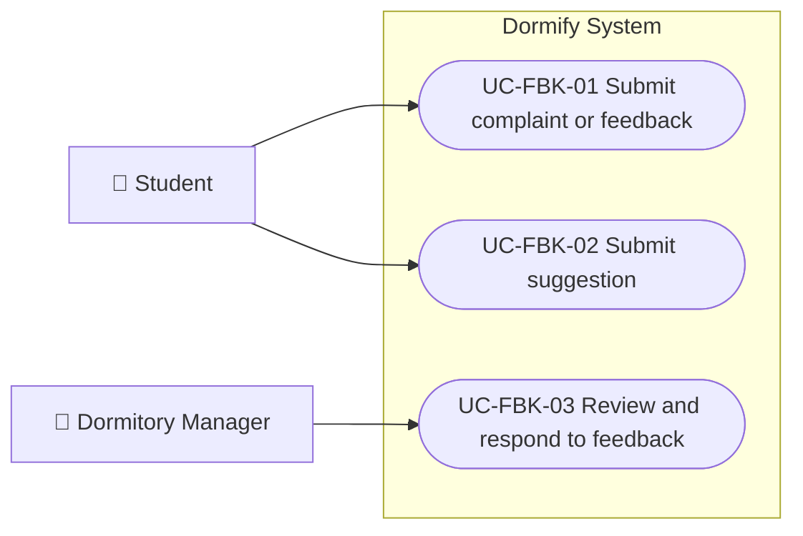

### 10.2 Use-Case Summary

| ID | Use case | Primary actor |
| --- | --- | --- |
| UC-FBK-01 | Submit complaint or feedback | Student |
| UC-FBK-02 | Submit suggestion | Student |
| UC-FBK-03 | Review and respond to feedback | Dormitory Manager |

The Dormitory Manager assumes the feedback-handling responsibility previously assigned to the removed Floor Manager role.

---

## 11. Conduct and Student Evaluation

**Performed by:** Trần Huỳnh Mạnh Đạt | **Reviewed by:** Đào Duy Anh | **Edited by:** Đào Duy Anh

### 11.1 Use-Case Diagram

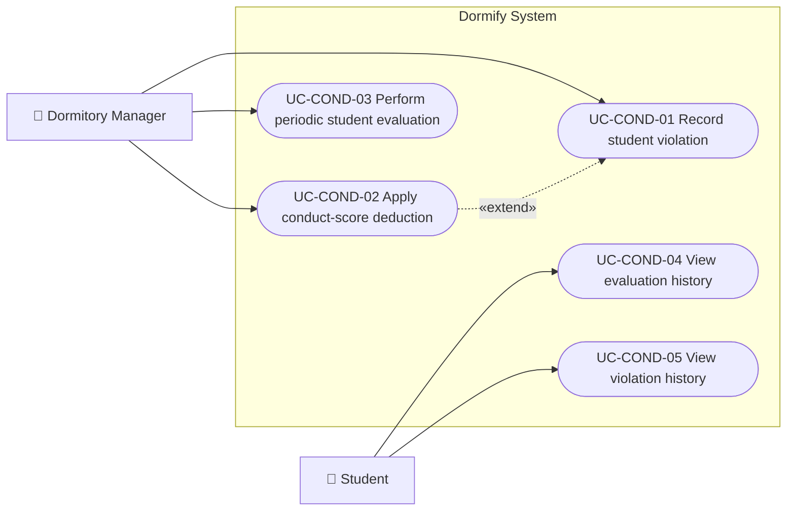

### 11.2 Use-Case Summary

| ID | Use case | Description |
| --- | --- | --- |
| UC-COND-01 | Record student violation | Manager creates a violation record |
| UC-COND-02 | Apply conduct-score deduction | System applies a deduction based on configured dormitory rules |
| UC-COND-03 | Perform periodic student evaluation | Manager records a periodic conduct evaluation |
| UC-COND-04 | View evaluation history | Student views previous conduct evaluations |
| UC-COND-05 | View violation history | Student views recorded violations and related penalties |

`UC-COND-02` extends `UC-COND-01` because not every recorded incident must necessarily result in a conduct-score deduction.

---

## 12. Notifications and Message Center

**Performed by:** Trần Huỳnh Mạnh Đạt | **Reviewed by:** Đào Duy Anh | **Edited by:** Đào Duy Anh

### 12.1 Use-Case Diagram

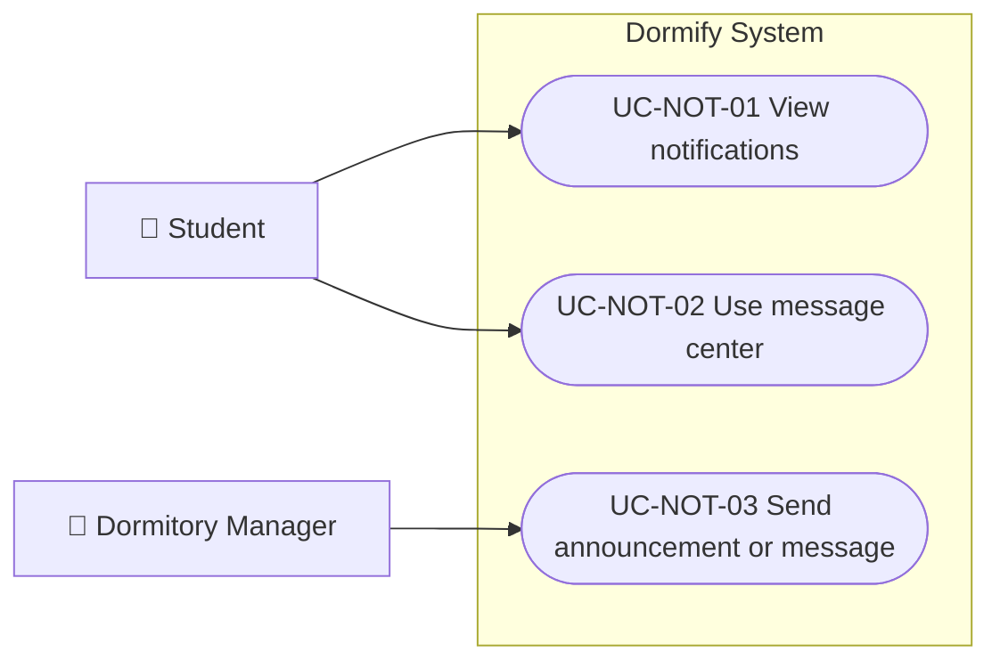

### 12.2 Use-Case Summary

| ID | Use case | Description |
| --- | --- | --- |
| UC-NOT-01 | View notifications | Student views system-generated and management notifications |
| UC-NOT-02 | Use message center | Student views received messages and communication history |
| UC-NOT-03 | Send announcement or message | Manager sends information to selected students, rooms, floors, or buildings |

Automatic notifications are treated as postconditions of related use cases.

Examples include:

- Room application decisions.
- Room transfer decisions.
- Newly generated invoices.
- Debt reminders.
- Repair-status updates.
- Residence-declaration updates.
- Violation records.

---

## 13. Functional Requirement Traceability

**Performed by:** Trần Huỳnh Mạnh Đạt | **Reviewed by:** Đào Duy Anh | **Edited by:** Đào Duy Anh

| Functional requirement | Related use cases | Coverage |
| --- | --- | --- |
| FR01 | UC-AUTH-01 | Covered |
| FR02 | UC-AUTH-02, UC-AUTH-03, UC-AUTH-04, UC-PRO-03 | Covered |
| FR03 | UC-PRO-01, UC-PRO-02, UC-STAY-01, UC-STAY-02, UC-STAY-03, UC-STU-01 | Covered |
| FR04 | UC-ADM-01 | Covered |
| FR05 | UC-ADM-02 | Covered |
| FR06 | UC-ADM-03 | Covered |
| FR07 | UC-ADM-04 | Covered |
| FR08 | - | Removed from scope |
| FR09 | UC-ROOM-01 | Covered |
| FR10 | UC-STU-01 | Covered |
| FR11 | UC-ROOM-04, UC-ROOM-05, UC-ROOM-06 | Covered |
| FR12 | UC-ROOM-07 | Covered |
| FR13 | UC-ROOM-08, UC-ROOM-09, UC-ROOM-10 | Covered |
| FR14 | UC-CON-01, UC-CON-02, UC-CON-03, UC-CON-04 | Covered |
| FR15 | UC-CON-02 | Covered |
| FR16 | UC-CON-03 | Covered |
| FR17 | UC-CON-04, UC-CON-06 | Covered |
| FR18 | UC-CHK-01, UC-CHK-02 | Covered |
| FR19 | - | Removed from scope |
| FR20 | UC-CHK-03 | Covered |
| FR21 | UC-CHK-04 | Covered |
| FR22 | UC-FIN-01, UC-FIN-02, UC-FIN-03, UC-FIN-07, UC-FIN-08, UC-FIN-09, UC-FIN-10, UC-FIN-11 | Covered |
| FR23 | UC-FIN-04, UC-FIN-05, UC-FIN-07 | Covered |
| FR24 | UC-FIN-06 | Covered |
| FR25 | UC-RES-01, UC-RES-05 | Covered |
| FR26 | UC-MNT-01, UC-MNT-03 | Covered |
| FR27 | UC-MNT-03 | Covered |
| FR28 | UC-MNT-02, UC-MNT-04, UC-MNT-05, UC-MNT-06, UC-MNT-07, UC-MNT-08, UC-MNT-09, UC-MNT-10 | Covered |
| FR29 | UC-COND-01, UC-COND-05 | Covered |
| FR30 | UC-COND-02, UC-COND-03, UC-COND-04 | Covered |

---

## 14. Student Feature Traceability

**Performed by:** Trần Huỳnh Mạnh Đạt | **Reviewed by:** Đào Duy Anh | **Edited by:** Đào Duy Anh

| Student features | Related use cases |
| --- | --- |
| ST01-ST03 Personal profile | UC-PRO-01, UC-PRO-02, UC-PRO-03 |
| ST04-ST06 Residence information | UC-STAY-01, UC-STAY-02, UC-STAY-03 |
| ST07-ST10 Room rental | UC-ROOM-02, UC-ROOM-03, UC-ROOM-04, UC-ROOM-05 |
| ST11-ST12 Contract | UC-CON-05, UC-CON-06 |
| ST13-ST16 Invoice and payment | UC-FIN-08, UC-FIN-09, UC-FIN-10, UC-FIN-11 |
| ST17-ST18 Repair requests | UC-MNT-01, UC-MNT-02 |
| ST19-ST20 Feedback and suggestions | UC-FBK-01, UC-FBK-02 |
| ST21-ST24 Residence declarations | UC-RES-01, UC-RES-02, UC-RES-03, UC-RES-04 |
| ST25-ST26 Notifications | UC-NOT-01, UC-NOT-02 |
| ST27-ST28 Evaluation and violations | UC-COND-04, UC-COND-05 |

---

## 15. Maintenance Staff Feature Traceability

**Performed by:** Trần Huỳnh Mạnh Đạt | **Reviewed by:** Đào Duy Anh | **Edited by:** Đào Duy Anh

| Maintenance features | Related use cases |
| --- | --- |
| MT01 | UC-MNT-05 |
| MT02 | UC-MNT-06 |
| MT03-MT04 | UC-MNT-07 |
| MT05-MT06 | UC-MNT-08 |
| MT07 | UC-MNT-09 |
| MT08 | UC-MNT-10 |

---

## 16. Reassignment of Removed Floor Manager Functions

**Performed by:** Trần Huỳnh Mạnh Đạt | **Reviewed by:** Đào Duy Anh | **Edited by:** Đào Duy Anh

| Former Floor Manager functions | New responsible role and use cases |
| --- | --- |
| FM01-FM02 View students and residence information | Dormitory Manager - UC-STU-01 |
| FM03 Track room conditions | Dormitory Manager - UC-ROOM-01 |
| FM04-FM09 Manage meter readings | Dormitory Manager - UC-FIN-01 |
| FM10-FM12 Track residence declarations | Dormitory Manager - UC-RES-05 |
| FM13 Record violations | Dormitory Manager - UC-COND-01 |
| FM14 Perform periodic evaluations | Dormitory Manager - UC-COND-03 |
| FM15 Receive feedback | Dormitory Manager - UC-FBK-03 |
| FM16 Track repair requests | Dormitory Manager - UC-MNT-04 |
