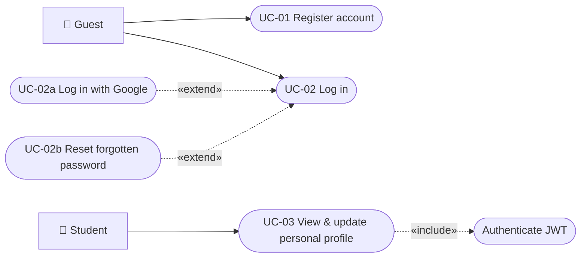
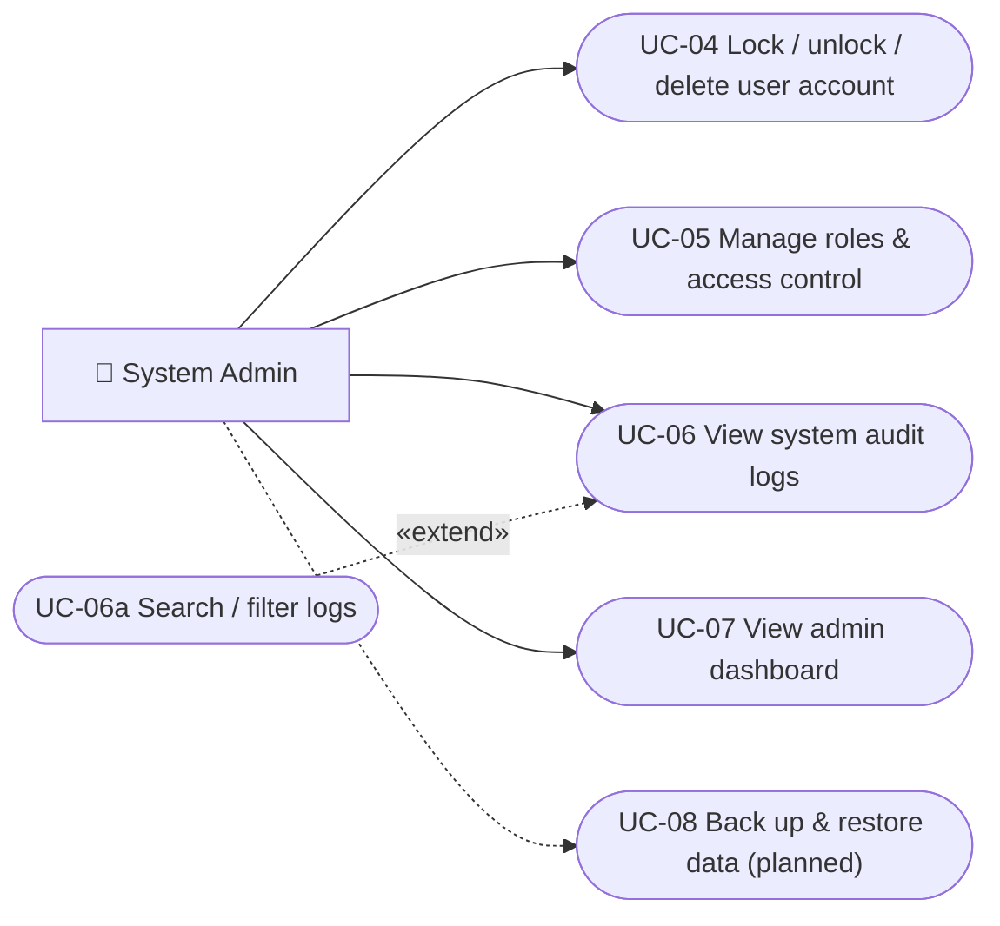
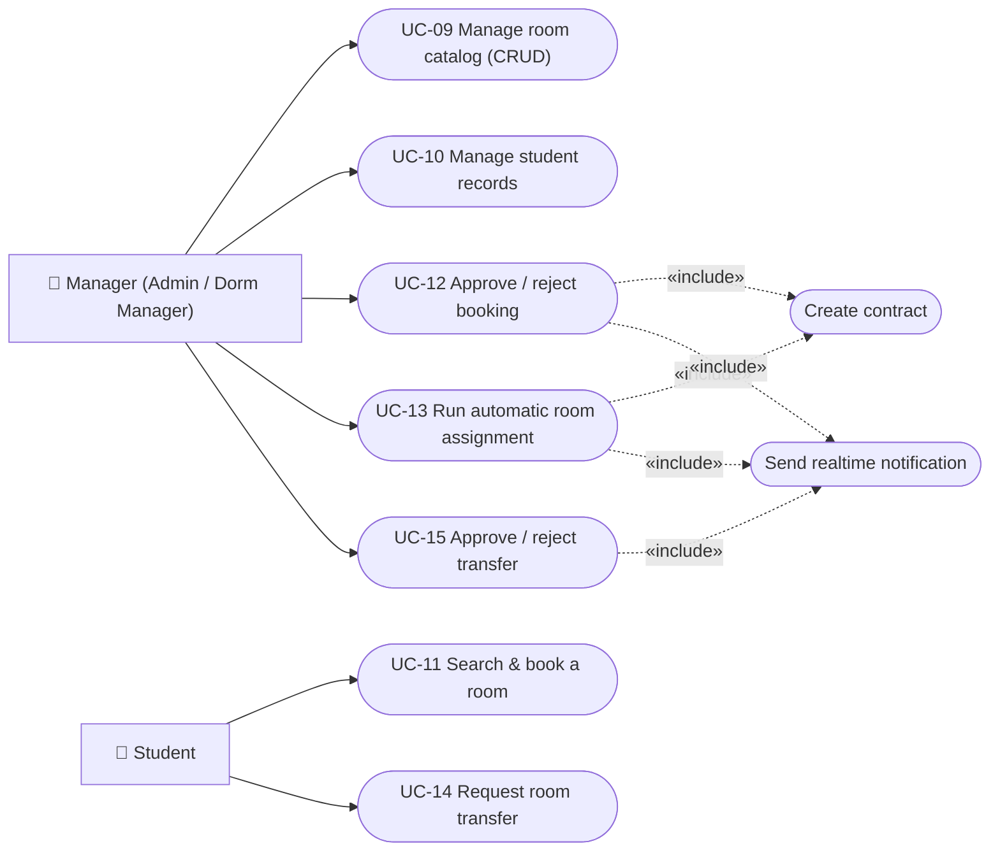
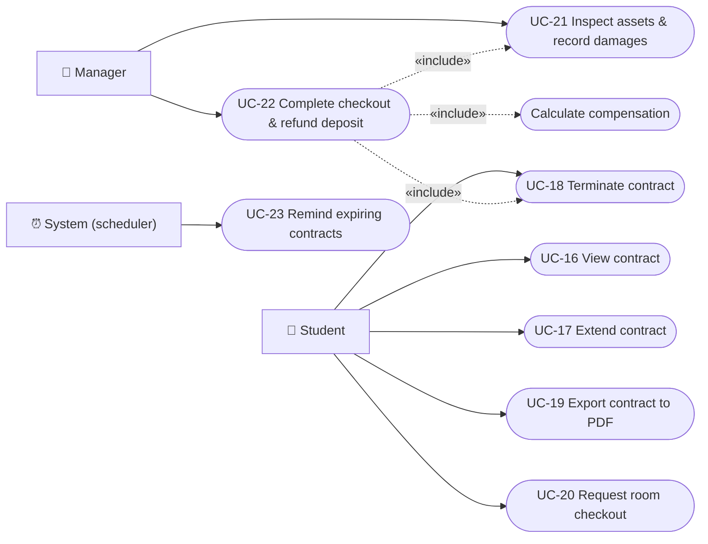
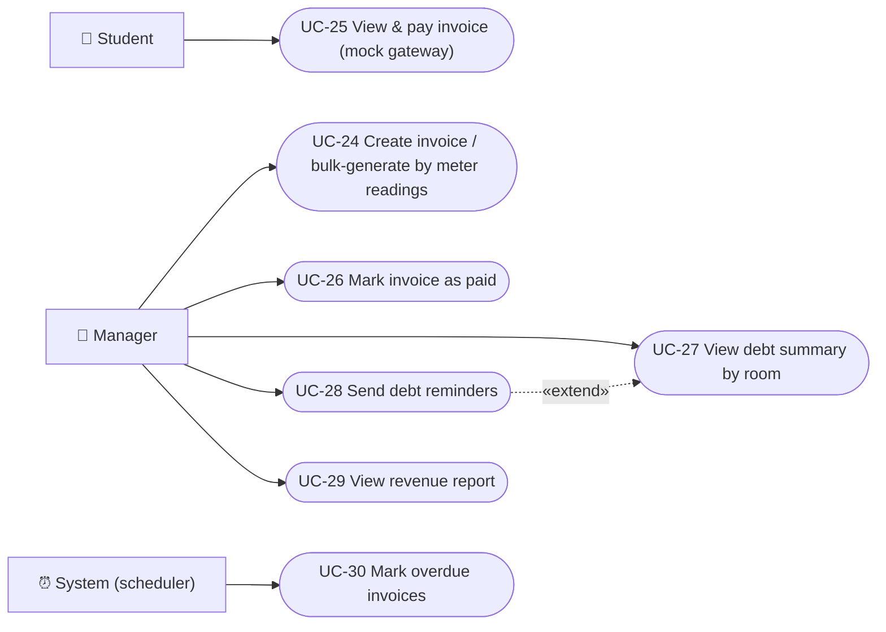
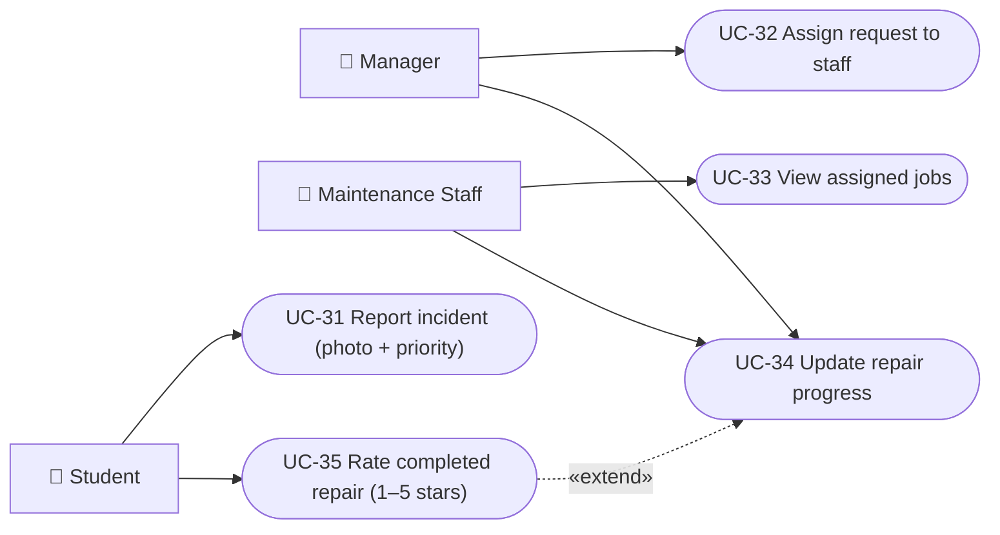
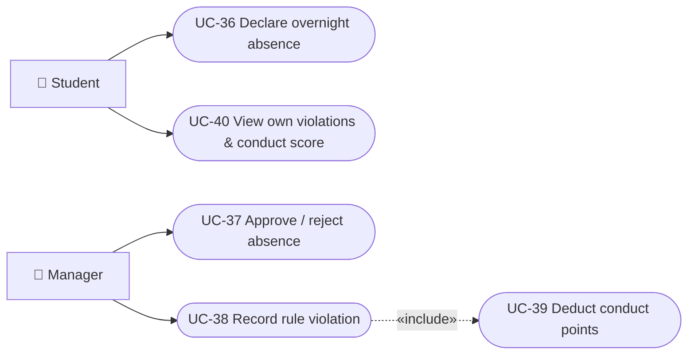

# Use-Case Model — Dormify (Dormitory Management System)

<!-- Performed by: <member>; Reviewed by: <member>; Edited by: <member> -->

> PA3 Section C. Diagrams are drawn in Mermaid (`flowchart` syntax: rectangles = actors, stadium shapes = use cases, dashed arrows = `«include»`/`«extend»`). All functional requirements FR01–FR30 from the vision/spec document are covered; traceability table at the end.

## Actors

| Actor | Description |
| --- | --- |
| **Student** | Dormitory resident: registers, books rooms, pays invoices, reports incidents. |
| **System Admin** | Full control: accounts, permissions, system logs, dashboards. |
| **Dormitory Manager** | Day-to-day operations: rooms, contracts, finance, discipline. |
| **Maintenance Staff** | Handles repair requests assigned to them. |
| **System (scheduler)** | Automated cron jobs: contract-expiry reminders, overdue invoices. |

`System Admin` and `Dormitory Manager` share most operational use cases (generalized as **Manager** in the diagrams).

## 1. Authentication & Profile (FR01–FR03)

## 2. System Administration (FR04–FR08)

## 3. Room Booking & Allocation (FR09–FR13)

## 4. Contracts & Checkout (FR14–FR21)

## 5. Finance (FR22–FR24)

## 6. Maintenance (FR26–FR28)

## 7. Residency Rules & Conduct (FR25, FR29–FR30)

## Traceability: Use Cases ↔ Functional Requirements

| FR | Use case(s) | Status |
| --- | --- | --- |
| FR01 | UC-01 | ✅ |
| FR02 | UC-02, UC-02a, UC-02b | ✅ |
| FR03 | UC-03 | ✅ |
| FR04 | UC-04 | ✅ |
| FR05 | UC-05 | 🔶 fixed roles only |
| FR06 | UC-06, UC-06a | ✅ |
| FR07 | UC-07 | ✅ |
| FR08 | UC-08 | ⬜ planned |
| FR09 | UC-09 | ✅ |
| FR10 | UC-10 | ✅ |
| FR11 | UC-11, UC-12 | ✅ |
| FR12 | UC-13 | ✅ |
| FR13 | UC-14, UC-15 | ✅ |
| FR14–FR17 | UC-16 … UC-19, UC-23 | ✅ |
| FR18–FR21 | UC-20 … UC-22 | ✅ |
| FR22 | UC-24, UC-25, UC-26, UC-30 | ✅ |
| FR23 | UC-27, UC-28 | ✅ |
| FR24 | UC-29 | ✅ |
| FR25 | UC-36, UC-37 | ✅ |
| FR26 | UC-31 | ✅ |
| FR27 | UC-32, UC-33 | ✅ |
| FR28 | UC-34, UC-35 | ✅ |
| FR29 | UC-38 | ✅ |
| FR30 | UC-39, UC-40 | ✅ |
